# 国外的系统设计面试

## some tips
* 说自己之前没有做过系统面试, 但是会尽力

Although I have not participated the system design, but I prepared a lot, I hope can present u a reasonable answer 

* The clarification阶段最重要的是把重点说出来。而不是每个点都说。这块控制的。两三分钟比较好。然后自己做一些假设，然后问。然后说是假设。我们可以后面调整。然后呢，假设他觉得你不合理，他肯定会说出来，然后他说他没有说，那么就继续</br>尤其不要说那些最基本的什么可用性啊。嗯，单点容错这种。这最基本的是肯定要有的，不需要问，但是是在系统大体设计出来之后再谈如何实现而不是在需求澄清阶段

* High level design最重要。这架构图。在那个data model和和API design,特别是API design没有这么重要。特别简单的接口就不需要说，不需要主动说，除非侧重考这部分

* High level design和 data model design可以先写data model design,然后再根据数据类型画架构图是比较顺着思路的

* 例如DB选择的时候。嗯，我要打到更高层级的一个要求的话，是不能一刀切的，必须要说。比较好的方法是哪个？但是次一点的方法也可以做，但是有什么缺点？

* 有很多方向可以细化(deep dive)。选熟悉的方向: 选主, 存储的格式

* shard key 的权衡: photo 表shard方案，如果按照photoid做shard，那么可能对某个user来说，他需要读。多个shard。增加延迟的问题，如果按照user 做shard会有热点的问题，但是面试当中不一定要做这个决定可以说出优劣之后说根据具体的机器做实验之后根据数据选择更好的

* 引入一个组件是需要理由的，不能在系统设计上不能想到一个组件之间就画出来，需要有理由，还要有trade off，以及缺点，然后为什么选择了他？而不是强硬的生搬硬套就像做题一样。你给人感觉你没有这方面的经验，只能生搬硬套

* 你在某个问题上引。doing 20 percent of thing will get 80 percent profit 。在某个合适的地方引入就是高级的信号, </br> 如果一开始就陷入到某个细节中，没有表现出全局的思维，肯定是低级

* 状态机的时候。要记几个状态，例如 not started, Pending, 成功, 失败，失败分为可重试不可重试。记录重试次数，上一次重试时间

* Workload isolation , cpu intensive, IO intensive, bandwidth intensive 就不能混在一起, 否则会can not scale independently

* 如果衡量面试成功的标准不是你说了什么，而是你让面试官说了什么，那会怎样？想象一下，你说的话激起了面试官的好奇心，他们别无选择，只能继续问“再告诉我一些情况”。如果你让他们深入挖掘的领域是你擅长的领域：恭喜你，你正在施展绝地思维技巧

* 简单来说，面试官的目标是找到足够的数据来聘用你。鉴于面试官可用的时间有限，他们必须尝试获取足够多的关于你能力的积极信号，以便他们有理由给你“聘用”评级。在一小时内，你必须向面试官展示你了解系统的基本原理（端到端）。你还应该能够命名和解释（至少在高层次上）系统的每个部分，描述你所做的权衡，并找到解决方案。
</br>
实现这一点的最佳方法是想象你正在向一群初级工程师解释一份设计文档。他们会问你关于你的决定的问题，并想知道你试图解决的问题。预测这些问题和你的回答将为你在面试中取得成功奠定基础。

* 面试官希望与您就问题限制和参数进行来回的对话，所以请避免对提示做出假设。
系统设计问题的初始提示往往故意忽略细节。许多候选人会犯这样的错误：根据初始提示推断细节，并根据这些假设制定解决方案。
例如，假设面试官要求你设计一个“照片共享服务”，并对其功能进行最低限度的定义。这可能会导致一些候选人想象他们正在重建 Instagram，并开始设计，假设所有图像都相对较小，不会被仔细检查，并且可以接受大量压缩以节省存储和带宽。</br>
但是面试官并没有让你重建 Instagram，所以你需要记住，照片共享服务有很多种。面试官可能想到了 Imgur 或 Photobucket 之类的网站，这些网站更适合基本的网络图片托管。或者他们可能在考虑 Flickr 或 500px 之类的网站，这些服务是为摄影师打造的，用于展示高分辨率作品。

* 想看到什么不想看到什么

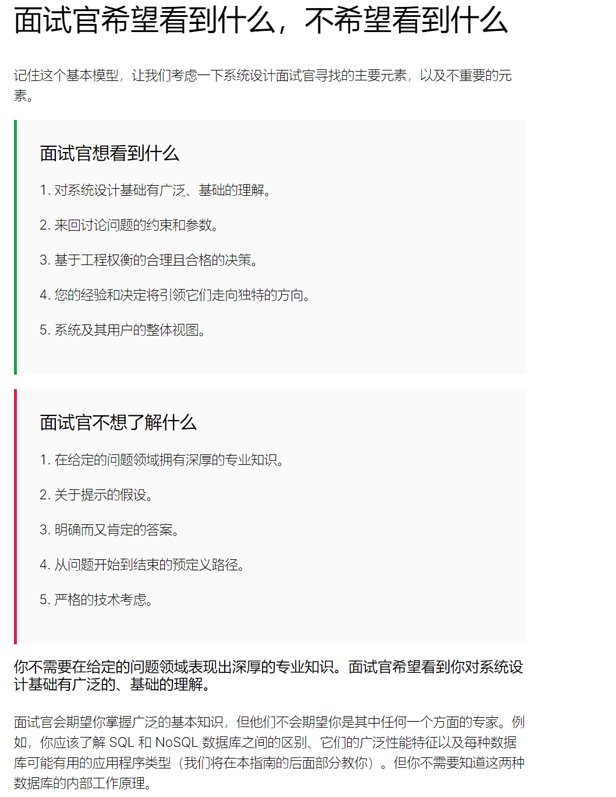

* 你不需要对每一个细节都进行询问，但一定要确保为你所做的决定提供一些理由，并让面试官知道你的决定在不同情况下会如何改变。系统设计问题没有一个明确的答案，所以面试官只是想看看你能证明你的答案是合理的。

* 面试官并不希望看到问题从开始到结束的既定路径。他们希望看到你的经验和决策会给他们带来怎样独特的方向。
编码问题通常有一个预期的路径。通常你会从一个显而易见但效率低下的解决方案开始，然后面试官会提示你进行一系列改进。这些改进会引导你找到越来越有效的解决方案，直到你最终找到最佳实现。

* 当在设计面试中面临选择时，很容易关注技术细节，但请记住，计算机系统是为人类用户服务的，因此您需要将技术决策锚定在它们所实现的用户体验上

* 为了说话而说话只会让自己被面试官的绳索勒死

* 您诚实地交流您所知道的和不知道的事情。

* 不要跳过问题并忽略面试官的提示，不要试图在不解决面试官顾虑的情况下继续进行面试。

* “我们可以使用这种类型的数据库，或者其他类型的数据库，这些都有其优点和缺点......并且基于所有这些权衡，我将使用那种类型的数据库。 ” , 说出优劣之后要做出决定

* 我将使用 Cassandra...”除非你对此非常熟悉，因为下一个问题是：“为什么是 Cassandra 而不是 some_other_db？说nosql 就可以了

* 在整个面试过程中，不要多次留下长时间（几分钟）的沉默, 一两分钟的关键沉默是可以的, 但是要注意时间, 实在不行了就说出问题和自己的思考

* 面试官看过你的简历后，决定故意挑战你，让你设计一些你没有做过的东西。在这种情况下，不要担心——只要记住“设计系统没有正确的方法”。运用你最好的判断力和行业知识来想出一个合理的方案。此外，要诚实地说明你的知识空白，不要害怕提问。表现出你的好奇心和学习意愿。

* 保持简单。分布式系统的第一条规则是，如果不需要，就应该避免使用它们！始终考虑维护成本。

* 怎么样说不知道, I am not certain, but I have an idea

* 如何以有益的方式反驳面试官

承认并肯定面试官。以“当然”、“好的”或“是”开头，

* 如何说不想陷入细节

I not wanna jump into the details now, but if we want, we can come back to it later

* 如何说接下来的问题比较困难

The challenge we would face would be ..., I know that would be a hard part, if I go wrong pls correct me(or may I ash u a question before I begin)

* 面对冷漠的面试官

不要大声思考。面对冷漠的面试官，你更容易保持沉默。最好在对自己要说的话没有把握之前不要开口

* 思考这些对象可能的访问模式
```
访问模式可能是设计中最具影响力的部分，因为它们决定了数据的存储方式。

让我们再次思考一下对象的交叉乘积。这次我们想确定如何从系统中检索数据。

访问模式要求的一般形状是：

给定 [对象 A]，获取所有相关的 [对象 B]
因此，将这个想法应用到我们的 Twitter 示例中，我们最终可能会得到以下访问模式：

给定一个帐户：
获取其所有关注者。（账户 → 账户）
获取他们关注的所有其他帐户。（帐户 → 帐户）
获取其所有推文。（账户 → 推文）
获取他们关注的帐户的精选推文。（帐户 → 推文）
给出一条推文：
获取所有喜欢它的帐户。（推文→帐户）
获取转发此推文的所有账户。（推文 → 账户
```
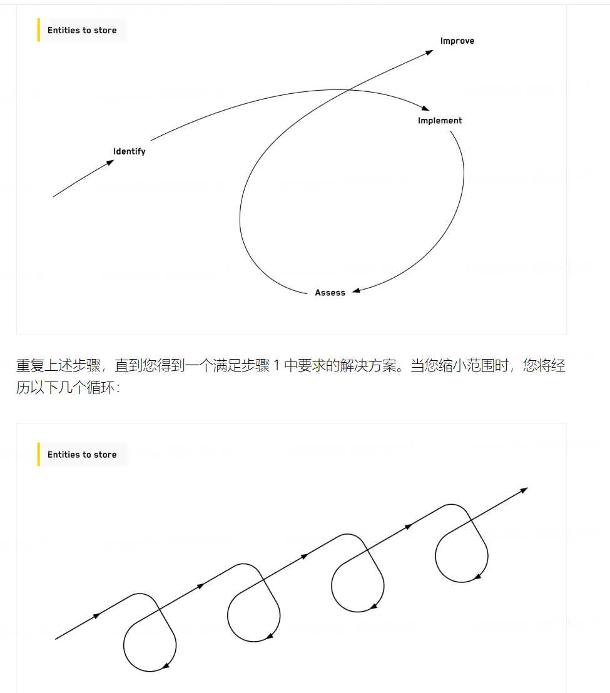
</br>
等于说是根据数据库里面的对象的某些字段, 如何实现读取和写入, 往上层说是如何实现某个单一的功能, 例如怎么去推特刷新推文, 这样去想就很具体, 不容易被其他复杂因素影响 

* 考虑数据模型的可变性

```
考虑可变性
最后，正如我们在本指南中所做的那样，您应该始终考虑可变性。系统持有的对象可以变异吗？或者可以假设它们是不可变的吗？

例如：推文发布后可以编辑吗？

可变性的另一种表现形式是删除。这些业务对象可以删除吗？后果会怎样？

例如：推文可以删除吗？账户可以删除吗？账户被删除后推文会怎样？

乍一听这似乎是一个小细节，但可变性可能会限制我们在设计中使用缓存的能力
```

* 不要陷入过早优化系统的常见陷阱

  * 考虑到我们确定该系统读取量很大，并且getFeed预计会被频繁调用，因此计算量可能会变得过大。考虑到每个帐户可能关注数千名用户，而这些用户可能有数百条推文。计算提要似乎是一个非常耗费计算资源的过程。
但是，不要陷入过早优化系统的常见陷阱。面试官可能根本不关心这个问题。
  
  * 我们假设面试官同意我们的观点，并希望继续优化这一点。每当你想要优化运行时，用内存来权衡应该是你的第一选择。(内存其实不一定就是memory , 而有可能是其他更快的存储数据库, 做上层的存储)

* 如何思考优化

如何优化的时候可以想, 目前已有了需求和前端和存储端, 但是可以在中间加入某些微服务或者layer 来优化关键最关心的问题, 一是想最需要优化的点, 最重要的点是什么, 二是如何在中间加层加微服务来实现
</br>
这些微服务的类型通常是缓存, 负载均衡, 消息队列

* 我们采用广度优先的方法进行架构设计, 容易把控时间, 不容易被卡住, 然后有了全局视野之后再去根据对象-属性-功能的视角去看某个功能点的设计会更加好, 

* 时间不够的原因，要分重点，不能每个都着重说，有必要的才说例如引入组件的原因，箭头上一般别写字了，写了也代表不了什么,

* 打字和选择组件名字的时候要快

* 图中的箭头可以是抽象的， 不需要直接表示数据流向， 因为这不是真实的系统设计图，表示真实的就太复杂和困难了

* 需求阶段, 到准备开始下一个阶段之前, 许多人忘记了他们可以直接询问面试官是否遗漏了任何重要要求。

* pull 方式的时候要计算一下tps , 如果tps 很高那么pull 就不适用.

* 处理流任务和聚合的时候, 多层过滤有利于减小最后给到存储的压力

* 用户接入层填access layer , 然后填包含LB, DNS, auth(JWT used for Single Sign-On) 等这些.

* 如果广度优先思考的方法想不到合适的service , 就使用DFS 深度优先, 根据entity 的关系或者重点功能点去写下来思考, 过程中可能就会想到涉及到其他service

* write all important down, 写requirement 和 estimation 之后写下主要的entity , 和实体要做的简单api 操作, 以及他们的关系. requirement 和 estimation 在十分钟之内搞完, 后面可以补充, 然后deep dive 问what part u would want me to deep dive ?
* 选择db 的时候, 先考虑是否需要ACID 和strong consistency, 再考虑schema 是否经常改变, 如果都不需要就是nosql, 再说nosql 的优点和缺点和sql 的优点和缺点
* 当碰到数数聚合事件类题目，数据的refreshness很关键，多久能算出这个数据当有更新的时候; 这类题目有个可以统一数据的model ，方便后续的开发和存储
* 做一些决定和一些选择时，一定要说清楚上下文、上下门。才是关键，否则面试官会认为你比较菜，因为可能他想的不一样
* 通用的一点就是一些数据分为better for reading format 和writing format ，合适的地方提出来; 说选什么数据库选什么存储的时候可以说。嗯。怎么读关系到怎么存。这是个signal
* 增加一个系统，它的一个缺点就是增加系统的复杂度。不仅包括系统的还包括组织上的; Tradeoff 不仅仅要说系统的，还要说组织架构的人的
* 拿到一个没有做过的题目, 从最核心的数据入手, 然后read path, write path 写出可能的方案和trade off, 最后过了一遍之后, 自己也有感觉了, 就可以选一个path 画图. 
* Tradeoff 不仅仅要说系统的，还要说组织架构的人的
* 可以一开始有把握的时候一句话说下这道题是一个什么题目
* 如何解决这道题的思路更重要
## uuid, snowflake id, auto_increment id 在 RDMS 使用上的区别

### uuid

uuid generated in client, usually longer, not waste performance in db, and it is random so will trigger random IO</br>

### auto increment id

auto increment id is auto incremental , usually is 4 or 8 bytes, better for inserting, but can be guessed the pattern of the id, and will have hot spot problem, because it will trigger the split of the largest leaf nodes if in mysql, but using partitioning 
table can solve it, but if so, we coupling the how we partition the table and id generating</br>

### snowflake id

 snowflakes id is the best, it is incremental, so better for insertion, not trigger random IO also not hotspot(have multiple tables)

## RPC 和 REST 的区别

### RPC 

is used for internal communication; effient because it uses some effient protocol(such as serialization protocol), and it is used for complicated operations

### REST API

it is used in external communication, and because of json and http protocol, it is not effient as RPC; it is used for some simple operations; 

## SQL DB VS NOSQL
### 如何在系统设计中选择数据库

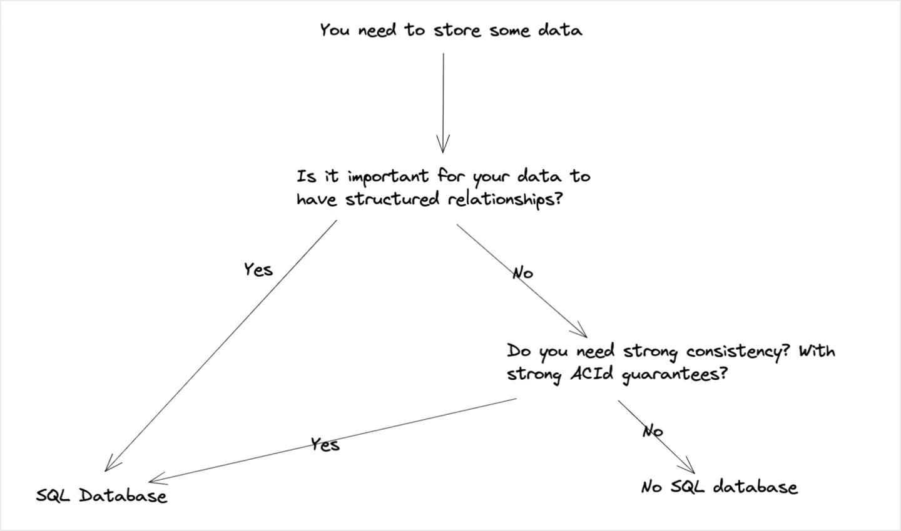
### SQL DB 
* SQL that searches for the data that you want without having to write custom code. This is an advantage over time because the compiler that transforms your SQL query into machine code can be optimized
* SQL has stronger ACID guarantees
* SQL with B plus trees index, means slower when ingestion compared to NOSQL db，it uses
log to append，it is sequential disk write rather than the b plus tree will trigger 
random disk IO and write Amplification，the reason of random disk io is the pages it going 
to write are not sequential。the reason of write amplification is if it is going to modify
one record in that page，will need to rewrite the whole page。
* SQL has higher latency，This is because strong consistency requires that the database lock particular fields when it is being modified.
* SQL not work well in mixed schema，because if a new val is introduced，it will update the data
in all nodes，this is time consuming。

### NOSQL
* faster for writes but slower for read
* flexible data models
* easy to scale 
* machine cost is usually cheaper
* LSMT data structure and how compaction and SS tables improve efficiency
* not suitable for strong consistence
* usually not support complicated query。

## web security
### rainbow table
彩虹表（Rainbow Table）是一种用于密码破解的工具。它通过预计算常见密码的哈希值，并将这些哈希值存储在一个表中，使得在进行密码破解时，可以快速查找已知哈希值对应的密码。彩虹表利用了时间-空间权衡（time-space tradeoff），在预计算阶段花费大量时间生成哈希值表，从而在破解阶段节省时间。

#### 防御方法
为了防止密码被彩虹表破解，可以采取以下防御措施：

* 使用强密码：使用长度较长、复杂度较高的密码，增加彩虹表生成的难度。

* 使用盐值：在生成密码哈希值时加入盐值，使得同一密码在不同的盐值下生成不同的哈希值，增加破解难度。

* 多次哈希：对密码进行多次哈希处理，增加破解难度。
### salting
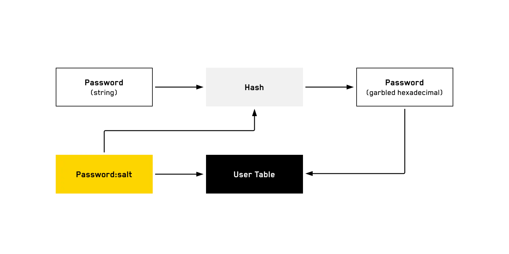

Say we use ten random characters as our salt, and user A's password salt is "a8h2rmd1tb". User A's password is "password123". If an attacker obtains the credential database, they will certainly have the hash of "password123" in their rainbow table. But they almost definitely will not have the hash of "password123:a8h2rmd1tb" in their rainbow table, which means they won't be able to derive user A's password from the table
### session tokens
作为后续的密码凭证, 因为用户不需要每次都提交密码了, simple way to track authentication is to generate a token the user can submit with subsequent requests to track that they are, in fact, signed in. This token should be randomly generated—be sure to use a secure random number generator—and long enough to be infeasible to brute force

* Don't store the token in your database in plain text, but rather salt and hash it the same way you would a password. Session tokens should also come with an expiration date, as short as it can

### json web tokens
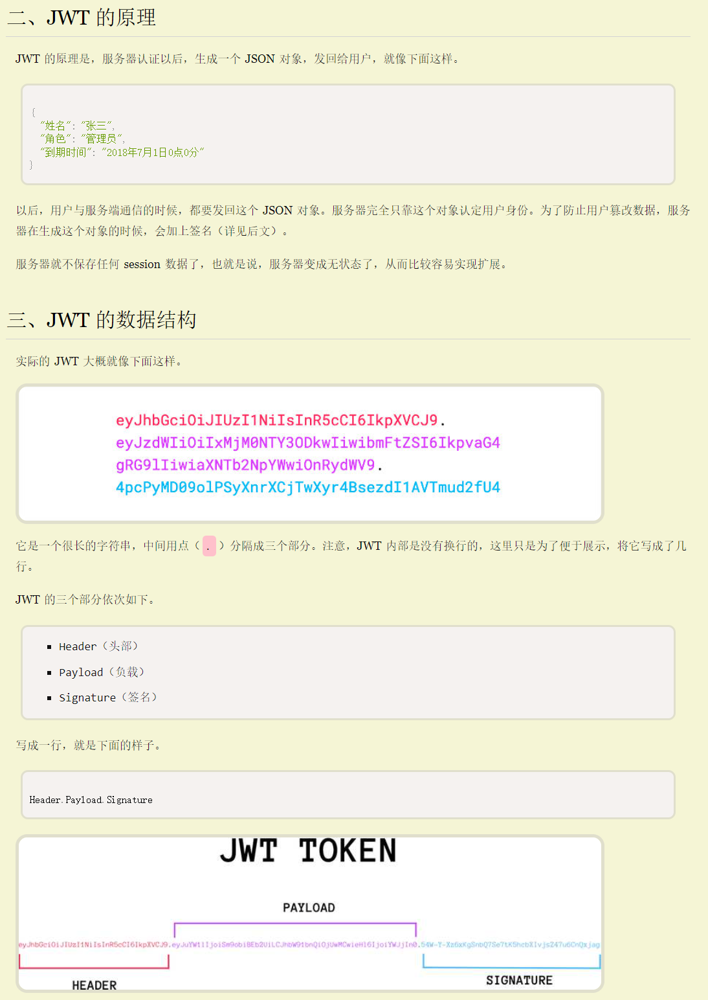
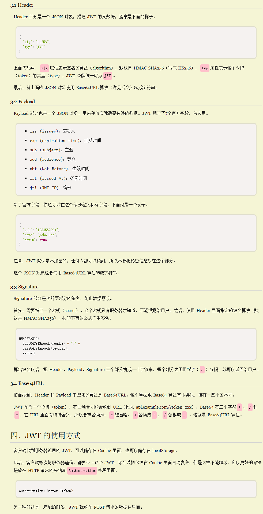
#### 解决的问题
解决的是跨域名登录的问题, 用户在一个网站登录之后, 其他网站也能免密登录, 如果不用JWT 等方法, 就需要把session 数据共享, 有个数据库共享所有session, 另一种方案是服务器索性不保存 session 数据了，所有数据都保存在客户端, JWT 就是这种方案的一个代表。

#### 特点
（1）JWT 默认是不加密，但也是可以加密的。生成原始 Token 以后，可以用密钥再加密一次。

（2）JWT 不加密的情况下，不能将秘密数据写入 JWT。

（3）JWT 不仅可以用于认证，也可以用于交换信息。有效使用 JWT，可以降低服务器查询数据库的次数。

（4）JWT 的最大缺点是，由于服务器不保存 session 状态，因此无法在使用过程中废止某个 token，或者更改 token 的权限。也就是说，一旦 JWT 签发了，在到期之前就会始终有效，除非服务器部署额外的逻辑。

（5）JWT 本身包含了认证信息，一旦泄露，任何人都可以获得该令牌的所有权限。为了减少盗用，JWT 的有效期应该设置得比较短。对于一些比较重要的权限，使用时应该再次对用户进行认证。

（6）为了减少盗用，JWT 不应该使用 HTTP 协议明码传输，要使用 HTTPS 协议传输。

## 缓存
本质上，这正是缓存的含义：存储昂贵的计算，以便您不必再次计算。

### 为什么要使用缓存, 减少昂贵的网络计算、网络调用、数据库查询或资产获取的延迟。

一般情况下，缓存的使用是以牺牲更多存储空间（或更多内存）为代价的。一般我们将其存储在内存（RAM）中，但也可以存储在磁盘上。

### redis
票hold 十分钟的功能, 过了十分钟不支付就释放, 可以设置redis 的key , 使用lua 脚本实现到期后回调, 
### 80/20 规则：您希望将 80% 的读取请求存储在 20% 的cache 中。只存热门数据, 使用Least at used 实现只存热门

80/20 rule: You want to store 80% of read requests in 20% of storage (or memory). Typically, these are the most popular requests.

### 缓存离用户越近, 就越高效(The closer the cache is to the user, the more efficient it is)
面试的时候要提一嘴这个, 在用到cache 的时候
### Write-through and Write-back patterns
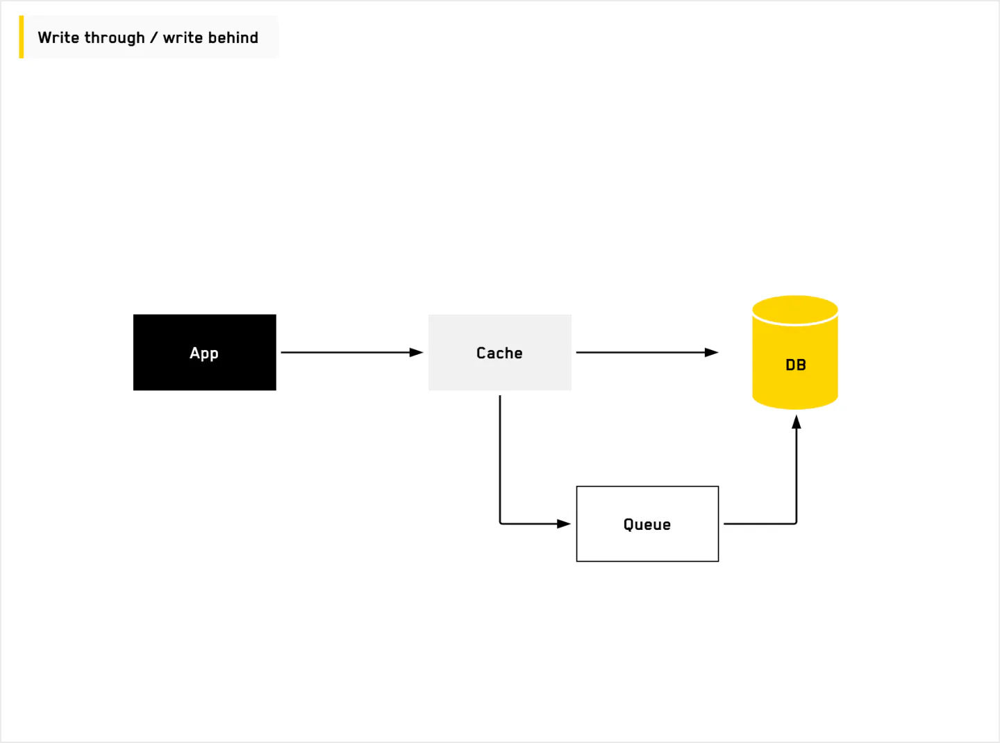
the application directly writes the data to the cache. And then the cache synchronously (or asynchronously) writes the data to the database. When we write it synchronously it’s called “write-through,” and when we write it asynchronously it’s called “write-back” (or “write-behind”). In the asynchronous example, we put the data in a queue, which writes the data back to the database and improves the latency of writes on your application.

### disadvantage
* cache unnecessary data
*  if the database goes down before the data is written to the database, this causes inconsistency.
### message queue
#### 根据消息队列的不同实现，可以有以下属性的不同组合

1. Guaranteed delivery.
2. No duplicate messages are delivered.
3. Ensure that the order of messages is maintained.
4. At least once delivery with idempotent consumers.

#### 消息队列的引用原因
当有以下几种原因出现的时候会引用 MQ
1. decouple the producer and consumer, producer do not need to care about how to consume
2. asynchronous processing
3. persist the msg, then will be multiple consumers to consume
4. can easily scale the consumer to handle large traffic
 
### replication
#### single leader
#### multiple leaders
##### Conflict resolution for concurrent writes
1. Keeping the update with the largest client timestamp.
2. Sticky routing—writes from same client/index go to the same leader.
3. Keeping and returning all the updates.

#### Leaderless 
P2P, block chain
#### 目标

1. 避免单点故障并提高机器故障时的可用性。
2. 为了更好地服务全球用户，通过按不同的地理位置组织副本来为附近的副本的用户提供服务。
3. 提高吞吐量。机器越多，可以满足的请求就越多

### hash
#### 一致性hash
* 一致性hash，除了可以解决hash重分配的问题，还可以解决热点问题，因为可以加虚拟节点

* 一致性hash 也可以做多副本，把多副本顺时针分配要多个节点即可

#### hash 冲突
Hash 冲突可以通过数据库再原数据上加一列随机字符串解决，原key不变，如果有hash冲突也新生成一个随机字符串，整体hash得到一个val，然后外界还是可以通过查表原有的key找到val

#### merkle tree
* 使用merkle tree检测大型数据结构是否有不一致
A hash tree or Merkle tree is a tree in which every non-leaf
node is labeled with the hash of the labels or values (in case of leaves) of its child nodes.
Hash trees allow efficient and secure verification of the contents of large data structures”.
### ratelimiter
* 令牌桶

最好用的限流算法是token bucket 
桶里积累的令牌可以应对burst traffic 

### 热点问题
* 可以监测热点key , 然后有热点, 后端服务推送所有服务器

* 应用侧的cache + cache 集群, 在应用侧cache 按照另一个key 进行shard

* 一致性hash，解决热点问题，因为可以加虚拟节点

### data partitioning

* 说分区的时候最好说要注意热点问题

we better to design a good key partitioning strategy to reduce the hotspot.
## 常见系统设计题目
### 视频存储类题目
#### 需要视频转码, 用户上传之后使用专门的硬件去更新这个视频, 更新视频的新的位置, 为了转换成cpu 的格式, 省cpu, gpu 比较贵

### topK 设计问题

#### 多层过滤, 提前聚合
it is similar like the combination phase in the map-reduce, agg as early as it can, then output the agg data
to the downstream, finally only a small fraction of data will arrive at the DB

### 设计一个支付系统
通常要求是接受客户的请求, 请求第三方支付系统完成支付, 要求exactly once

#### 异步处理
先使用 idempotent key 记录数据库后, 再请求第三方, 根据可重试请求和不可重试请求进行重试

#### RPC 调用下游银行和记录幂等性操作的前置操作分开, 避免RPC 受到攻击

[引用自airbnb payment service](https://medium.com/airbnb-engineering/avoiding-double-payments-in-a-distributed-payments-system-2981f6b070bb#id_token=eyJhbGciOiJSUzI1NiIsImtpZCI6ImMzYWJlNDEzYjIyNjhhZTk3NjQ1OGM4MmMxNTE3OTU0N2U5NzUyN2UiLCJ0eXAiOiJKV1QifQ.eyJpc3MiOiJodHRwczovL2FjY291bnRzLmdvb2dsZS5jb20iLCJhenAiOiIyMTYyOTYwMzU4MzQtazFrNnFlMDYwczJ0cDJhMmphbTRsamRjbXMwMHN0dGcuYXBwcy5nb29nbGV1c2VyY29udGVudC5jb20iLCJhdWQiOiIyMTYyOTYwMzU4MzQtazFrNnFlMDYwczJ0cDJhMmphbTRsamRjbXMwMHN0dGcuYXBwcy5nb29nbGV1c2VyY29udGVudC5jb20iLCJzdWIiOiIxMTQ3MDM0MzQyMjQyMjg4MjM1MzQiLCJlbWFpbCI6IjEyMzk1NjI1MDhndWdlQGdtYWlsLmNvbSIsImVtYWlsX3ZlcmlmaWVkIjp0cnVlLCJuYmYiOjE3MTg2ODA2ODAsIm5hbWUiOiJKZWRpIEtuaWdodCIsInBpY3R1cmUiOiJodHRwczovL2xoMy5nb29nbGV1c2VyY29udGVudC5jb20vYS9BQ2c4b2NLQm5WbVZweDdhM0hvbVRDZVFYMmJBR3VwOFpOMzI2N0ViTnY2SzhkR1Z3cWxkX2c9czk2LWMiLCJnaXZlbl9uYW1lIjoiSmVkaSIsImZhbWlseV9uYW1lIjoiS25pZ2h0IiwiaWF0IjoxNzE4NjgwOTgwLCJleHAiOjE3MTg2ODQ1ODAsImp0aSI6ImUzNTgxZmIyYjI4MmJlZjY5YmNhYjM2YzQ5ZWI0OWU1ZWU2MjcxMzUifQ.m4AiCILALwd6YdYjLmhngPLfLu3vXle0TTUxtaTEIVwmlHJRuqjYglm5LCJtBGsMW-nttQbowi8DsopQJ1nSP4CJ8crlN3rRE01MWlUWRnTM-9sjQ8Ez_IxqLVx68nt1coC3m84fXTBDp0JMjCcxPiutK59VmcPPhK5slCm7mMjFCtvi1OqB0Nff6U7P0vywDtPXMoH_2jMAtyPj3TzndIHLr-ywxPEY9CyvKaRt4xNJLoE8z_ILUMW576AwFiCvBYTUQveqIgRFqVA51J96maV9KtJzHce58tJt7b_PJstM-7Zp59hxtF_IwupHAY1BLGFwqiGYkIapiT-dVbgvUQ)
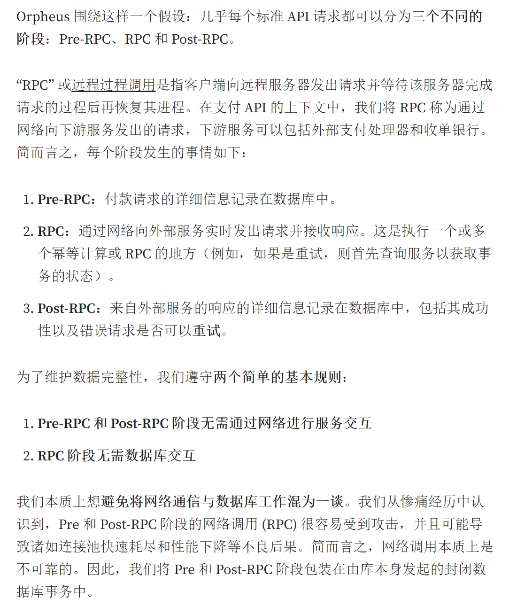

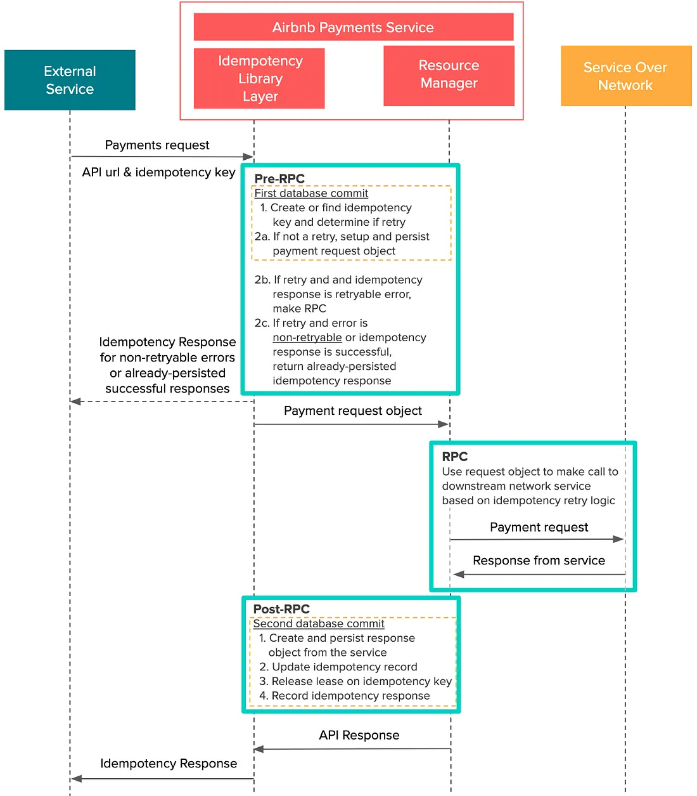

#### 记录 idempotent key 的数据库操作要和其他相关操作, 合并到同一个数据事务中
就是pre-commit 只能由一个数据库事务组成, 不能分开多个, 否则不能保证原子性, 原理同kafka commit
#### 如何避免客户端的多次无效重试呢
1. 限流可以避免恶意的, 通过LB 实现
2. 如果是正常的提交重试, 如果前面已经有个请求在pending 了, 则可以检查后直接返回特定错误码告诉客户端晚一点重试, too many request 之类的

#### 记录从第三方返回的response, 以便后续直接根据相同的请求返回给客户端. 

#### sticky to master
prevent the data lag between the master and slave

#### 如何避免两个请求同时执行, 可以采取数据库加锁的方式

# 参考资料
## 阿里云这里有常见的业务系统的设计方案

https://help.aliyun.com/zh/tablestore/use-cases/scheme-analysis?spm=a2c4g.11186623.0.i5
# 性能指标
## 硬件的性能

参考: https://www.cs.cornell.edu/projects/ladis2009/talks/dean-keynote-ladis2009.pdf
* 每年的延迟分布情况:https://colin-scott.github.io/personal_website/research/interactive_latency.html

## 框架的性能


# 系统设计


## 要点
* 系统设计面试题的时候, 最重要的就是搞清楚问题和需求, 不做任何假设, 并且直接在对话框进行写, 如果说不用写, 就可能不需要回答这么细, 但为了保证自己的思路, 在自己的记事本上写. 如果一开始有多个方案多个思想, 可以说有多个方案, 一个个说; 
* 说白了任何系统设计都是涉及到写, 存储, 读, 
* 分布式系统最重要的就是要能水平扩展, 否则找个 mysql 存了任何业务问题都能解决. 写, 存储, 读都要能水平扩展. 
## 写
常见的就是 LSM 思想, 写WAL 和内存, 写 WAL 是顺序写, 将随机写转变为顺序写和内存写

## 存储
考虑数据如何分区, 如何复制, 如何设计表, 如何保持数据一致性, 这个一致性根据业务常见和读的需求不同而不同

## 读
如何保证性能, 如何保证符合业务要求的数据一致性, 例如转账是必须两边都要看到同样的符合转账记录的数据. 
### 数据分区(parition)
就是把热点数据分开, 让读写都可以水平扩展, 通过把数据分散到多台机器, 分布式解决单机的瓶颈问题
* 如何思考具体的分区策略呢

就是看热点数据是哪种, 怎么设定 key, 指定什么策略才能把热点 key 分散. 

* 数据密集型系统笔记-数据分区

  https://github.com/Knight-Wu/articles/blob/master/books/data_intensive_system_book_notes/chapter6_%E5%88%86%E5%8C%BA.md

## 异地多活的方案
### 同城灾备
* 热备冷备的区别

热备指的是不光备份数据, 应用层接入层等都准备好, 秒级别切换到另一
个机房的服务, 而冷备只备份数据, 另一套机房没有完全的服务, 可能
切换机房之后延迟较大.


如果 A 机房真挂掉了，要想保证服务不中断，你还需要在 B 机房「紧急」做这些事情：

1. B 机房所有从库提升为主库
2. 在 B 机房部署应用，启动服务
3. 部署接入层，配置转发规则
4. DNS 指向 B 机房接入层，接入流量，业务恢复
看到了么？A 机房故障后，B 机房需要做这么多工作，你的业务才能完全「恢复」过来。

你看，整个过程需要人为介入，且需花费大量时间来操作，恢复之前整个服务还是不可用的，这个方案还是不太爽，如果能做到故障后立即「切换」，那就好了。

因此，要想缩短业务恢复的时间，你必须把这些工作在 B 机房「提前」做好，也就是说，你需要在 B 机房提前部署好接入层、业务应用，等待随时切换。架构就变成了这样：
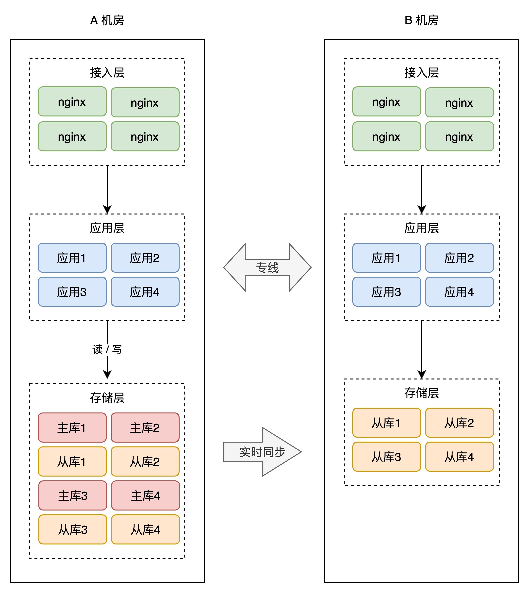

* 但是为了不浪费B 机房的资源, 会让B 机房服务一部分请求, 如下图:

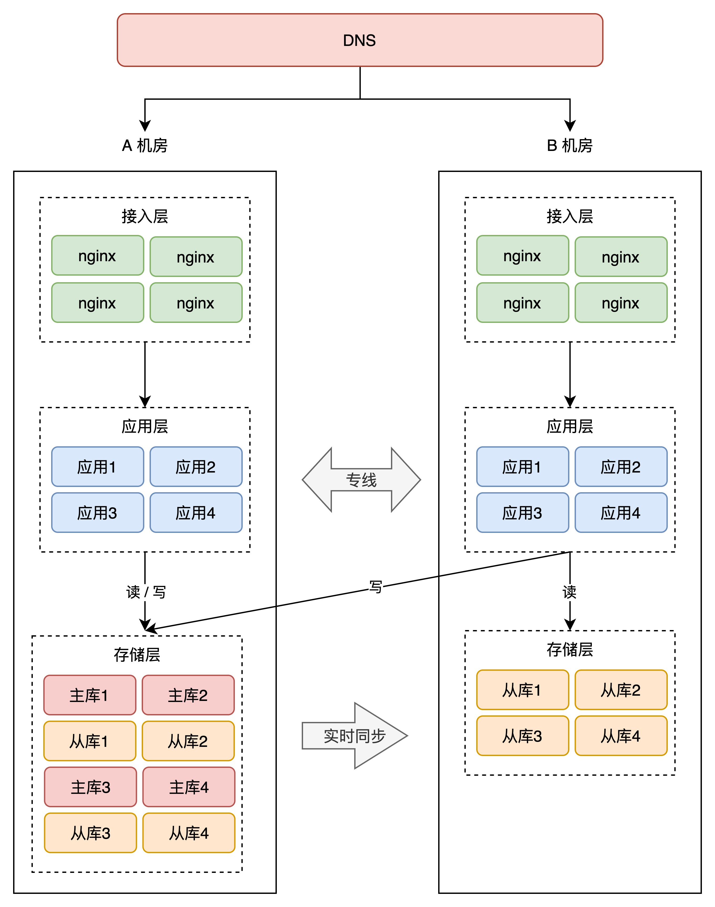


### 异地多活

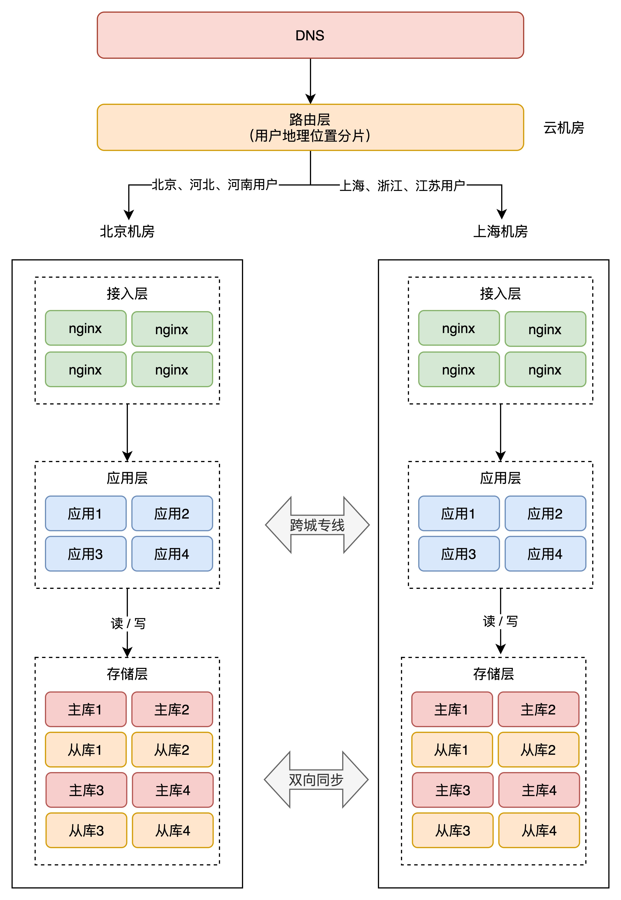

* 两个机房就近服务用户
* 数据库双主模式, 但是没法做到实时同步, 备份数据有一定延迟, 没法做到秒级切换, 可以在同城有双机房的情况下, 作为核心业务的最后的一道保障
* 规避同城的自然灾害
* 需要保证单个核心业务的整个过程，要在一个机房中完成，不允许跨机房调用。这个原则是为了保证实时性，不依赖另外一个机房的服务，才能保证没有延迟

* 如何解决用户之前在上海登录, 然后把密码给了在西藏的朋友, 然后再西藏
登录的问题, 

  * 如果是根据用户的地理位置来路由, userId 按照地理区域来生成, 比如 userId 是一个字符串, 有八个地理区域, 每个区域管理八分之一的 userId, 拿到 userId 就可以知道用户的数据在哪个地理区域, 然后再由这个地理区域的总路由去分配到具体的机房. 
  * 类似 DNS, 本地机房没有, 向上层发起请求, 一直找不到就最上层会广播请求到各地机房, 最后找到用户的数据所在的机房

  * 根本来说是 CAP 的 一致性(C)和可用性(A) 不能同时满足
   
   因为如果要求强一致, 那么数据同步时副本是要被锁住的, 否则会读到同步一半的数据, 被锁住的时候就不能读, 失去了可用性, 所
   以要求一致性强的场景, 就必须回到数据原来的机房去读取, 延迟提高就是失去了一部分的可用性, 是避免不了的; 如果就近读取副
   本可能读取到不一致的数据, 因为分区容错(P) 是肯定会发生的, 肯定会有同步失败的场景, 那么选择了就近读取(AP)就要接受
   数据不一致 
#### Mysql 数据复制工具 DRC 

* 如何解决 ID 冲突

Mysql 的数据量最大，每个机房产生的数据，都通过 DRC 复制到其他 zone，每个zone的主键取值空间是 zoneid + 固定步长，所以产生的 id 各不相同，数据复制到一起后不会发生主键冲突。

* 同一行数据发生了多个区域的写入怎么办

按照分区规则，正常情况下，每个 zone 只会写入自己的数据，但万一出现异常，2个 zone 同时更新了同一笔数据，就会产生冲突。DRC 支持基于时间戳的冲突解决方案，产生数据时会带上生成数据的时间戳, 当一笔数据在两个机房同时被修改时，最后修改的数据会被保留. 

## 设计一个分布式限流器.
分为中心化的和去中心化的

### 中心化
中心化的就是依赖一个分布式的数据库, 每个需要限流的业务分配一个唯一的 key, 根据这个 key 请求, 判断是否达到了限流的上限

* 数据分区

根据 key 做 hash 分区, 

* 如何保证各个实例承载的压力一致呢?

由于限流请求很简单, 每个实例所能承载的限流 TPS 是固定的, 那么注册这个 key 的时候会知道需要支持多少 qps, 如果多个 key 的 qps 超过这个实例所能承载的上限就换到其他实例

* 数据访问

直接访问内存的数据结构, 如令牌桶和漏桶, 区别就是令牌桶会根据 tps 定期新增令牌, 能应对徒增; 漏桶就是严格控制请求平均; 内存的数据结构定期同步到磁盘, 但是对于某个 key 来说, 数据只在一个实例有单点问题, 那么就需要副本形成一个 replica group, 做数据拷贝</br>

* 数据同步的协议, 访问不了集群的情况. 

一般是主从同步, 但是这样开销比较大, 如果有 n 个副本, 则某个限流请求要访问 n+1 个实例, 都访问成功之后, 才能保证数据是同步的, 在限流这个场景对数据的精确度要求没这么高, 因为限流的数值一般是会留有 30% 的余地, </br>
所以应该是主副本定期将数据同步磁盘的时候, 同步到另外一个副本, 能容忍一次故障, 在副本数据跟主副本有延迟的情况下, 选择保守的策略, 偏向于将限流值调低, </br>
如果集群 down 或者多个实例挂掉的情况, 客户端应该能 failover 使用本地的限流器进行粗粒度的单机限流, 例如有一个转发层, 可以定期把key 对应的内存中限流的数据结构返回给客户端, 对于某个客户端来说只保留自己的 key 的限流数据, 在集群访问不了的情况下进行 failback

## 设计一个推特(feed 流系统)
### 详细设计
* 数据估算: 10,0000,0000 注册 user, 活跃用户 421 million monthly active users in 2023 and about 220 million daily actives
* write : 600 tweet /s, 
* read: 60 0000 tweet /s, 
* tweet size: 280 character, 140 Chinese word, assume 0.2 kb


assume pull 5 tweets per fresh

#### 架构图
```
@startuml
phone -> loadBalance(nginx): 鉴权(包括给访问 cdn 的数据授权), 转换协议, 应对攻击, cpu 用在处理连接  
phone -> CDN: get video and img: 推特内容可能才两百字节, 存 CDN 提升不大. 
loadBalance ->  backendService: 做具体的写入和查询, 属于逻辑层, 可以在应用服务器加缓存, 减少对 cache 服务的压力. 
backendService -> StorageService: 存储层, 包括 cache 和数据库
@enduml

```


#### post api
 
post api, post with userId, content from client -> validation service -> storage service 
stoage service : 
1. gen tweet id 
2. 查 followRelation 获取被关注者 id list, 然后写 tweetId kv, append , 如果是大 v 则不写 tweetID kv
3. 写 userId kv
4. 写 tweetMeta kv

5. send to content to oss , save cost


 #### pull api

login serivce, validate -> pull api, query with timestamp, userId from client -> query service

query service:


1. query tweetId kv db, key is userId, val is 被关注者发帖的帖子 id list, 按照时间戳倒序排, 每次被关注者发帖的时候都会更新这个列表, 除了大 v, 如果关注者里面有大 v, 需要专门根据大 v 的 userID 查 tweetMeta kv, </br>
如果没有大 v, 就走 3, 实际上是 push 模式, 但是如果关注者很多几千个, 解决不了一下归并几千个 帖子 id lsit 的问题, 不知道哪些可以跳过, 不知道他们时间分布的情况, 而且读远多于写, 优化读取路径会性价比更高


2. query tweetMeta kv db, userid -> 自己发帖的 tweet id(including timestamp, meta) list, sorted, 每个 list 取五条, return query service a merge sorted list
2.1 写入的时候先写 cache, 再写 db, 查询也是先查 cache, 除非 cache 查不到,会造成部分用户看到最新帖子部分看不到 , 差异在秒级. 某个热点的 userId 集中在 redis 的某个机器, 可以添加读副本, 并且在上一层逻辑层的服务器内存加一层缓存, 因为应用服务器那层对某个 userId 的查询是分散在多台机器的, 
2.2 支持一直刷新, 类似深翻页:
 query the last tweet id list from lastedReturnId, 存储结构支持类似 skip list , index: range index, 因为 tweet id 肯定有序, 一个 chunk 指定开始 id 和结束 id, 就可以马上定位到哪个 chunk 包含需要的 id, 

2.3 如果大 v 的 userId 存在热点问题, 可以通过在 queryService 在应用服务器内存加缓存, 或者 tweetMeta kv 增加读的副本数解决吗, 如何感知某个 key 分布在多个 data partition 呢


3. query service 查询 tweet content by id, 
3.1 content cache 在 oss 前面,  tweetId is key, val is content, redis, 异步更新, 网红的 tweetId 会成为热点需要有多个副本都可以读取的能力. 

3.1 与 2.1 要先更新 3.1 保证能根据 id 找到 content, 如果实在找不到 content, 再去 query service 拿一个新的 id 会增加 RTT, 
所以可以查 10 个 content, 如果最新的五条能返回就直接返回, 如果某一条找不到 content, 就返回第六新的 content. 


4. get the 帖子内容从 oss, 并发的, 只需要等最新的五条, return to client

#### 写流程
1. 生成帖子 id, LSM 模式写入, 分区策略
#### 读流程
1. 根据用户 id 查询帖子, 然后 merge 排序展示. 
### 系统分类

Feed流种类较多，可根据接收的数据和关系数据进行分类。

根据接收数据的展示排序方式可以分为：
</br>
基于时间的Timeline：按发布的时间顺序排序，最后发布的排列在最上方，类似于朋友圈、微博，是最常见的Feed流形式。
</br>
基于推荐的Rank：按非时间的因子排序，例如按照用户的喜好度排序，选择出用户最想看的Top N结果排在上方。应用场景包括视频推荐、资讯推荐、商品推荐等。
</br>
根据用户数据中的关注关系可以分为：
</br>
单向关系系统：用户之间的关系有向，用户可以单方面关注另一个用户。因此系统中可能会存在大V，即有很多粉丝的用户。主要产品有微博、抖音等。
</br>
双向关系系统：用户之间的关系无向，用户建立关系后成为好友，即可互相交流，因此系统中不存在大V和粉丝的概念。用户使用此类产品时，会对时效性有更高的要求。主要产品有朋友圈、私信等。


### pull 模式, 读扩散

每一个内容发布者都有一个自己的发件箱（“我发布的内容”），每当我们发出一个新帖子，都存入自己的发件箱中。当我们的粉丝来阅读时，系统首先需要拿到粉丝关注的所有人，然后遍历所有发布者的发件箱，取出他们所发布的帖子，然后依据发布时间排序，展示给阅读者。
</br>
这种设计，阅读者读一次Feed流，后台会扩散为N次读操作（N等于关注的人数）以及一次聚合操作，因此称为读扩散。每次读Feed流相当于去关注者的收件箱主动拉取帖子，因此也得名拉模式。
</br>
这种模式的好处是底层存储简单，没有空间浪费。坏处是每次读操作会非常重，操作非常多。设想一下如果我关注的人数非常多，遍历一遍我所关注的所有人，并且再聚合一下，这个系统开销会非常大，时延上可能达到无法忍受的地步。
</br>因此读扩散主要适用系统中阅读者关注的人没那么多，并且刷Feed流并不频繁的场景。

### push 模式, 写扩散


据统计，大多数Feed流产品的读写比大概在100:1，也就是说大部分情况都是刷Feed流看别人发的朋友圈和微博，只有很少情况是自己亲自发一条朋友圈或微博给别人看。
</br>因此，读扩散那种很重的读逻辑并不适合大多数场景。我们宁愿让发帖的过程复杂一些，也不愿影响用户读Feed流的体验，因此稍微改造一下前面方案就有了写扩散
### pull 和 push 模式结合


当何炅这种粉丝量超大的人发帖时，将帖子写入何炅的发件箱，另外提取出来何炅粉丝当中比较活跃的那一批（这已经可以筛掉大部分了），将何炅的帖子写入他们的收件箱。
</br>当一个粉丝量很小的路人甲发帖时，采用写扩散方式，遍历他的所有粉丝并将帖子写入粉丝收件箱。

对于那些活跃用户登录刷Feed流时，他直接从自己的收件箱读取帖子即可，保证了活跃用户的体验。
</br>
当一个非活跃的用户突然登录刷Feed流时，我们一方面需要读他的收件箱，另一方面需要遍历他所关注的大V用户的发件箱提取帖子，并且做一下聚合展示。
</br>在展示完后，系统还需要有个任务来判断是否有必要将该用户升级为活跃用户。因为有读扩散的场景存在，
</br>因此即使是混合模式，每个阅读者所能关注的人数也要设置上限，例如新浪微博限制每个账号最多可以关注2000人。
</br>如果不设上限，设想一下有一位用户把微博所有账号全部关注了，那他打开关注列表会读取到微博全站所有帖子，一旦出现读扩散，系统必然崩溃；即使是写扩散，他的收件箱也无法容纳这么多的微博。

读写混合模式下，系统需要做两个判断。一个是哪些用户属于大V，我们可以将粉丝量作为一个判断指标。另一个是哪些用户属于活跃粉丝，这个判断标准可以是最近一次登录时间等。

#### 如果使用大V/普通用户的切分，架构存在一定风险
例如某个大V突然发了一个很有话题性的Feed，那么就有可能导致整个Feed产品中的所有用户都没法读取新内容。以粉丝读取流程为例：

大V发送Feed消息。

大V使用拉模式。
</br>
大V的活跃粉丝（用户群A）开始通过拉模式读取大V的新Feed。有可能这部分用户可以在收件箱直接读取大 v 信息(提前写入), 毕竟是活跃用户
</br>
Feed内容太有话题性，快速传播。
</br>
未登录的大V粉丝（用户群B）开始登录产品，登录进去后自动刷新，再次通过拉模式读取大V的发件箱。
</br>
非粉丝（用户群C）去大V的个人页Timeline里面去围观，再次需要读取大V个人的Timeline，同读发件箱。
</br>
结果就是，平时正常流量只有用户群A，结果现在却是用户群A + 用户群B + 用户群C，流量增加了好几倍，甚至几十倍，导致读3路径的服务模块被打到server busy或者机器资源被打满，导致读取大V的读3路径无法返回请求。如果Feed产品中的用户都有关注大V，那么基本上所有用户都会卡死在读取大V的读3路径上，然后就没法刷新了。

##### 解决思路
  * 单个模块的不可用，不应该阻止整个关键的读Feed流路径。如果大V的无法读取，但是普通用户的要能返回，等服务恢复后，再补齐大V的内容即可。
  * 限流: 当模块无法承受这么大流量的时候，模块不应该完全不可服务，而应该能继续提供最大的服务能力，超过的拒绝掉。
###### 一个将用户帖子分散开, 提升读写的并发能力
因为大 v 采用 pull 模式, 可能存在某个大 v 的数据集中在某台机器造成热点, 所以让某个用户的帖子存在于多个 parition , 可以水平扩展, 增加读写并发度</br>
帖子 id = 用户 id + seqId, can get which data partitions to store those tweet when specify userId, 例如先通过 user id 做 hash 然后得到 prefix, 
</br> 每个 partition id 由 prefix 和 suffix 构成, 那么可以根据 prefix 定位这些 parition 在哪, 然后剩下的在某个 parition 中根据 userId 做扫描, 就是单机数据库的问题了
</br>
假设某个大 v 有 n 个 partition, 然后根据seqId 取模写入, 某个大 v 的 partition 应该不需要很多, 因为发帖很少, 总集群的 partition 数量根据所需的写入能力而定
</br> 一般都是写入数据写入 log 多副本之后, 就可以返回成功了, log 多副本因为顺序写磁盘加上写内存, 顺序写磁盘不会比内存慢多少, 就是一个 LSM 的架构. 
</br>
读取的时候每个 partition 读前5 条最新的, 假设第一页是五条, 最后在 merge, 因为每个 parition 的读取是并行的, 可以水平扩展, 读取时间取决于最慢的那个partition, 最后再按时间 merge, 而且大 v 的数量有限, 按大 v 的热度排序, 取最热的一批大 v, 把最新五条帖子写入缓存, 直到用完缓存, 
### 读写 feed 流程
#### 发布Feed流程
当你发布一条Feed消息的时候，流程是这样的：
1. Feed消息先进入一个队列服务。
2. 先从关注列表中读取到自己的粉丝列表，以及判断自己是否是大V。
3. 将自己的Feed消息写入个人页Timeline（发件箱）。如果是大V，写入流程到此就结束了。还可以将大 V 的帖子写入活跃粉丝的收件箱, 降低大 v 发热门贴时的读取压力. 
4. 如果是普通用户，还需要将自己的Feed消息写给自己的粉丝，如果有100个粉丝，那么就要写给100个用户，包括Feed内容和Feed ID。
5. 第三步和第四步可以合并在一起
6. 发布Feed的流程到此结束。

#### 读取Feed流流程
当刷新自己的Feed流的时候，流程是这样的：
1. 先去读取自己关注的大V列表
2. 去读取自己的收件箱，只需要一个GetRange读取一个范围即可，范围起始位置是上次读取到的最新Feed的ID，结束位置可以使当前时间，也可以是MAX，建议是MAX值。
3. 如果有关注的大V，则再次并发读取每一个大V的发件箱，如果关注了10个大V，那么则需要10次访问。
4. 合并2和3步的结果，然后按时间排序，返回给用户。


### 动态列表分页问题
传统的前端分页参数使用page_size和page_num，分表表示每页几条，以及当前是第几页。对于一个动态列表会有如下问题：


在T1时刻读取了第一页，T2时刻有人新发表了“内容11”，在T3时刻如果来拉取第二页，会导致错位出现，“内容6”在第一页和第二页都被返回了。事实上，但凡两页之间出现内容的添加或删除，都会导致错位问题。

为了解决这一问题，通常Feed流的分页入参不会使用page_size和page_num，而是使用last_id来记录上一页最后一条内容的id。前端读取下一页的时候，必须将last_id作为入参，后台直接找到last_id对应数据，再往后偏移page_size条数据，返回给前端，这样就避免了错位问题。

### 如何做sharding
例如推特表，存所有推文。userid 分表，某个网红就是热点；时间分表，读写最近是热点；比较好的是 userId+发帖时间戳 分表，最近一天的数据作为热数据分shard，比如100 个shard，然后hash 到不同shard，如果是hash 就要读多份，如果是range 就是有热点，为了读的体验，只能是range 写多份，读只读多数副本已经提交了的，类似kafka 的water mark。

### 优先级队列合并多个排序列表
```
// 用链表连接每个用户发的推特, 获取关注列表的所有推特, 就可以用优先级队列合并多个有序列表
public List<Integer> getNewsFeed(int userId) {
    List<Integer> res = new ArrayList<>();
    if (!userMap.containsKey(userId)) return res;
    // 关注列表的用户 Id
    Set<Integer> users = userMap.get(userId).followed;
    // 自动通过 time 属性从大到小排序，容量为 users 的大小
    PriorityQueue<Tweet> pq = 
        new PriorityQueue<>(users.size(), (a, b)->(b.time - a.time));

    // 先将所有链表头节点插入优先级队列
    for (int id : users) {
        Tweet twt = userMap.get(id).head;
        if (twt == null) continue;
        pq.add(twt);
    }

    while (!pq.isEmpty()) {
        // 最多返回 10 条就够了
        if (res.size() == 10) break;
        // 弹出 time 值最大的（最近发表的）
        Tweet twt = pq.poll();
        res.add(twt.id);
        // 将下一篇 Tweet 插入进行排序
        if (twt.next != null) 
            pq.add(twt.next);
    }
    return res;
}

class Tweet {
    private int id;
    private int time;
    private Tweet next;

    // 需要传入推文内容（id）和发文时间
    public Tweet(int id, int time) {
        this.id = id;
        this.time = time;
        this.next = null;
    }
}


class User {
    private int id;
    public Set<Integer> followed;
    // 用户发表的推文链表头结点
    public Tweet head;

    public User(int userId) {
        followed = new HashSet<>();
        this.id = userId;
        this.head = null;
        // 关注一下自己
        follow(id);
    }

    public void follow(int userId) {
        followed.add(userId);
    }

    public void unfollow(int userId) {
        // 不可以取关自己
        if (userId != this.id)
            followed.remove(userId);
    }

    public void post(int tweetId) {
        Tweet twt = new Tweet(tweetId, timestamp);
        timestamp++;
        // 将新建的推文插入链表头
        // 越靠前的推文 time 值越大
        twt.next = head;
        head = twt;
    }
}

```
## 求一个在线系统的某个时间段的最大在线人数和某个时刻的在线人数

给出的条件是一个日志数组 loga ，每个数组元素有三个属性，一个是用户id，一个是登陆时间 s，一个是登出时间 e。
不需要排序，用空间换时间，用一个时间数组 ta ，假设一天 x 秒，那么就是一个x 个元素的数组，遍历日志数组，
for l : loga{
    ta[s]++;
    ta[e]--;
}
某个时间点tx 的在线人数就是sum(ta[t], t从0 到tx),
某个时间段 t1 - t2的最大在线人数，
for t=t1;t <= t2; t++{
    用第一个式子求出ta[t1] 之后，再依次累加ta[t] , 并保留最大值即可.
}

## 秒杀系统, 抢红包系统
微信红包分为发, 抢, 拆, 看到领取结果几个阶段, 
发就是发一条特殊类型的消息到群聊里, 
然后抢可以设计为有个队列, 按照用户请求的顺序排队, 然后进队列前和后判断红包有没有抢完, 如果还有红包就到拆的页面, 就是多个请求并发 CAS 获取红包金额, 减红包数量, 红包的随机金额是根据发红包的时候
就计算出来的, 提前计算好, 有最大和最小值, 就是个随机序列, 然后CAS 成功就加一条红包记录, 就返回用户成功, 至于到账就是异步的, 可以在页面提醒高峰时到账慢或者只是简单加当前设备的余额

* 如何避免请求过多呢

因为先进队列, 后续并发CAS 是可以控制并发的, 然后如果红包没了, 就加一个缓存, 用红包id 做key, 后续的访问都走了缓存, 或者再客户端加缓存, 抢完后请求都不会发到服务端. 
## 微信朋友圈一篇文章几个人读过

采用发消息, 数据只显示在用户客户端上, 换了个客户端需要从其他客户端同步消息, 一个人读了一篇文章, 就给他所有好友发一条消息, 只累加文章读取数. 

## LRUCache(Least Recently Used)
```
// here is LRUCache for only update when access(get)
public class LRUCache<K, V> {
  private LinkedHashMap<K, V> cache;
  private int cap;

  public LRUCache(int cap) {
    this.cap = cap;
    this.cache =
        new LinkedHashMap<>(cap, 0.75f, true) {
          @Override
          public boolean removeEldestEntry(Map.Entry<K, V> eldest) {
            return this.size() > cap;
          }
        };
  }

  public V get(K key) {
    // will unlink this node, and link it the the tail of the double linkedlist
    return cache.get(key);
  }

  public void put(K key, V val) {
    // will set the element to the tail, also make it to be the latest
    cache.put(key, val);
  }

  public static void main(String[] args) {
    LRUCache<Integer, Integer> ca = new LRUCache<>(2);
    ca.put(1, 1);
    ca.put(2, 2);
    ca.put(3, 3);
    Assert.assertNull(ca.get(1));
    Assert.assertEquals(2, ca.get(2).intValue());
    ca.put(4, 4);
    Assert.assertNull(ca.get(3));
  }
}
```
