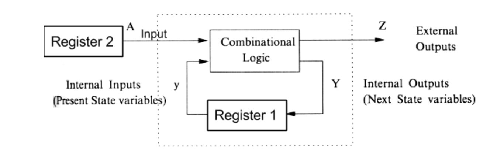

# CPU
## cache line
对于写程序的意义就是, 关键数据设计成 cache line 大小或者 cache line 的倍数, 避免多个主存数据对应同一个 cache line , 导致某个 core 的 cache line 更新的时候引起其他 core 的 cache line 失效, cpu 就很容易 cache miss, 导致性能下降. 
### CPU一级缓存、二级缓存、三级缓存是什么意思？
大家都知道现在CPU的多核技术，都会有几级缓存，现在的CPU会有三级内存（L1，L2， L3），如下图所示：

一级缓存（L1 Cache）CPU一级缓存，就是指CPU的第一层级的高速缓存，主要当担的工作是缓存指令和缓存数据。一级缓存的容量与结构对CPU性能影响十分大，但是由于它的结构比较复杂，又考虑到成本等因素，一般来说，CPU的一级缓存较小，通常CPU的一级缓存也就能做到256KB左右的水平。
二级缓存（L2 Cache）CPU二级缓存，就是指CPU的第二层级的高速缓存，而二级缓存的容量会直接影响到CPU的性能，二级缓存的容量越大越好。例如intel的第八代i7-8700处理器，共有六个核心数量，而每个核心都拥有256KB的二级缓存，属于各核心独享，这样二级缓存总数就达到了1.5MB。
三级缓存（L3 Cache）CPU三级缓存，就是指CPU的第三层级的高速缓存，其作用是进一步降低内存的延迟，同时提升海量数据量计算时的性能。和一级缓存、二级缓存不同的是，三级缓存是核心共享的，能够将容量做的很大。其中：L1缓存分成两种，一种是指令缓存，一种是数据缓存。L2缓存和L3缓存不分指令和数据。L1和L2缓存在每一个CPU核中，L3则是所有CPU核心共享的内存。L1、L2、L3的越离CPU近就越小，速度也就越快，越离CPU远，速度也越慢。再往后面就是内存，内存的后面就是硬盘。我们来看一些他们的速度L1的存取速度：4个CPU时钟周期L2的存取速度：11个CPU时钟周期L3的存取速度：39个CPU时钟周期RAM内存的存取速度：107个CPU时钟周期我们可以看到，L1的速度是RAM的27倍，L1和L2的存取大小基本上是KB级的，L3则是MB级别的。例如，Intel Core i7-8700K,是一个6核的CPU，每核上的L1是64KB（数据和指令各32KB）,L2是256K，L3有2MB。我们的数据从内存向上，先到L3，再到L2，再到L1，最后到寄存器进行计算。那么，为什么会设计成三层？这里有以下几方面的考虑：物理速度，如果要更大的容量就需要更多的晶体管，除了芯片的体积会变大，更重要的是大量的晶体管会导致速度下降，因为访问速度和要访问的晶体管所在的位置成反比。也就是当信号路径变长时，通信速度会变慢，这就是物理问题。另外一个问题是，多核技术中，数据的状态需要在多个CPU进行同步。我们可以看到，cache和RAM的速度差距太大。所以，多级不同尺寸的缓存有利于提高整体的性能。这个世界永远是平衡的，一面变得有多光鲜，另一方面也会变得有多黑暗，建立多级的缓存，一定就会引入其它的问题。这里有两个比较重要的问题。一个是比较简单的缓存命中率的问题，另一个是比较复杂的缓存更新的一致性问题尤其是第二个问题，在多核技术下，这就很像分布式系统了，要面对多个地方进行更新。【

### 缓存命中
首先，我们需要了解一个术语Cache Line。缓存基本上来说就是把后面的数据加载到离自己最近的地方，对于CPU来说，它是不会一个字节一个字节的加载的。因为这非常没有效率，一般来说都是要一块一块的加载的，对于这样一块一块的数据单位，术语叫“Cache Line”。一般来说，一个主流的CPU的Cache Line是64 Bytes(也有的CPU用32Bytes和128Bytes),64Bytes也就是16个32位的数字,这就是CPU从内存中捞数据上来的最小数据单位。比如：Cache Line是最小单位（64Bytes），所以先把Cache分布多个Cache Line。比如：L1有32KB，那么 32KB/64B = 512个Cache Line。缓存需要把内存里的数据放进来，英文叫CPU Associativity，Cache的数据放置策略决定了内存中的数据会拷贝到CPU Cache中的哪个位置上，因为Cache的大小远远小于内存，所以，需要有一种地址关联算法，能够让内存中的数据被映射到Cache中。这个就有点像内存地址从逻辑地址到物理地址的映射方法。但是不完全一样。基本上会有以下的一些方法任何一个内存的数据可以被缓存在任何一个Cache Line里，这种方法是最灵活的，但是，如果我们要知道一个内存是否存在于Cache中。我们就需要进行O(n), n 为 cache 的大小, 复杂度的Cache遍历，这是没有效率的。另一种方法，为了降低缓存搜索算法的时间复杂度，我们要使用像hash table这样的数据结构，最简单的hash table就是“求模运算”。比如，我们的L1 Cache有512个Cache Line,那么公式就是(内存地址 mod 512) *64就可以直接找到所在的Cache地址的偏移了。但是，这样的方式需要程序对内存地址的访问非常的平均，不然会造成严重地冲突。所以，这成了一个非常理想的情况了。为了避免上述的两种方案的问题，于是就要容忍一定的hash冲突，也就出现了N-Way关联。也就是把连续的N个Cache Line绑成一组，然后，先找到相关的组，然后再在组内找到相关的Cache Line。这叫Set Associativity。如下图所示对于 N-Way 组关联，可能有点不好理解。这里举个例子，并多说一些细节（不然后面的代码你会不能理解），Intel 大多数处理器的L1 Cache都是32KB，8-Way 组相联，Cache Line 是64 Bytes。这意味着32KB的可以分成，32KB / 64 = 512 条 Cache Line；因为有8 Way，于是会每一Way 有 512 / 8 = 64 条 Cache Line；于是每一路就有 64 x 64 = 4096 Byts 的内存。为了方便索引内存地址Tag：每条 Cache Line 前都会有一个独立分配的 24 bits来存的 tag，其就是内存地址的前24bits；Index：内存地址后续的6个bits则是在这一Way的是Cache Line 索引，2^6 = 64 刚好可以索引64条Cache Line；Offset：再往后的6bits用于表示在Cache Line 里的偏移量索引过程如下图所示：当拿到一个内存地址的时候，先拿出中间的 6bits 来，找到是哪组；然后在这一个8组的cache line中，再进行O(n) ，n=8 的遍历，主是要匹配前24bits的tag。如果匹配中了，就算命中，如果没有匹配到，那就是cache miss，如果是读操作，就需要进向后面的缓存进行访问了。L2和L3同样是这样的算法。而淘汰算法有两种，一种是随机，另一种是LRU。这也意味着：L1 Cache 可映射 36bits 的内存地址，一共 2^36 = 64GB的内存当CPU要访问一个内存的时候，通过这个内存中间的6bits 定位是哪个set，通过前 24bits 定位相应的Cache Line。就像一个hash Table的数据结构一样，先是O(1)的索引，然后进入冲突搜索。 因为中间的 6bits决定了一个同一个set，所以，对于一段连续的内存来说，每隔4096的内存会被放在同一个组内，导致缓存冲突。此外，当有数据没有命中缓存的时候，CPU就会以最小为Cache Line的单元向内存更新数据。当然，CPU并不一定只是更新64Bytes，因为访问主存实在是太慢了，所以，一般都会多更新一些。好的CPU会有一些预测的技术，如果找到一种pattern的话，就会预先加载更多的内存，包括指令也可以预加载。这叫 Prefetching 技术。比如，你在for-loop访问一个连续的数组，你的步长是一个固定的数，内存就可以做到prefetching。了解这些细节，会有利于我们知道在什么情况下有可以导致缓存的失效。三、缓存一致对于主流的CPU来说，缓存的写操作基本上是两种策略Write Back：写操作只在Cache上，然后再flush到内存上Write Through：写操作同时写到cache和内存上。为了提高写的性能，一般来说，主流的CPU（如：Intel Core i7/i9）采用的是Write Back的策略，因为直接写内存实在是太慢了。好了，现在问题来了，如果有一个数据 x 在 CPU 第0核的缓存上被更新了，那么其它CPU核上对于这个数据 x 的值也要被更新，这就是缓存一致性的问题。
### 缓存一致性
一般来说，在CPU硬件上，会有两种方法来解决这个问题：Directory 协议。这种方法的典型实现是要设计一个集中式控制器，它是主存储器控制器的一部分。其中有一个目录存储在主存储器中，其中包含有关各种本地缓存内容的全局状态信息。当单个CPU Cache 发出读写请求时，这个集中式控制器会检查并发出必要的命令，以在主存和CPU Cache之间或在CPU Cache自身之间进行数据同步和传输。Snoopy 协议。这种协议更像是一种数据通知的总线型的技术。CPU Cache通过这个协议可以识别其它Cache上的数据状态。如果有数据共享的话，可以通过广播机制将共享数据的状态通知给其它CPU Cache。这个协议要求每个CPU Cache 都可以“窥探”数据事件的通知并做出相应的反应。如下图所示，有一个Snoopy Bus的总线。因为Directory协议是一个中心式的，会有性能瓶颈，而且会增加整体设计的复杂度。而Snoopy协议更像是微服务+消息通讯，所以，现在基本都是使用Snoopy的总线的设计。在分布式系统中我们一般用Paxos/Raft这样的分布式一致性的算法。而在CPU的微观世界里，则不必使用这样的算法。因为CPU的多个核的硬件不必考虑网络会断会延迟的问题。所以，CPU的多核心缓存间的同步的核心就是要管理好数据的状态就好了。这里介绍几个状态协议，先从最简单的开始，MESI协议，这个协议跟那个著名的足球运动员梅西没什么关系，其主要表示缓存数据有四个状态：Modified（已修改）, Exclusive（独占的）,Shared（共享的），Invalid（无效的）。MESI 这种协议在数据更新后，会标记其它共享的CPU缓存的数据拷贝为Invalid状态，然后当其它CPU再次read的时候，就会出现 cache miss 的问题，此时再从内存中更新数据。从内存中更新数据意味着20倍速度的降低。我们能不能直接从我隔壁的CPU缓存中更新？是的，这就可以增加很多速度了，但是状态控制也就变麻烦了。还需要多来一个状态：Owner(宿主)，用于标记，我是更新数据的源。于是，出现了 MOESI 协议。 MOESI协议允许 CPU Cache 间同步数据，于是也降低了对内存的操作，性能是非常大的提升，但是控制逻辑也非常复杂。顺便说一下，与 MOESI 协议类似的一个协议是 MESIF，其中的 F 是 Forward，同样是把更新过的数据转发给别的 CPU Cache 但是，MOESI 中的 Owner 状态 和MESIF 中的 Forward 状态有一个非常大的不一样—— Owner状态下的数据是dirty的，还没有写回内存，Forward状态下的数据是clean的，可以丢弃而不用另行通知。需要说明的是，AMD用MOESI，Intel用MESIF。所以，F 状态主要是针对 CPU L3 Cache 设计的（前面我们说过，L3是所有CPU核心共享的）。

### cpu cache line 对程序性能的影响
示例一
首先，假设我们有一个64M长的数组，设想一下下面的两个循环：       
```
const int LEN = 64*1024*1024;
       int *arr = new int[LEN];

          for (int i = 0; i < LEN; i += 2) arr[i] *= i;

          for (int i = 0; i < LEN; i += 8) arr[i] *= i; 

```
按我们的想法，第二个循环要比第一个循环少4倍的计算量。其应该要快4倍的。但实际跑下来并不是，在我的机器上，第一个循环需要128毫秒，第二个循环则需要122毫秒，相差无几。这里最主要的原因就是 Cache Line，因为CPU会以一个Cache Line 64Bytes最小时单位加载，也就是16个32bits的整型，所以，无论你步长是2还是8，都差不多。而后面的乘法其实是不耗CPU时间的。
示例二接下来，我们再来看个示例。下面是一个二维数组的两种遍历方式，一个逐行遍历，一个是逐列遍历，这两种方式在理论上来说，寻址和计算量都是一样的，执行时间应该也是一样的。
```
const int row = 1024;
const int col = 512

int matrix[row][col];
//逐行遍历
int sum_row=0;
for(int _r=0; _r<row; _r++) {
    for(int _c=0; _c<col; _c++){
        sum_row += matrix[_r][_c];
    }
}
//逐列遍历
int sum_col=0;
for(int _c=0; _c<col; _c++) {
    for(int _r=0; _r<row; _r++){
        sum_col += matrix[_r][_c];
    }
}
```
然而，并不是，在我的机器上，得到下面的结果。逐行遍历：0.083ms逐列遍历：1.072ms执行时间有十几倍的差距。其中的原因，就是逐列遍历对于CPU Cache 的运作方式并不友好，所以，付出巨大的代价。
示例三接下来，我们来看一下多核下的性能问题，参看如下的代码。两个线程在操作一个数组的两个不同的元素（无需加锁），线程循环1000万次，做加法操作。在下面的代码中，我高亮了一行，就是p2指针，要么是p[1]，或是 p[30]，理论上来说，无论访问哪两个数组元素，都应该是一样的执行时间。 

```
void fn (int* data) {
    for(int i = 0; i < 10*1024*1024; ++i)
        *data += rand();
}
int p[32];
int *p1 = &p[0];
int *p2 = &p[1]; // int *p2 = &p[30];
thread t1(fn, p1);
thread t2(fn, p2);
```
然而，并不是，在我的机器上执行下来的结果是：对于 p[0] 和 p[1] ：570ms对于 p[0] 和 p[30]：105ms这是因为 p[0] 和 p[1] 在同一条 Cache Line 上，而 p[0] 和 p[30] 则不可能在同一条Cache Line 上 ，CPU的缓存最小的更新单位是Cache Line，所以，这导致虽然两个线程在写不同的数据，但是因为这两个数据在同一条Cache Line上，就会导致缓存需要不断进在两个CPU的L1/L2中进行同步，从而导致了5倍的时间差异。

### cpu 为什么需要时钟
时钟是为了同步各种寄存器的计算, 像乐队的指挥一样, 例如cpu 执行1到10 的累加, 可以理解为两个寄存器完成, 一个寄存器保留外部输入就是1到10, 另一个保留中间结果, 当一个时钟脉冲来的时候两个寄存器的都接受输入, 否则输入等待, 如果没有时钟保持输入同步, 则有可能外部寄存器的输入过慢而导致外部输入被加了两次, 外部寄存器输入过快而内部寄存器的输入过慢就会导致内部寄存器输入被加了两次. 



### 为什么用户态切换到内核态开销大
执行系统调用的时候会触发中断, 用户线程保存当前? 到?, cpu 执行内核态的程序, 执行完成后恢复用户线程的状态, 涉及到很多寄存器的修改. 
### buffer and cache
[https://zhanjindong.com/2016/03/02/jvm-memory-tunning-notes](https://zhanjindong.com/2016/03/02/jvm-memory-tunning-notes)

> Written with [StackEdit](https://stackedit.io/).
<!--stackedit_data:
eyJoaXN0b3J5IjpbMTEzMjI1NTYyLC0xNzEyOTk5NDQ3LDczMD
k5ODExNl19
-->