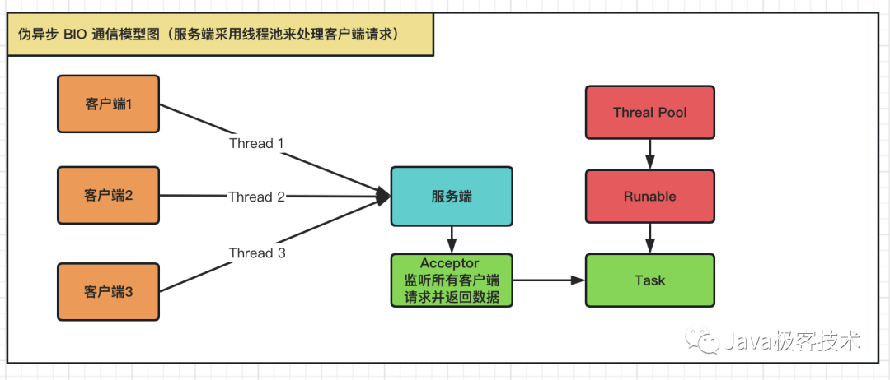
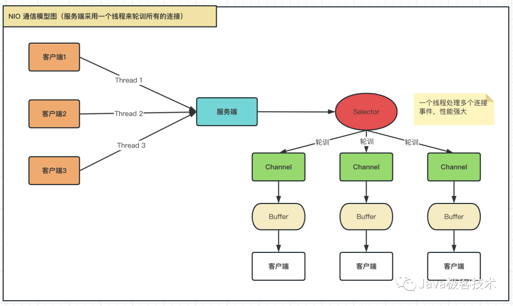

---

# java IO的历史, 为什么IO 模型需要这样进化
从一开始的Socket BIO, 同步阻塞, 等待连接和读写的时候是阻塞的, 只能忙等, 并且一个事件（读,写, 建立连接)必须开多一个线程去处理, 因为读写等函数是阻塞的, 需要等待实际读写的执行, 那么一阻塞, 新的请求到来时就需要新开线程, 否则会造成新连接的排队; 那么就会带来两个问题一个是线程数过多, 二线程切换开销大, 导致无法应对海量连接; 
</br>
到1.4的 NIO(Non blocking IO), 同步非阻塞, 连接和读写请求非阻塞, 单线程采用selector去接受请求, 再根据事件的不同用不同的线程去处理 ,NIO使用了多路复用器机制，以socket使用来说，多路复用器通过不断轮询各个连接的状态，只有在socket有流可读或者可写时，应用程序才需要去处理它， 对比BIO 就是不阻塞应用但是需要轮询事件, 事件到来的时候代表读写等操作是可以进行了, 那么既然读写等操作不需要等待, IO 线程池一般开启cpu 核心个线程即够, 速度是内存拷贝的速度, GB/s 的级别, 那么避免了BIO 的线程多, 切换开销大的问题, 可以应对海量连接了;
</br>
AIO 是基于事件回调机制实现的，也就用户线程操作之后会直接返回，不会堵塞在那里，当读写处理完成，操作系统会通知相应的线程进行后续的操作。不需要再像 NIO 去轮询事件, 完全异步通知的模式, 需要操作系统支持.

## 异步同步,阻塞和非阻塞
阻塞 VS 非阻塞：人是否坐在水壶前面一直等。
</br>
同步 VS 异步：水壶是不是在水烧开之后主动通知人

BIO （Blocking I/O）：同步阻塞 I/O 模式。
</br>
NIO （New I/O）：同步非阻塞模式。
</br>
AIO （Asynchronous I/O）：异步非阻塞 I/O 模型。


## BIO 

从一开始的Socket BIO, 同步阻塞, 等待连接和读写的时候是阻塞的, 只能忙等, 并且一个事件（读,写, 建立连接)必须开多一个线程去处理, 因为读写等函数是阻塞的, 需要等待实际读写的执行, 那么一阻塞, 新的请求到来时就需要新开线程, 否则会造成新连接的排队; 那么就会带来两个问题一个是线程数过多, 二线程切换开销大, 导致无法应对海量连接; 

## NIO

到1.4的 NIO(Non blocking IO), 同步非阻塞, 连接和读写请求非阻塞, 单线程采用selector去接受请求, 再根据事件的不同用不同的线程去处理, 这是一种IO多路复用的思想, 但是对比BIO 就是事件到来的时候代表读写等操作是可以进行了, 但是需要等待数据从网卡到内存的拷贝, 那么既然读写等操作不需要等待, IO 线程池一般开启cpu 核心个线程即够, 速度是内存拷贝的速度, GB/s 的级别, 那么避免了BIO 的线程多, 切换开销大的问题, 可以应对海量连接了;

### 代码
```
/**
 * NIO 服务端
 */
public class NioServerTest {

    public static void main(String[] args) throws IOException {
        // 打开服务器套接字通道
        ServerSocketChannel ssc = ServerSocketChannel.open();
        // 服务器配置为非阻塞
        ssc.configureBlocking(false);
        // 进行服务的绑定，监听8080端口
        ssc.socket().bind(new InetSocketAddress(8080));

        // 构建一个Selector选择器,并且将channel注册上去
        Selector selector = Selector.open();
        // 将serverSocketChannel注册到selector,并对accept事件感兴趣(serverSocketChannel只能支持accept操作)
        ssc.register(selector, SelectionKey.OP_ACCEPT);

        while (true){
            // 查询指定事件已经就绪的通道数量，select方法有阻塞效果,直到有事件通知才会有返回，如果为0就跳过
            int readyChannels = selector.select();
            if(readyChannels == 0) {
                continue;
            };
            //通过选择器取得所有key集合
            Set<SelectionKey> selectedKeys = selector.selectedKeys();
            Iterator<SelectionKey> iterator = selectedKeys.iterator();
            while (iterator.hasNext()){
                SelectionKey key = iterator.next();
                //判断状态是否有效
                if (!key.isValid()) {
                    continue;
                }
                if (key.isAcceptable()) {
                    // 处理通道中的连接事件
                    ServerSocketChannel server = (ServerSocketChannel) key.channel();
                    SocketChannel sc = server.accept();
                    sc.configureBlocking(false);
                    System.out.println("接收到新的客户端连接，地址：" + sc.getRemoteAddress());

                    // 将通道注册到选择器并处理通道中可读事件
                    sc.register(selector, SelectionKey.OP_READ);
                } else if (key.isReadable()) {
                    // 处理通道中的可读事件
                    SocketChannel channel = (SocketChannel) key.channel();
                    ByteBuffer byteBuffer = ByteBuffer.allocate(1024);
                    while (channel.isOpen() && channel.read(byteBuffer) != -1) {
                        // 长连接情况下,需要手动判断数据有没有读取结束 (此处做一个简单的判断: 超过0字节就认为请求结束了)
                        if (byteBuffer.position() > 0) {
                            break;
                        };
                    }
                    byteBuffer.flip();

                    //获取缓冲中的数据
                    String result = new String(byteBuffer.array(), 0, byteBuffer.limit());
                    System.out.println("收到客户端发送的信息，内容：" + result);

                    // 将通道注册到选择器并处理通道中可写事件
                    channel.register(selector, SelectionKey.OP_WRITE);
                } else if (key.isWritable()) {
                    // 处理通道中的可写事件
                    SocketChannel channel = (SocketChannel) key.channel();
                    ByteBuffer byteBuffer = ByteBuffer.allocate(1024);
                    byteBuffer.put("server send".getBytes());
                    byteBuffer.flip();
                    channel.write(byteBuffer);

                    // 将通道注册到选择器并处理通道中可读事件
                    channel.register(selector, SelectionKey.OP_READ);
                    //写完之后关闭通道
                    channel.close();
                }
                //当前事件已经处理完毕，可以丢弃
                iterator.remove();
            }
        }
    }
}
```

```
/**
 * NIO 客户端
 */
public class NioClientTest {

    public static void main(String[] args) throws IOException {
        // 打开socket通道
        SocketChannel sc = SocketChannel.open();
        //设置为非阻塞
        sc.configureBlocking(false);
        //连接服务器地址和端口
        sc.connect(new InetSocketAddress("127.0.0.1", 8080));
        while (!sc.finishConnect()) {
            // 没连接上,则一直等待
            System.out.println("客户端正在连接中，请耐心等待");
        }

        // 发送内容
        ByteBuffer writeBuffer = ByteBuffer.allocate(1024);
        writeBuffer.put("Hello，我是客户端".getBytes());
        writeBuffer.flip();
        sc.write(writeBuffer);

        // 读取响应
        ByteBuffer readBuffer = ByteBuffer.allocate(1024);
        while (sc.isOpen() && sc.read(readBuffer) != -1) {
            // 长连接情况下,需要手动判断数据有没有读取结束 (此处做一个简单的判断: 超过0字节就认为请求结束了)
            if (readBuffer.position() > 0) {
                break;
            };
        }
        readBuffer.flip();

        String result = new String(readBuffer.array(), 0, readBuffer.limit());
        System.out.println("客户端收到服务端：" + sc.socket().getRemoteSocketAddress() + "，返回的信息：" + result);

        // 关闭通道
        sc.close();
    }
}
```
### buffer
jdk 文档如下: 
https://docs.oracle.com/javase/7/docs/api/java/nio/channels/SocketChannel.html#read(java.nio.ByteBuffer[])

>Reads a sequence of bytes from this channel into the given buffer.
An attempt is made to read up to  _r_  bytes from the channel, where  _r_  is the number of bytes remaining in the buffer, that is,  dst.remaining(), at the moment this method is invoked.
// 故需要在每次读满buffer 之后, 进行flip(buffer 准备写), 或者
clear, 保证还有remaning, 因为remaning = limit- position

> A read operation might not fill the buffer, and in fact it might not read any bytes at all. Whether or not it does so depends upon the nature and state of the channel. A socket channel in non-blocking mode, for example, cannot read any more bytes than are immediately available from the socket's input buffer; similarly, a file channel cannot read any more bytes than remain in the file. It is guaranteed, however, that if a channel is in blocking mode and there is at least one byte remaining in the buffer then this method will block until at least one byte is read.
// read 方法是不是阻塞的取决于channel 是不是blocking, 

示例如图: 


缓冲区, byteBuffer看看源码很简单, 有position 表示读写到哪了, mark 只是个标记位, 用来回溯, limit 表示可以读写的边界, capacity 表示字节数组的大小, 来控制字节数组读写的位置, 读之前需要flip() 回到数组头部开始读.

 * DirectByteBuffer, HeapByteBuffer
  DirectByteBuffer 字节数组直接存储在native memory, 避免了native memory和java heap 的来回拷贝, 但是分配和回收native memory的速度会比heap memory要慢;
        在网络读写和文件读写的时候, 基于buffer 进行读写, 需要保证buffer 的地址在读写时不能改变(调用操作系统函数的时候, 传入buffer的起始地址和size), 而GC的时候很有可能改变buffer的地址, 所以需要将buffer 先拷贝到堆外内存, 就是native memory, 而HeapByteBuffer的数组一开始是在java heap的, 故需要先拷贝到native memory, 因此效率会比 DirectByteBuffer 要慢.
        
1. 如何GC的
            
 GC压力更小。虽然GC仍然管理着DirectBuffer的回收，但它是使用PhantomReference来达到的，在平常的Young GC或者mark and compact的时候却不会在内存里搬动。如果IO的数量比较大，比如在网络发送很大的文件，那么GC的压力下降就会很明显。但是具体GC的细节和发生条件, 和时间还不清楚, 可以参见这篇帖子 [PhantomReference & Cleaner](https://zhuanlan.zhihu.com/p/29454205)
            
 >    // Doubly-linked list of live cleaners, which prevents the cleaners themselves from being GC'd before their referents ??
        
     底层通过write、read、pwrite，pread函数进行系统调用时，需要传入buffer的起始地址和buffer count作为参数。具体参见：write(2): to file descriptor，read(2): read from file descriptor，pread(2) - Linux man page，pwrite(2) - Linux man page。如果使用java heap的话，我们知道jvm中buffer往往以byte[] 的形式存在，这是一个特殊的对象，由于java heap GC的存在，这里对象在堆中的位置往往会发生移动，移动后我们传入系统函数的地址参数就不是真正的buffer地址了，这样的话无论读写都会发生出错。而C Heap仅仅受Full GC的影响，相对来说地址稳定 
        
2. 传统的文件IO的流程
 * MappedByteBuffer 
   可以作为利用内存来映射region of file, 可以快速进行大文件的读写, 详见 jdk官方文档.

### buffer vs stream
 stream不是缓存的, 不能移动数据, 除非进行cache, 而buffer 是一整块数据过来, 可以移动数据, 移动指针, 更加的灵活

### channel
> A Java NIO FileChannel is a channel that is connected to a file. Using a file channel you can read data from a file, and write data to a file. The Java NIO FileChannel class is NIO's an alternative to reading files with the standard Java IO API. A FileChannel cannot be set into non-blocking mode. It always runs in blocking mode.

### selector
用于单线程去接受网络事件, 包括读写,连接,接收; 避免了多线程接收连接导致的资源消耗高, 线程上下文切换慢, 也不能解决海量连接的问题.


## AIO
AIO 是基于事件回调机制实现的，也就用户线程操作之后会直接返回，不会堵塞在那里，当读写处理完成，操作系统会通知相应的线程进行后续的操作。不需要再像 NIO 去轮询

```
/**
 * aio 服务端
 */
public class AioServer {

    public AsynchronousServerSocketChannel serverChannel;

    /**
     * 监听客户端请求
     * @throws Exception
     */
    public void listen() throws Exception {
        //打开一个服务端通道
        serverChannel = AsynchronousServerSocketChannel.open();
        serverChannel.bind(new InetSocketAddress(8080));//监听8080端口
        //服务监听
        serverChannel.accept(this, new CompletionHandler<AsynchronousSocketChannel,AioServer>(){

            @Override
            public void completed(AsynchronousSocketChannel client, AioServer attachment) {
                try {
                    if (client.isOpen()) {
                        System.out.println("接收到新的客户端连接，地址：" + client.getRemoteAddress());
                        final ByteBuffer buffer = ByteBuffer.allocate(1024);
                        //读取客户端发送的信息
                        client.read(buffer, client, new CompletionHandler<Integer, AsynchronousSocketChannel>(){

                            @Override
                            public void completed(Integer result, AsynchronousSocketChannel attachment) {
                                try {
                                    //读取请求，处理客户端发送的数据
                                    buffer.flip();
                                    String content = new String(buffer.array(), 0, buffer.limit());
                                    System.out.println("服务端收到客户端发送的信息：" + content);

                                    //向客户端发送数据
                                    ByteBuffer writeBuffer = ByteBuffer.allocate(1024);
                                    writeBuffer.put("server send".getBytes());
                                    writeBuffer.flip();
                                    attachment.write(writeBuffer).get();
                                } catch (Exception e) {
                                    e.printStackTrace();
                                }
                            }

                            @Override
                            public void failed(Throwable exc, AsynchronousSocketChannel attachment) {
                                try {
                                    exc.printStackTrace();
                                    attachment.close();
                                } catch (IOException e) {
                                    e.printStackTrace();
                                }
                            }
                        });
                    }
                } catch (Exception e) {
                    e.printStackTrace();
                } finally {
                    //当有新客户端接入的时候，直接调用accept方法，递归执行下去，保证多个客户端都可以阻塞
                    attachment.serverChannel.accept(attachment, this);
                }
            }

            @Override
            public void failed(Throwable exc, AioServer attachment) {
                exc.printStackTrace();
            }
        });
    }

    public static void main(String[] args) throws Exception {
        //启动服务器，并监听客户端
        new AioServer().listen();
        //因为是异步IO执行，让主线程睡眠但不关闭
        Thread.sleep(Integer.MAX_VALUE);
    }
}
```


### java stream

* how to gracefully close stream

1. [use "Execute Around” idiom](https://stackoverflow.com/questions/341971/what-is-the-execute-around-idiom)
2. since java7 , can use try-with
3. write a IOUtils

```
public final class IOUtil {
  private IOUtil() {}

  public static void closeQuietly(Closeable... closeables) {
    for (Closeable c : closeables) {
        if (c != null) try {
          c.close();
        } catch(Exception ex) {}
    }
  }
}
```

Then your code would be reduced to:

```
try {
  copy(in, out);
} finally {
  IOUtil.closeQuietly(in, out);
}

```
## UNIX network programming

####  6.2 IO model


分为五种, blocking io, non blocking io, sigal driven io, io 多路复用, aio 完全异步的io.
对于一个输入操作, 主要分为两个阶段, 一是等待数据从网络到达, 二是将数据从内核态拷到用户态.

1. blocking io
两个阶段全是阻塞的


2. non blocking io
while 循环发起recvform 调用(消耗cpu ), 询问数据是否准备好, 若没有准备好就直接返回, 数据准备好之后, 再发起系统调用去等待数据从内核态拷贝到用户态, 总之是同步非阻塞.


3. io 多路复用
目前java nio 就是这个模型, select 调用阻塞, 有数据返回, 就发起系统调用去等待数据拷贝到用户态, 跟第二个模型多了一次select 系统调用, 但是不需要一直轮训获取, 减少cpu 消耗


4. signal driven io
注册信号发送到内核, 注册了一个回调的handler, 当有数据到达之后通知应用, 应用在发起系统调用, 同步阻塞等待数据拷贝到内核态


5. AIO 
完全异步的IO, 调用aio 函数, 注册handler 到内核, 一直到内核将数据拷贝到用户态之后才通知用户态, 异步非阻塞的, 但是却不是所有的操作系统都支持


## netty in action 笔记

* 为什么要用netty, netty 解决了什么问题
netty 简化了网络编程, 使得网络编程变得容易, 兼容老版本, 高性能, 并支持各种协议;
要想实现高性能的网络处理, 光利用java NIO api 是容易出错, 且很工作量浩大的事, 而且很难扩展
_[The Netty project](https://netty.io/)_ is an effort to provide an asynchronous event-driven network application framework and tooling for the rapid development of maintainable high-performance · high-scalability protocol servers and clients.

Netty is an NIO client server framework that enables quick and easy development of network applications such as protocol servers and clients. It greatly simplifies and streamlines network programming such as TCP and UDP socket server development.

#### 1.3  netty core components
* channel 

an open connection to an entity such as a hardware device, a file, a
network socket, or a program component that is capable of performing
one or more distinct I/O operations, for example reading or writing.
可以把channel 理解为装载着数据的即将到来(或者离开的)车

* callback

A callback is simply a method, a reference to which has been provided to another
method. This enables the latter to call the former at an appropriate time. Callbacks
are used in a broad range of programming situations and represent one of the most
common ways to notify an interested party that an operation has completed.
可以理解为把需要执行的函数的引用传递给另一个函数, 并在适当的时机执行

Netty uses callbacks internally when handling events; when a callback is triggered
the event can be handled by an implementation of interface ChannelHandler

```
public class ConnectHandler extends ChannelInboundHandlerAdapter {
@Override
public void channelActive(ChannelHandlerContext ctx)
throws Exception {
System.out.println(
"Client " + ctx.channel().remoteAddress() + " connected");
}
}
// 这是一个channel connected的callback
```

* future

In short, the notification mechanism
provided by the ChannelFutureListener eliminates the need for manually checking
operation completion.
不同于jdk 的future, netty 提供了futureListener , 不需要轮训结果

#### echoServer  and echoClient
> All Netty servers require the following:
 At least one ChannelHandler—This component implements the server’s processing
of data received from the client—its business logic.
 Bootstrapping—This is the startup code that configures the server. At a minimum,
it binds the server to the port on which it will listen for connection requests
// 需要ChannelHandler 去处理业务逻辑, Bootstrapping 把服务器绑定到端口去监听

* echoServer
> Because your Echo server will respond to incoming messages, it will need to implement
interface ChannelInboundHandler, which defines methods for acting on inbound
events. This simple application will require only a few of these methods, so it will be
sufficient to subclass ChannelInboundHandlerAdapter, which provides a default implementation of ChannelInboundHandler // 根据到来的事件, 应该选择channelInboundHandler, 或他的子类 ChannelInboundHandlerAdapter

* echoClient
The Echo client will
1 Connect to the server
2 Send one or more messages
3 For each message, wait for and receive the same message back from the server
4 Close the connection

#### netty 新连接的建立过程
1. boss 线程检查到有新来的连接, 即accept 事件, 则将该channel 注册到worker EventLoopGroup 线程池
2. 从 worker EventLoopGroup 选择一个EventLoop 线程来关注channel 的其余事件, 例如read, write, channelHandler 事件.

#### EventLoop


events 在eventloop 的逻辑执行图


包括两个部分, 一是concurrent, 二是networking, 
>Netty’s EventLoop is part of a collaborative design that employs two fundamental APIs:
concurrency and networking. First, the package io.netty.util.concurrent builds
on the JDK package java.util.concurrent to provide thread executors. Second, the
classes in the package io.netty.channel extend these in order to interface with
Channel events.

* netty IO thread model

**boss EventLoopGroup** 负责accept connection, 并把channel retister to worker threads. EventLoopGroup 如果不指定构造函数, 使用的是默认的jdk ScheduledThreadPool, 线程数量是cpu 核心数*2. 
**worker EventLoopGroup** 负责执行具体的io operation, 一个channel 的所有事件, 包括connect, read, write和注册的所有 channelHandlers 都会只由一个 worker threads 执行, 避免了多线程的同步和线程切换问题, channel 和thread 的模型是: N:1, 所以一个事件的延迟会阻塞到这个channel 的其他事件和该线程其他channel 事件, 所以长时间运行的event 需要新建线程池处理, 如下图


#### Channel


#### ChannelFuture
在netty 中所有的IO 操作都是异步的, 

#### ChannelPipeline
* channelHandler, channelPipeline, channelHandlerContext 关系


>A ChannelPipeline provides a container for a chain of ChannelHandlers and defines
an API for propagating the flow of inbound and outbound events along the chain.
When a Channel is created, it is automatically assigned its own ChannelPipeline.
ChannelHandlers are installed in the ChannelPipeline as follows:
a. A ChannelInitializer implementation is registered with a ServerBootstrap.
b. When ChannelInitializer.initChannel() is called, the ChannelInitializer
installs a custom set of ChannelHandlers in the pipeline.
c. The ChannelInitializer removes itself from the ChannelPipeline.

#### ChannelHandler

> ChannelHandler has been designed specifically to support a broad range of uses,
and you can think of it as a generic container for any code that processes events
(including data) coming and going through the ChannelPipeline // 理解为用户业务代码和将要处理的事件和数据的容器

* sharable
A ChannelHandler intended
for this use must be annotated with @Sharable; otherwise, attempting to add it to
more than one ChannelPipeline will trigger an exception.

> WHY SHARE A CHANNELHANDLER? A common reason for installing a single
ChannelHandler in multiple ChannelPipelines is to gather statistics across
multiple Channels

* 作用
Typical uses for ChannelHandlers include:
■ Transforming data from one format to another
■ Providing notification of exceptions
■ Providing notification of a Channel becoming active or inactive
■ Providing notification when a Channel is registered with or deregistered from
an EventLoop
■ Providing notification about user-defined events

* ChannelHandlerAdapter


#### Bootstrapping
> Netty’s bootstrap classes provide containers for the configuration of an application’s
network layer, which involves either binding a process to a given port or connecting
one process to another one running on a specified host at a specified port. // 实现连接服务器, 或者监听端口的功能

* server Bootstrapping 和client Bootstrapping的最大区别


> The second difference is perhaps more significant. Bootstrapping a client requires
only a single EventLoopGroup, but a ServerBootstrap requires two (which can be the
same instance). Why?
A server needs two distinct sets of Channels. The first set will contain a single
ServerChannel representing the server’s own listening socket, bound to a local port.
The second set will contain all of the Channels that have been created to handle incoming  client connections—one for each connection the server has accepted. Figure 3.4 illustrates this model, and shows why two distinct EventLoopGroups are required.
The EventLoopGroup associated with the ServerChannel assigns an EventLoop
that is responsible for creating Channels for incoming connection requests. Once a connection has been accepted, the second EventLoopGroup assigns an EventLoop to
its Channel. // server Bootstrapping 有两个EventLoopGroup , 一个绑定了ServerChannel  负责根据新来的connection 创建Channels , 另一个负责处理已经accepted conncetions, 

#### linux epoll
作为linux 默认的NIO API, 比java 的NIO api 更高效, 因为java 的nio 为了多平台的兼容性 做了某些妥协. 
> To substitute epoll for NIO
in that listing, replace NioEventLoopGroup with EpollEventLoopGroup and NioServer-
SocketChannel.class with EpollServerSocketChannel.class. // 使用基于epoll 的netty api

#### Dealing with a Stream-based Transport
网络传输的单位是字节, 并且接收和发送都有缓存, 有可能接收到的字节未达到一个单位消息的字节大小, 那么收到的消息就是不完全的, 所以需要额外的解码和编码. 具体见 https://netty.io/wiki/user-guide-for-4.x.html " Dealing with a Stream-based Transport", 解决方法是在CHANELPipeline 添加handler 
```
public class TimeDecoder extends ReplayingDecoder<Void> {
    @Override
    protected void decode(
            ChannelHandlerContext ctx, ByteBuf in, List<Object> out) {
        out.add(in.readBytes(4));
    }
}
```
#### netty bytebuffer
相比于jdk 原生的bytebuffer, 没有类似flip() 的方法用于读写的转变, 因为它有读写两个指针, 如图


* 用法
```
Charset utf8 = Charset.forName("UTF-8");
ByteBuf buf = Unpooled.copiedBuffer("Netty in Action rocks!", utf8);
System.out.println((char)buf.getByte(0));
int readerIndex = buf.readerIndex();
int writerIndex = buf.writerIndex();
buf.setByte(0, (byte)'B');
System.out.println((char)buf.getByte(0));
assert readerIndex == buf.readerIndex();
assert writerIndex == buf.writerIndex();
```
* 工厂方法
ByteBufAllocator, ByteBufHolder, Unpooled

#### TCP 拆包, 封包
* 拆包
通过看dubbo 服务端接收的源码, 大致明白了服务端本地持有一个buffer, 读剩下的数据都保存在这个buffer 里, 每次来了新的数据都先合并到这个buffer

* 如何将字节数组转化为对象呢
以dubbo decode 为例, 每次channel 读取了一部分字节, 就decode 一部分数据看看是否已经得到了完整的数据对象, 因为编码的时候会把数据长度也编码到字节流的header 中, 如果字节长度不够, 则会跳过此次轮训, 等待下次轮训的时候再次检查字节长度, 如果超过了, 则取字节长度的字节流, 剩下的保留在本地的buffer 里, 用于与下次发送的数据先进行合并.  dubbo 字节头部的编码方式如图: 

dubbo encode data header length: 16 bytes
包括: magic number, request id, 序列化的contentTypeId, 是否是异步的等. 


#### netty 性能
https://github.com/netty/netty/issues/3919

* 工具方法
ByteBufUtil, ReferenceCounted 对ByteBuffer 引用计数法回收, 
```
java -Dio.netty.leakDetectionLevel=ADVANCED 
// 可以用netty 抽样检查bytebuffer 是否有泄漏
```

### 网络协议
* ping和telnet

ping 基于ICMP 协议, 属于IP 层, telnet 基于telnet 协议, 属于TCP 层, 互相独立, 一个可通并不代表另一个可以通. 
若是需要java socket 可连, 则需要开通Aip  到Bip 的Bport, 只是单向的, 若是双向的, 则需要注明, 否则默认单向

### 疑问
* netty timeout and idle connection
* Listen socket and connected socket 
* What is file descripter
* MappedByteBuffer and directByteBuffer
* zero copy
* epoll 作为linux 默认的NIO api
* hi, [@trustin](https://github.com/trustin) i am newer to netty. I have read the above comments , but i am still not clear about current thread model. I want to make sure that all events from one channel, including channelHandlers, read and write events is always done by one eventloop from worker eventloop, and not executed by other threads, is that right ? Then, if two channels bind to the same threads, one channelHandler may block other events, is that right ? So, if there are long time events, we should use new threadpool to handle , is that right, and are there any examples to show ?  
Thank you first ! https://github.com/netty/netty/issues/1912

> Written with [StackEdit](https://stackedit.io/).
<!--stackedit_data:
eyJoaXN0b3J5IjpbMzYwOTM0NTQyLC0xMTI1NTEzNzksLTgwNT
cwNzY3MywtMTEwNDQzMTQxNV19
-->