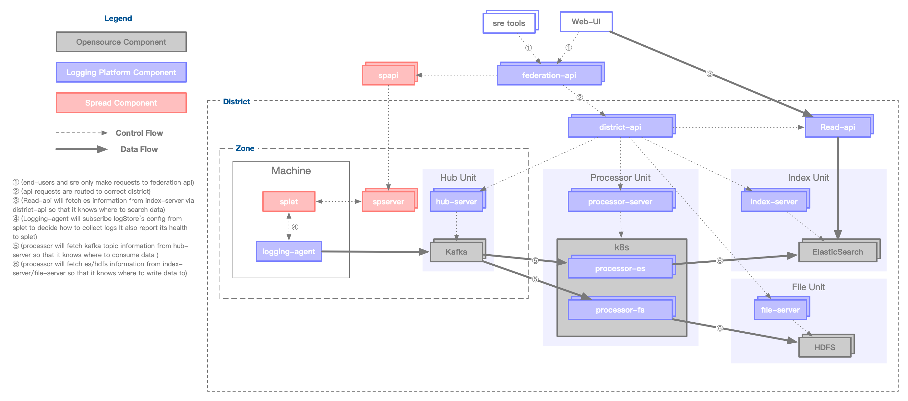
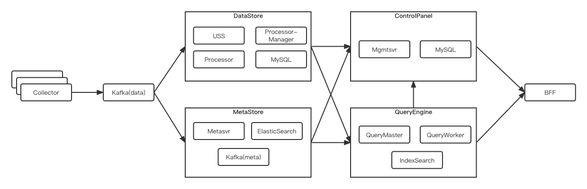
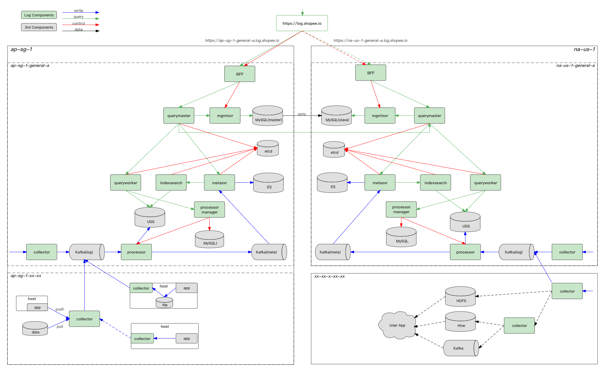
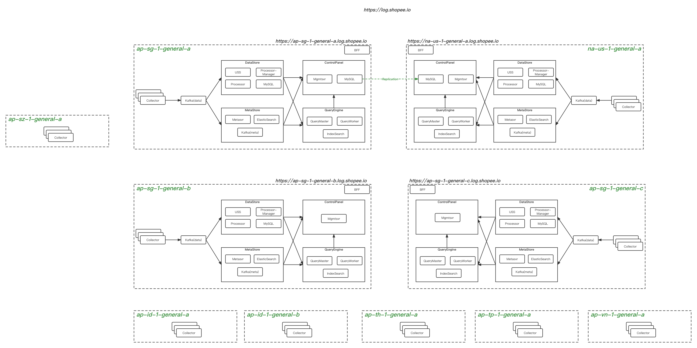

Version	

Date

	PIC	Description
v0.1	

2021-6-11 

	

Dongxu Xiang

	create the initial version
v0.1	

2022-5-30 

	

Dongxu Xiang 

	update the data flow
1.  背景
1.1 现状

日志系统已经上线运行一段时间，承接着公司绝大多数系统的业务日志存储需求，日均数据存储量在PB级别。随着公司业务的快速扩张，对日志系统各方面也提出新的挑战。

本文尝试梳理目前系统架构的一些限制，并对未来架构演化提供思路。

1.2 目标

新的架构主要需要解决以下一些问题：

降低用户使用成本

提供灵活的产品“机制”，内置部分推荐的“策略”，兼容各异的用户场景
降低平台运维成本 
解决运维不够自动化的问题
解决运维工具散乱的问题
解决大规模agent管理的问题
降低平台资源成本
解决ElasticSearch占用存储成本过大的问题
解决中间处理环节资源利用率不高的问题
容错
解决ElasticSearch单副本问题
解决各个服务节点单点故障
2. 需求描述
2.1 日志的用户场景

日志是记录软件系统发生过的事件，其特点：

一旦产生不会改变
与时间强相关
规模大(QPS: 40M/s; BW: 15GB/s)

对于收集到的日志，团队内部有以下几个主要用途：

排查问题：这是用户最常用的场景，根据日志流来回溯系统运行过程，进而追踪发生的问题
数据分析：简单诸如错误数的统计，复杂的诸如安全分析，用户行为分析等
审计：存储较长周期的数据，以符合金融等特殊业务场景监管审计需求

对于现代化的IT系统，一般都有一个日志管理系统来满足上述用户场景。

2.2 日志数据来源

根据目前用户的现状，日志数据有几个来源：

分散存在于物理机的某个目录下的文件(k8s/mesos等容器日志也可以落到物理机上的文件)
消息队列，例如kafka
应用程序接口通过网络写出
通过接口主动拉取（例如windows event log，或者云服务的日志，目前我们还没有用到）

通过CMDB可以看到，这些日志散落在各个地区的不同机房。同时由于业务安全考虑，部分机房做了一些网络隔离。

2.3 典型的日志数据处理流程

日志经由各个软件模块产生后，要达到上述不同的用户场景，一般会经过以下几个阶段：

采集和传输：怎么把分散的日志采集起来，并通过某一个通道送到集中化日志管理系统
处理：对采集的日志做一些分类和预处理，方便后续的查询和分析
存储：对日志进行持久化存储，生命周期管理
查询：对存储的日志提供用户界面来分析查看

对于现在有的系统架构来说，采集是通过log-agent完成，传输通道依赖于kakfa，处理依赖自研的processor组件，存储和查询能力依赖于elasticsearch。

本文档的后续章节将详细描述各个环节的系统设计。

3. 概念模型

0. 概念模型

4. 系统架构
4.1 系统总览

4.2 数据流程

模块说明：

collector: 物理主机部署，主要负责采集主机侧的文件日志（程序写入的日志理论也可以），经过预处理后按照约定的格式上报kafka。
collector(服务): 独立于主机部署，接收各种通过网络送过来的日志，经过预处理后按照约定的格式上报到kafka。同时也承担一些鉴权和流控的作用。
bff: 主要负责前端页面相关的服务接口的
mgmtsvr: 系统核心配置管理服务，是一个k8s服务，数据存在mysql/redis。mgmtsvc暴露各种grpc接口供其他模块使用。
processor/processor-manager: 从kakfa消费日志数据，经过logsource定义的各种处理pipeline后，最终把产生的数据上报到不同的存储。
query-master/query-worker/index-search：分布式查询引擎，详情设计参考这个设计文档[2]
metasvr: 提前存储chunk的元数据服务

uss：主要负责日志相关的所有存储，包括冷热数据。

4.3 部署架构

5. 模块设计
5.1 Collector设计

1. collector设计与实现

5.2 mgmtsvr设计

2. mgmtsvr设计与实现

5.3 存储设计

3. 存储引擎设计与实现

5.4 查询设计

4. 查询引擎设计与实现

6. 参考文档
[1] [日志平台]整体架构
[2] 4. 查询引擎设计与实现
[3] https://flume.apache.org/
[4] https://github.com/open-telemetry/opentelemetry-collector/blob/main/docs/design.md

