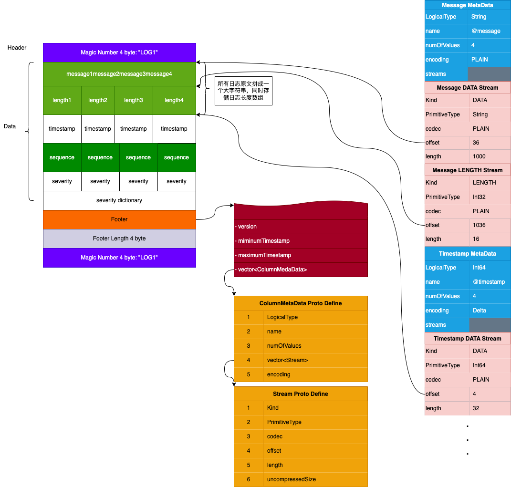
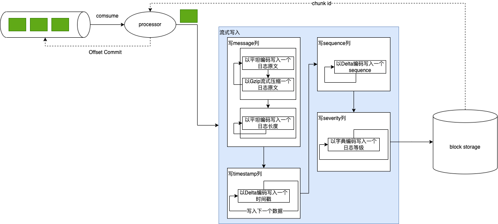
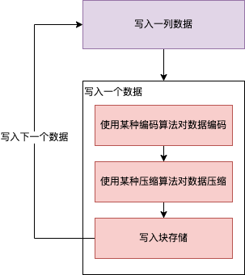
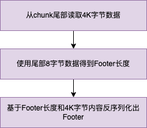

[WIP]Chunk存储格式调研与设计
	

Date

	

PIC

	

Description

v0.1

	

2022-1-11 

	

Jun Wang

	create the initial version
1. 需求背景

3. 存储引擎设计与实现

2. 设计目标
节省存储成本
搜索友好
可扩展
3. 架构设计

3. 存储引擎设计与实现

4.数据模型设计

chunk内容分为：Header，Data，Footer，Footer Length，Magic Number。

4.1 Header

Header目前包含4字节的魔数"LOG1"。

4.2 Data

Data部分将0. 概念模型中定义的日志系统字段按列存储，其他从日志原文中提取的字段则不进行存储，使用3. 存储引擎设计与实现中提到的schema on read方法在查询时构建。

列在chunk中会拆解成一个或多个部分分别进行存储，我们引入流(Stream)这个概念来描述这些部分的逻辑语义。

流有3种类型：

@startuml

usecase stream 

agent DATA
agent LENGTH
agent DICTIONARY_DATA

stream --> DATA
stream --> LENGTH
stream --> DICTIONARY_DATA

@enduml

DATA表示流存储的是列的原始数据，LENGTH表示流存储的是列中每个元素的长度信息，DICTIONARY_DATA表示流存储的是列中元素的字典信息。

典型的，我们将message列拆成两个流存储，DATA部分存储所有日志原文拼成的一个大字符串，LENGTH部分存储每个日志原文的长度。例如以下日志原文：

[“Nevada”, “California”]

会被存储为：

@startuml

map message {
 DATA => "NevadaCalifornia"
 LENGTH => [6, 10]
}

@enduml

每列可以根据数据特性独立选择合适的编码算法，而对每条流可以选择合适的压缩算法，例如对timestamp列可以选择Delta编码，而对于message DATA部分可以使用zstd压缩。

下表列出了0. 概念模型中定义的所有字段的存储布局：

列	数据类型	编码方式	流	压缩方式	示例
message	String	PLAIN	DATA	ZSTD	"NevadaCaliforniaCity"
LENGTH	PLAIN	[6, 10, 4]
timestamp	Int64	DELTA	DATA	PLAIN	[2022-01-10 10:00:00 +386, 2022-01-10 10:00:00 +387, 2022-01-10 10:00:00 +388]
sequence	Int64	DELTA	DATA	PLAIN	[0, 1, 2]
severity	Int8	DICTIONARY	DATA	PLAIN	[0, 1, 0]
DICTIONARY_DATA	PLAIN	[INFO, ERROR]
4.3 Footer

Footer部分记录了Data部分在chunk中的布局，chunk存储的日志数量，schema信息：

message Footer {
  int32 version                  = 1;
  int64 numOfRows                = 2;
  repeated ColumnMetaData schema = 3;
  int64 minimumTimestamp         = 4;
  int64 maximumTimestamp         = 5;
  string host                    = 6;
  string source                  = 7;
  string cid                     = 8;
  string env                     = 9;
  string category                = 10;
}

列在chunk的布局信息由ColumnMetaData描述：

message ColumnMetaData {
  LogicalType type             = 1;
  string name                  = 2;
  int64 numOfValues            = 3;
  EncodingKind encoding        = 4;      
  repeated Stream streams      = 5;
}

其中Stream描述了组成列的各部分的布局信息，编码方式，和压缩方式：

message Stream {
  enum Kind {
    PRESENT = 0;
    DATA = 1;
    LENGTH = 2;
    DICTIONARY_DATA = 3;
  }
  Kind kind = 1;
  PrimitiveType type = 2;
  CompressionKind codec  = 3;
  int64 offset           = 4;
  int64 length           = 5;
  int64 uncompressedSize = 6;
}

5.核心流程描述 
5. 1 chunk写入

chunk使用流式方式进行写入和读取。

processor从kafka消费一批日志消息组成了一个LogChunk：

@startuml

left to right direction

object LogChunk {
	// the service that generates the logs
	string service = 1;
	// The env of the service, e.g. live, test, uat, staging etc
	string env = 2;
	// The country id of the service
	string cid = 3;
	// the original host ip or dns that generates the logs
	string host = 4;
	// the file name, syslog, docker api etc
	string source = 5;
	// a user defined field that describe the log category, e.g. nginx/accesslog
	string category = 6;
	// the extra attributes
	map<string, string> attributes = 7;
	// the log data
	repeated Log logs = 8;
}

object Log {
	// the log timestamp in milliseconds
	fixed64 timestamp = 1;
	// severity
	Severity severity = 2;
	// trace id
	optional string trace_id = 3;
	// seq number
	int64 sequence = 4;
	// the message body
	bytes message = 5;
}

object Severity {
	SEVERITY_UNSPECIFIED = 0;
	SEVERITY_TRACE = 1;
	SEVERITY_DEBUG = 2;
	SEVERITY_INFO = 3;
	SEVERITY_WARN = 4;
	SEVERITY_ERROR = 5;
	SEVERITY_FATAL = 6;
}

LogChunk --* Log
Log --* Severity

@enduml

我们按timestamp，message，severity，sequence的顺序将各列数据写入块存储中。写入是按一个数据编码，压缩，下一个数据的流程：

写完列数据后，各个数据流在块中的offset和长度信息已知，我们在Footer Protobuf结构里将这些信息填充好后序列化Footer追加到块中。

最后我们追加Footer的4字节长度和4字节魔数到块中，完成整个块的写入。

5. 2 chunk读取

chunk是按和写入相反的顺序读取的，先读取尾部Footer Length，然后读取Footer数据，反序列化。然后基于Footer里各列的offset，length以及编码压缩信息，读取各列数据。

利用ussfs的部分读取能力，我们可以实现按需读取：

例如反序列化出Footer后，如果severity字典数据刚好在4K数据范围内，则我们可以顺便把字典数据和Footer一起缓存起来，而不用再去读一次存储获取这份字典数据。

5. 3 查询

@startuml

rectangle {
	usecase query
	usecase time_filter as "time range filter"
	usecase meta_search as "meta search"
	usecase chunk_get as "chunk get"
	usecase keyword_search as "keyword search"
	usecase pipeline_search as "pipeline search"
}

query -- time_filter
query -- meta_search
query -- chunk_get
query -- keyword_search
query -- pipeline_search

database meta_store [
	meta storage
]

node meta_data_list #palegreen [
	meta
	----
	...
	----
	meta
]

node chunk_id_list #palegreen [
	chunk_id
	----
	...
	----
	chunk_id
]

database chunk_store [
	chunk storage
]

node chunk_list #palegreen [
	chunk
	----
	...
	----
	chunk
]

node log_list #palegreen [
	log message
	----
	...
	----
	log message
]

node result_list #palegreen [
	result message
	----
	...
	----
	result message
]

time_filter --> meta_store : 1
meta_store --> meta_data_list : 1
meta_data_list -[dashed]-> meta_search : 2
meta_search --> chunk_id_list : 2
chunk_id_list -[dashed]-> chunk_get : 3
chunk_get --> chunk_store : 3
chunk_store --> chunk_list : 3
chunk_list -[dashed]-> keyword_search : 4
keyword_search --> log_list : 4
log_list -[dashed]-> pipeline_search : 5
pipeline_search --> result_list : 5

@enduml

使用新的存储方案后，查询过程将拆解成多个阶段，每个阶段的目的是尽可能为下一个阶段过滤更多的数据。同时，pipeline search第一级的关键词搜索需要做响应的适配，只支持等于、包含、与、或、非这几种布尔逻辑。

5. 2.1 元数据获取

查询执行的起点是获取块数据的元数据（包括块地址，索引信息，列信息，字典信息等）。我们需要根据查询的时间范围过滤尽可能多的数据。

5. 2.2 元数据搜索

元数据搜索即对索引和字典信息进行搜索。部分查询可以利用这部分信息过滤掉大部分块，例如对于这个查询：@message : abc @severity = ERROR，我们可以利用在severity字典以及fst对元数据进行关键词搜索，返回满足条件的块信息。对于一些过滤效果不是很好的关键词查询（例如：@message : abc or trace_id = "tr12353gf32hewg2"），可以跳过该阶段。

5. 2.3 块内搜索

通过元数据搜索得到满足关键词条件的块后，我们按需读取块列内容：对于关键词查询，我们全量解压message列，在大字符串上搜索。得到满足条件的日志后，对于timestamp列，只反解码符合条件的行。

5. 2.4 pipeline search

经过块内搜索后，我们已经得到了解压解码后的日志数据，执行后续pipeline search的流程就能得到最终结果。

6. 模块设计（可选）
7. 监控和告警（必填）
8. 上线计划 （必填）
9. 其他说明事项
9.1 实验数据
原始数据大小	日志条数	数据来源	CPU	内存	系统	chunk大小	解压时间	  关键字搜索耗时
(关键字长度 >= 4)	

关键字搜索耗时
(关键字长度 < 4)

1G

	1350863	线上日志	2.3 GHz 八核Intel Core i9

	16GB 2667 MHz DDR4

	macOS 11.6.2

	zstd-1	106M	1.52239213s	alFandachA 	308.795991ms	ab	3.83469036s
zstd-3	98M	

1.572277312s

	shopee	282.279573ms	dEf	2.900074329s
lz4	244M	1.027582892s	

snappy	315M	1.191175113s
gzip	193M	3.031362822s

48  Intel(R) Xeon(R) Silver 4116 CPU @ 2.10GHz

	124GB 2666 MHz DDR4	Ubuntu 16.04.6 LTS	zstd-1	
	3.16437992s	alFandachA	405.632583ms	ab	5.44596619s
zstd-3	
	3.958155458s	shopee	438.94391ms	dEf	4.233108872s
lz4	
	1.01326597s	

snappy	
	1.705952942s
gzip	
	4.514934456s
1M

	1235

	2.3 GHz 八核Intel Core i9	16GB 2667 MHz DDR4	macOS 11.6.2	zstd-3	148K	5.895417ms	alFandachA	353.773µs	ab	4.145223ms

	
	
	shopee	316.185µs	dEf	2.903813ms
48  Intel(R) Xeon(R) Silver 4116 CPU @ 2.10GHz	124GB 2666 MHz DDR4	Ubuntu 16.04.6 LTS	zstd-3	
	7.549462ms	alFandachA	413.719µs	ab	4.958174ms

	
	
	shopee	377.151µs	dEf	3.935991ms

注：

macOS下将1G数据拆分成1024个1M的数据压缩构造chunk，使用10个并发读取、解压和查询执行时间为2.178353429s
将数据块拆成128K为单位压缩，执行块内关键字搜索算法时无L2 Cache Miss
10.sign off :SRE/PM/DEV/QA/SEC （必填）