存储引擎设计与实现
Version	Date	PIC	Description
0.1	

2021-11-15 

	

Dongxu Xiang 

	Create the initial version
1. 背景

目前日志平台日均数据写入在2PB左右，存储周期3~15天不等。随着业务的快速，对日志平台的存储带来很大的压力，本方案的目的是梳理现有存储系统的问题和现状，并提出可能的解决方案。

注意本文主要提供重要部分的设计思路，细节设计逐步在后续详细设计文档里体现。

1.1 现状

1）从存储类型来讲，现阶段日志平台在数据存储方面主要分为两种类型：

由index-server管理的一些存储资源元信息，如集群信息，索引和集群的关系等，存储在MySQL里。
由各种processor-xx使用的ES/HDFS/USS存储的资源，这部分主要存了日志数据以及相关的索引信息。
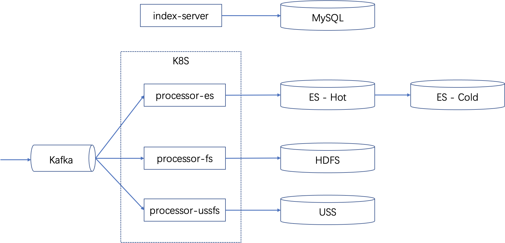

2）从数据链路来讲，主要分为两条数据链路：

一条数据链路通过运行在k8s里的processor-es服务处理的结构化数据，主要存储在ES-Hot数据集群（该集群主要采用SSD磁盘H6机型）。当在ES-Hot里的数据超过一定时间后，就被移动到ES-Cold的集群（该集群主要采用HDD磁盘的H4/H8机型）。由于整体磁盘资源的限制，这两部分的数据存储时间加起来不超过2周。

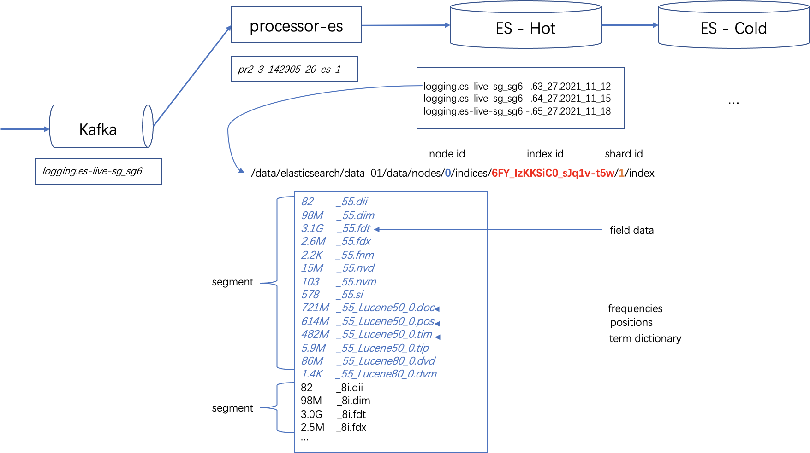

第二条数据链路主要通过processor-fs/processor-ussfs把数据写入一个归档的文件存储上(HDFS/USS)。这个主要解决数月乃至数年的数据存储需求（例如BKE由于合规审计的需求）。在文件存储格式基本是按照logstore以及时间来组织，类似如下的格式。

mountDir/logName/yyyy-MM/dd/file/bussinessLogPath-partiton.yyyy-MM-dd.HHmmss.log。

1.2 当前存储架构的问题
存储成本高：目前线上每日写入的数据量约为2PB左右，整体机器资源占用约1000+台物理机。按照公司后续的业务增长规模来看，每年的机器成本至少翻倍增长。同时ES和hdfs/uss有部分存储重复。
可靠性低：由于成本以及性能的原因，目前日志存储都是单副本状态，一旦一个ES节点硬盘故障，则可能导致数据的永久不可恢复。
维护成本高: 基于ES架构的存储，经常有写入不平衡，节点元数据管理瓶颈，集群状态异常等需要较多人工介入。我们也做了大量的ES优化，总体收益不高。

其中第三点提到的ES运维问题，目前正在测试ES+SPBS来解决部分，相关的技术方案在这个文档[15]里讨论。

1.3 业界解决方案

调研过的工业界的解决方案(SumoLogic, Scalyr, Splunk, LogDevice, Qihoo360, Wechat, SLS等), 以及相关学术论文讨论的方案[4], [5]，在存储层主要分为以下几类:

1.3.1 基于全文索引

基于ES/Lunece/Solr，比如开源的如ELK，商业产品如腾讯云。

1.3.2 基于OLAP系统

基于CK, Hive, HBase等OLAP。如Uber[6]的log系统。

1.3.3 自研存储引擎

基于日志特性，自研存储引擎。这块差异比较大，主要不同公司根据不同的业务模式，用户场景来做一些定制化的解决方案。

商业产品如Scalyr[7]是一个SaaS产品提供商，从公开信息来看，他们的存储架构通过暴力扫描的方式辅以良好工程实现来解决，宣称整个系统能做到1.5TB/s的扫描速度。
阿里云针对云上业务的日志订制化的开发一个LogReducer[4]解决方案，其原理利用了日志的模板性很强的特性，实现了基于parser tree方式压缩。
YScope公司提到CLP[5]则根据日志模式特征做特殊的压缩，在极大的降低存储开销的同时，也能基于压缩的数据再不解压的情况下做一些高效的搜索。
腾讯的企业微信[8]则利用分布式文件系统来存储数据，根据业务场景辅以callid特殊索引，并行查询并辅以linux shell grep/awk/uniq来做查询。
阿里云的日志服务[9]的主要采用HDD来存储数据，利用了Succinct Tree(FST), 优化BKD-Tree, 自适应Bitmap等技术自研存储和索引引擎来实现。
2. 设计思考
2.1 Log search is not a search engine problem

从这个文档[3]分析来看，日志主要使用场景分为三类:

1）ad-hoc类型的查询

// 查看程序panic日志
panic AND -"view func end" AND -"friend info" AND -"getContacts" AND -"ShakeFriendTree"
用户对查询过程是探索式，需要不断的调整查询条件以便用户更加精确的定位自己所需要的日志
每个探索过程比较短，期望能快速响应
每个探索过程返回小部分数据（比如前100条）即可，不要因为等全量数据要卡比较长的时间
有一些便捷的操作方便用户快速探索，比如把查询结果某些信息快速加到过滤条件，根据某条日志的时间快速调整查询范围等
对搜索结果是精确匹配，没有PageRank和语义关联搜索。反而由于ES分词规则不同导致用户查询理解的困扰。

2）实时分析统计类的查询

// 找出派发voucher失败用户，并以失败次数降
"spsDistributeVoucher" | parse "uid=*," as uid | count by uid | sort by @count desc
能够通过对关键字搜索出来的日志做进一步的分析，比如从payload里提取信息
需要支持按照字段做一些统计和排序
不需要一次得到很精确的结果，可以及时更新不断刷新计算结果
支持对分析结果进行导出
3）离线分析 

// 把error日志聚类
@severity=ERROR AND -"no chance" AND -"shaked today" | reduce
离线计算，对实时性没有要求，一般都是通过邮件或者报告异步展示给用户
查询都是统计类型的，可能涉及到数据量和计算量比较大

从几个使用场景来看，对待日志搜索不是一个"搜索引擎"问题，更像一个"OLAP"问题。那我们应该使用OLAP一些经典技术来处理日志问题。

2.2 Not every log message need to be indexed

日志数据访问特性具有很强的"时间局部性"和"空间局部性"[2]:

时间局部性：90%的查询到的落到最近1d之内（即使用户查询时间是3d，但是往往也只翻前几页的数据)
空间局部性：90%的查询会聚集到少量的logstore里（2021年: 90% query在1227/16072 logstores)

基于ES的体系架构下，对所有的日志都等价来处理的，并对每一条日志都建立细粒度的索引，这在两个”局部性“条件下是一种很大的浪费：

有很大一部分数据我们花比较大的计算和存储代价维护了索引，但是最后几乎不会被用到就删除了。
对待日志数据，时间是个很重要的概念，日志数据也是AppendOnly的模式，但是ES完全感知不到这个时间的特殊性，对于搜索结果还需要按时间戳排序，所以导致即使全量数据查询第一条数据的返回结果也会超时。

业界360 poseidon[10]也提出此问题，并采用基于Chunk的索引方式。

2.3 Share nothing vs. share disk/storage
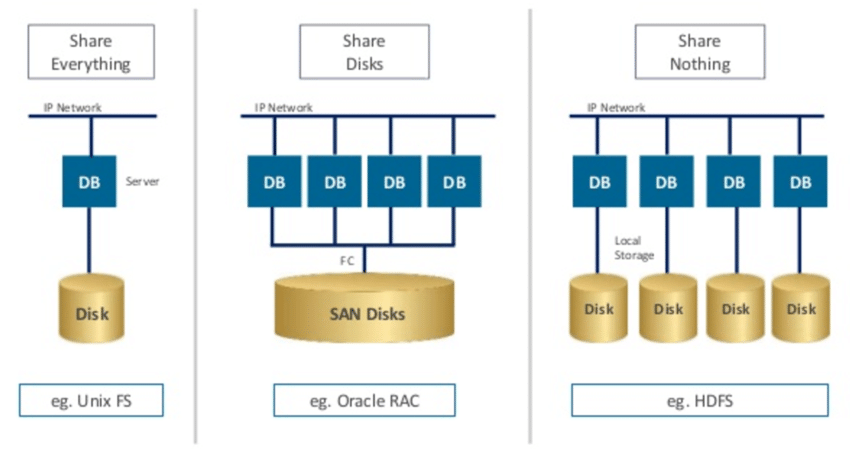
现在有的基于ES架构是一种share nothing的做法，主要解决的是scale out的问题。虽然这种share nothing是目前数据存储领域比较主流的方式，但也存在一些问题：

计算和存储耦合。所有的节点在硬件配置上基本是同构的，但是workload却可能不一样，有些是计算密集型，有些是IO密集型，所以大部分时候都有一些资源浪费。同时也不能单独的扩展计算或者存储。
节点变更导致的存储的re-sharding也一个比较大的开销。

share storage主要是多个无状态的计算节点，共享一个有状态的分部署存储。不过这个层次模型对计算层是透明，不像share disk只提供了一个disk基本的抽象。业务比较成功的案例是Snowflake[11]。

2.4 Schema on write vs. Schema on read
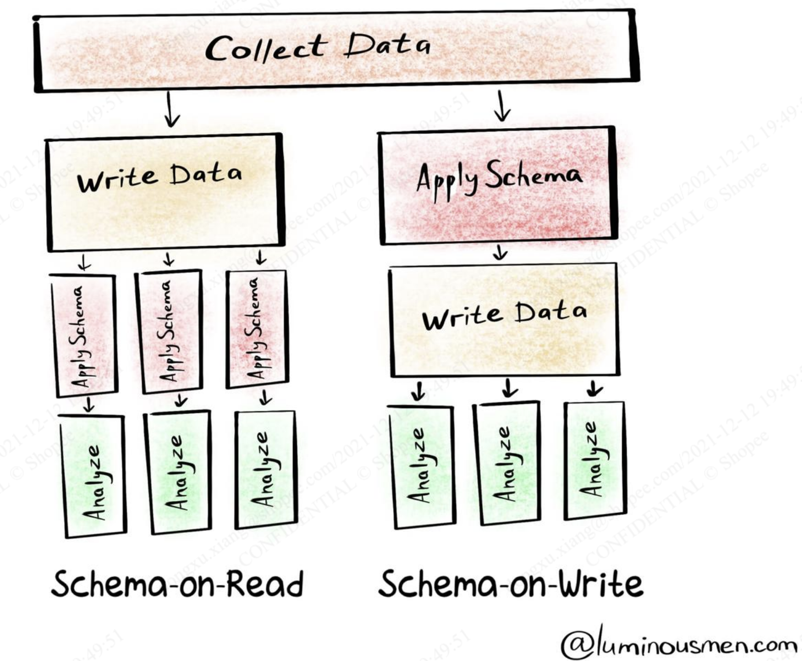
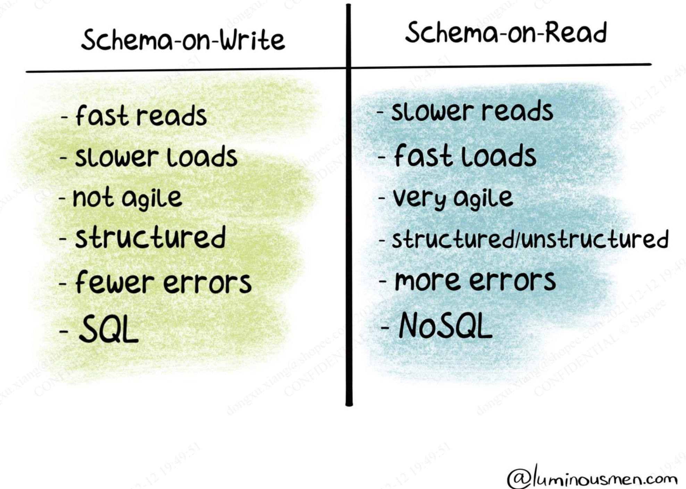

日志是一种半结构化的数据，将日志数据存储到后面的存储系统的时候，关于是否需要有schema，我们有两种选择：

schema on write:  类似现在ES架构的方式，我们定义了一个grok（实际是正则）来把日志转换为结构化数据，然后apply一个ES的type来存储相关的数据。
schema on read：类似目前pipeline search的架构，提供一些运行时的数据抽取能力(parse/split, 类似awk/cut)，查询时转成结构化数据处理。

针对日志数据，如果完全采用"schema on write"其实是一种比较大的计算浪费，因为如上的两个“局部性”特性而导致大部分日志数据不会被访问。

因此对于日主数据而言，"schema on read"是一个更好的选择。但并非认为日志完全无结构的，事实上诸如概念模型提到的那些系统字段则是schema中的一部分，而且这个schema是apply到所有的日志的。

3. 架构设计
3.1 概念模型

新的存储系统有一下概念模型:

1) Tenant，Space，LogDB， Index

参考0. 概念模型
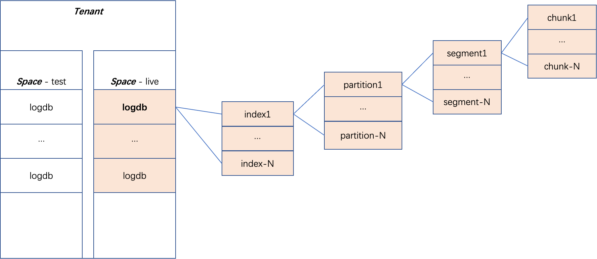

2) Partition

用户不感知的概念，是一种更细粒度的数据组织单位，是数据淘汰的单位。典型的按照时间维度来组织partition（1天生产一个partition）。一个partition的数据大小在100G ~ 1TB左右。

3) Segment

用户不感知的概念，对内部实现来说一个建立索引的单位。查询也是以segment为粒度。一个Segment的数据大小在1MB~100G范围内。

3) Chunk

用户不感知的概念，为了优化存储IO，通常为了适配底层存储系统大小以1K~100MB为单位。

3.2 架构设计
3.2.1 Big Picture
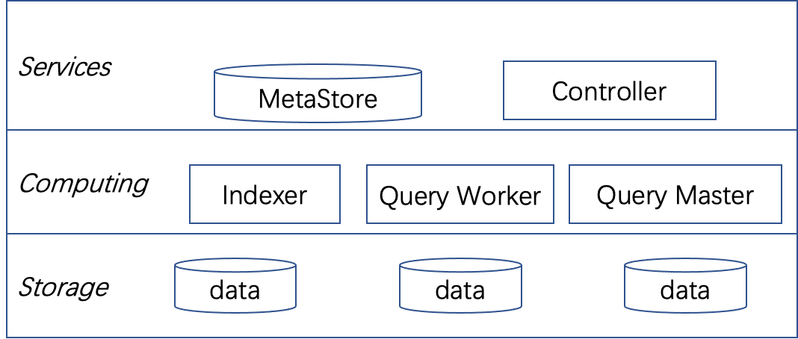
吸收了Snowflake[11]的计算和存储分离的设计思想，整个日志的存储系统主要分为三部分:

一组Services，包括对外暴露的API以及对内的数据管理服务
一组K8S计算节点，主要做数据的写入和查询
一组独立的数据存储节点

其设计目标是能做到两层都能根据需求分别做独立的扩展。同时整个存储层提供了一套独立的grpc接口服务接口，并能独立于其他日志组件来运行，主要目的是系统解耦来方便开发和测试。

1）Controller：负责管理整个存储的元数据，包括LogDB，Index，Partiton的生命周期的管理。所有存储集群的元数据访问都要通过controller。

2）Indexer：是对外暴露的数据写入的接口，负责把数据存储起来，并根据数据测试建立合适的索引。

3）Query Worker/Master: 是对外暴露的数据查询接口，负责接收用户的查询语句并返回结果。

4）Meta Storage：负责存储整个集群的元数据信息，包括LogDB/Index一些静态信息，也包括Partition/Segment/Chunk等数据的元信息。

5）Data Storage：负责存储整个集群的实际的数据块。

3.2.2 Component View

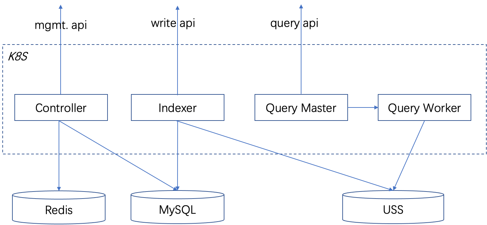

根据Overview架构展示的，存储层采用这些组件来实现：

MetaStore主要采用MySQL来实现，如果MySQL性能不足支撑，则可以替换为TiDB/ES来实现。其中Redis部分主要为加速一些元数据的访问。
DataStore主要依赖Object Store来实现，特别在公司内部主要依赖于USS。特别也可以利用SPBS实现同等能力。具体需要进步的测试。
3.2.3 存储选型
3.2.3.1 依赖USSFS实现
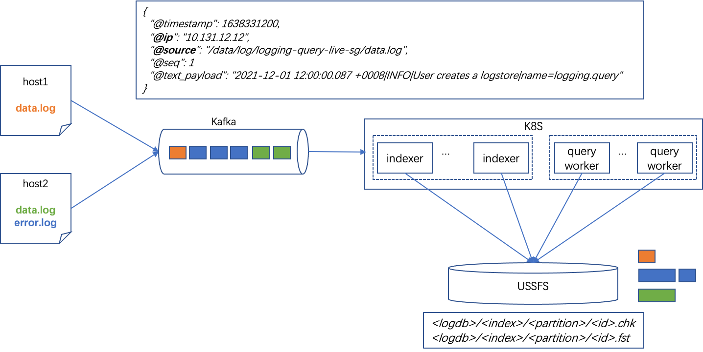
本方案数据存储层完全依赖分布式文件系统ussfs实现，indexer和queryworker共享读写这个文件系统。

优点:

很好的实现了计算和存储分离，并且各自都可以独立扩展
依赖于文件系统提供的目录结构，省掉元数据管理的负担

缺点：

ussfs没有线上大规模检验过，可靠性待定。一旦ussfs故障，则全局数据都不读写。
ussfs对小io和小文件支持规模待验证，特别是针对BKE有长期存储需求。
没有区分数据的冷热，不能根据数据特性做特定的优化。
3.2.3.2 依赖USSFS+USS实现
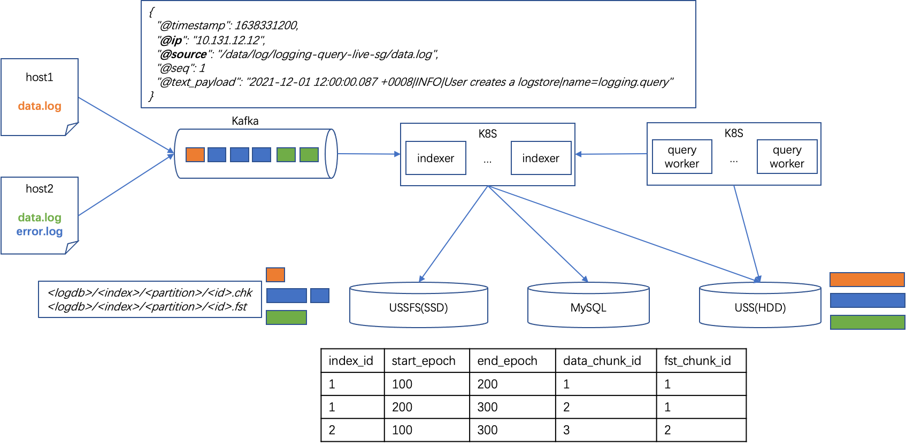
本方案针对3.2.3.1方法做一点改进，对于近期数据放在共享的ussfs里，这部分主要是ssd磁盘机器。然后根据一定的策略，把数据合并后再迁移到uss object存储上。uss object这部分主要采用HDD机器部署。uss object存储是整个数据的source of truth。

优点：

可以根据数据的冷热特性做一些访问上加速

缺点：

对于上述ussfs的问题依然存在
针对uss object需要自己独立的元数据管理
有一定的数据冗余和数据合并迁移成本（uss object存储不支持追加写）
3.2.3.3 依赖SPBS实现
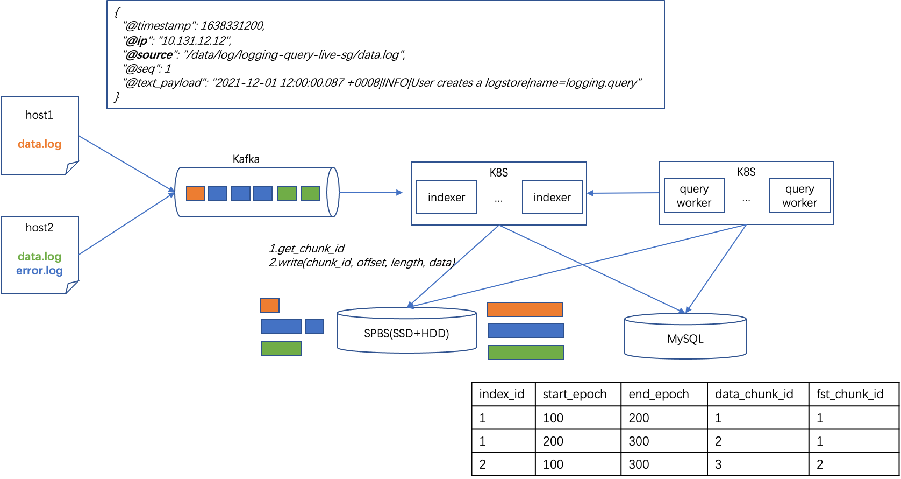
主要依赖SPBS提供的存储池来实现（非挂在卷的模式）。SPBS存储系统主要以混闪（2SSD+10HDD）来实现，提供SDK来读写原始存储块。

其中写数据流程:

调用sdk提供 get_chunk_id来获取存储一块可写区，通常比如是64M
调用sdk提供的write(chunk_id, offset, length, data)来写数据。

优点：

支持小io，主要由前置的ssd来扛iops，然后再异步刷HDD
支持对同一chunk追加写
利用SPBS的SSD->HDD的数据迁移能力

缺点：

需要自己做元数据管理
SPBS稳定性待验证
3.2.3.4 混合share noting/storage的方式
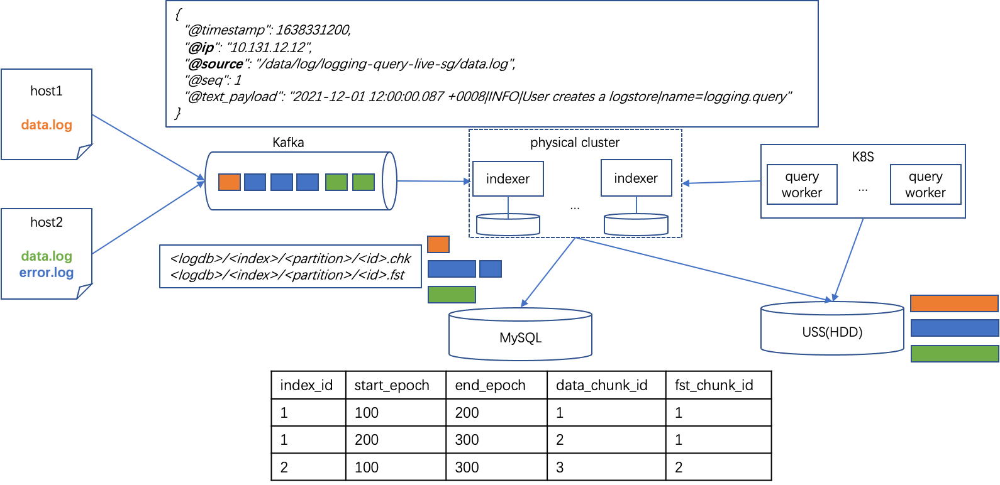
参考阿里[17]这边文章提到的思考，存储架构并非只是"非此即彼"的问题。

我们把数据和索引分开来考虑：

针对日志的chunk的数据，这部分量比较大，访问延迟不是很敏感，还是采用shared storage的方式来存储。
针对index数据，底层还是依赖shared storage作为整体数据的source of truth。但是为了提高性能，我们采用share nothing的架构来缓存index数据，很好的利用这些节点的本地内存和SSD磁盘。

3.3 数据流程
3.3.1 管理流程

主要通过Controller提供的grpc访问。以最基本的创建logdb为例:

用户调用controller.createLogDB()接口
controller把相关的元数据写入MySQL controldb
controller把相关的元数据写入Redis
返回创建结果
3.3.1 写入流程
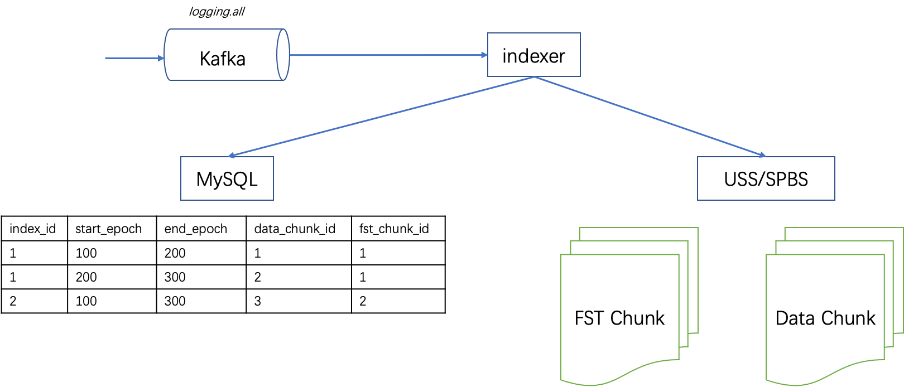
主要通过Indexer提供的grpc接口访问，并依赖于Kafka来实现WAL。日志写入流程：

kafka里的数据以logdb为单位来组织，注意写入的日志基本上是时间有序的
indexer服务根据创建的index的规则（比如按照日志等级）分流写
写入的时候先在内存累积在一个memory chunk里，同时对这批数据做分词建FST索引（todo: 数据规模小则直接暴力扫描而不建索引？）
待memory chunk达到一定的缓存时间或者大小后，则压缩（先用通用的gzip压缩算法）刷盘写入USS上。同时将相关的元数据记录的MySQL里。两步完成再commit kafka offset。
indexer后台把不断时间的小的chunk的元数据合并为更大的segment，同时把合并的segment元数据写入MySQL和USS里。其目的合并重复信息（特别是FST）以方面后续能快速跳过不相关的chunk。

存储开销预估: 比如原始的日志数据是1GB, 则需要付出的存储开销:

按照10MB一个Chunk，则需要100条MySQL记录，整体元数据存储大小约为1MB。
根据之前的测试数据来看[2]，一个FST索引约占原始数据的1/1000，存储开销约为1MB。
根据对日志数据的压缩测试[12], 采用通用的压缩算法诸如gzip/zstd，能收获到5~10倍压缩率(200MB~100MB)。特别的，如采用[4],[5]提到基于模板的压缩算法，压缩率能提高10~30倍(100MB~33.3MB)。
总体计算，存储开销最坏情况能到20%，最好情况不到原始数据的4%。这和基于ES架构的1:1的压缩比来看，有极大的提升。压缩后的另外一个好处是减少IO资源和网络传输带宽。
3.3.2 查询流程
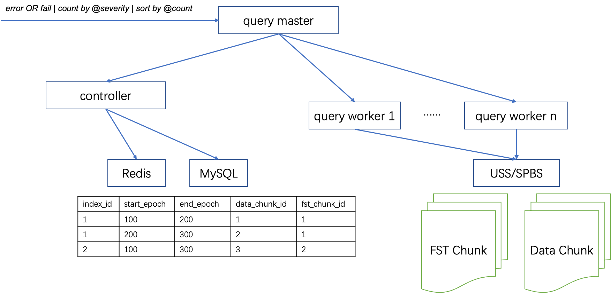
 以执行这个查询为例(error OR fail | count by @severity | sort by @count ):

query-master收到用户这条查询语句后，后续通过parser/lexer生成必要的物理查询计划
查询计划的第一步根据查询的logdb和时间范围，初步确定要扫描的index和partition
根据搜索的关键词error, fail通过FST索引初步筛选出并求OR关系后扫描出符合条件的data chunk id
把这些data chunk id并行的发给多个query worker执行暴力扫描查询。query worker把符合条件的结果送给query master做聚合计算
整个查询过程都是流式的，包括query master查找chunk id和query worker查询data chunk的过程

怎么查询过程怎么保证查询时间？

设计目标：任何查询的首条数据返回时间小于1s。
核心依赖多worker并行化处理。对日志查询模型来说，是典型的低QPS高throughput场景（Clickhouse也类似）。所以比较依赖存储层能提供高throughput模式(SPBS 6台机器就能提供GB级别的带宽；USS 2台机器也能提供GB带宽[14])。
其次日志搜索不同于OLAP，快速展示第一屏数据最重要，而不需要等待全量数据。
3.4 模块设计
3.4.1 Controller设计
3.4.1.1  元数据存储

元数据存储主要依赖于MySQL数据库有多个数据库:

control_db：主要记录全局一些logdb, index等信息
data_db: 主要存储日志chunk元数据的。这部分数据按照时间维度进行分区。

3.4.2 Indexer设计
3.4.2.1 Chunk数据格式
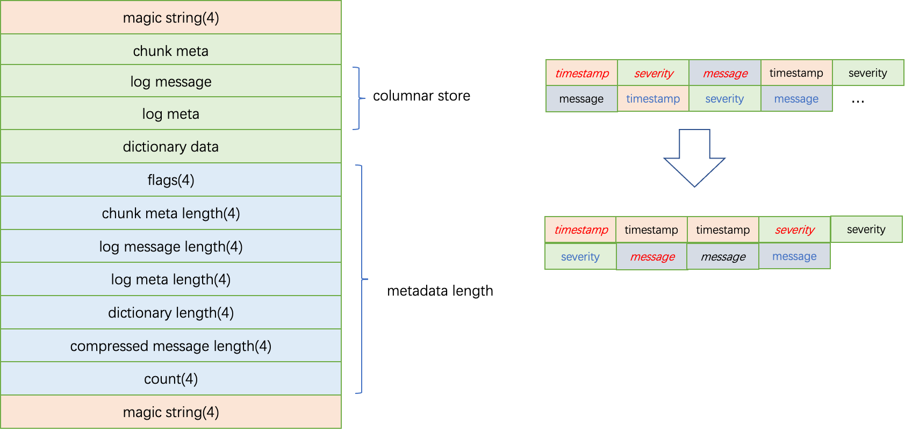
chunk是一种自定义的格式，其中

日志元数据（log meta，诸如每行的timestamp, trace_id, severity）采用列式存储，这部分利用parquet/OCR的格式。
日志数据（log message），则参考这边文章[7]提到的思想：讲所有的message拼接为一个big string，然后利用Leonid Volnitsky字符算搜索算法来做暴力扫描。这很好利用cpu cache friendly和cpu pipeline。
其他描述各个数据长度则统一放在末尾，主要原因：
整个chunk可以以流的方式来构造，这样避免内存结构到磁盘结构转换的开销。
可以利用uss的partial read能力，定长的从末尾读取chunk元数据。对查询节点来说，也可以做部分信息缓存。

3.4.2.2 FST数据格式
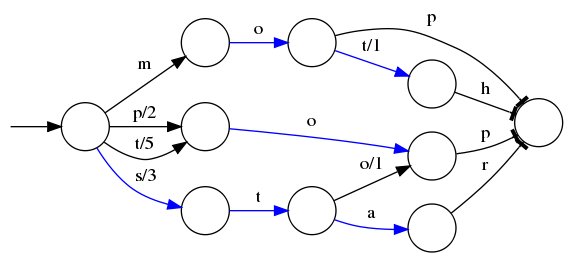
FST的内存格式等价于map<term,chunk_id>,  这一块的磁盘存储格式参考Lucene的实现即可。 

4. 成本分析
4.1  资源成本

按照日均2PB原始日志计算，压缩率按5倍计算。

1）存储成本

原始数据	压缩后	FST数据量	其他索引数据	H4机器数（EC容错）	H6机器数(2副本)	存储15天
2PB	400TB	2TB	<1TB	400TB/80TB*1.4=7	2	(7+2)*15=135

2）写入计算成本

原始数据	zstd压缩速度	所需CPU核数	H6机器数	FST索引速度	总计机器数
2PB	500MB/s	2PB/24/3600/500MB=49	49/56=1	//todo	//todo

3）查询计算成本

最大QPS	zstd解压速度	平均每次扫描数据量
10	1660MB/s	//todo

最粗略估算：总体存储成本小于200台机器，相比目前基于ES的架构机器数700+的规模可以节省约2/3的硬件成本。

5. 开发计划
时间点	Checkpoint	负责人	状态	备注

2022.Q4 - Research

	

2021-11-10 

	阅读和调研业界的技术方案	

Dongxu Xiang 

	

	链接

2021-11-29 

	输出存储技术方案第一版本并Review	

Dongxu Xiang 

	

	链接

2021-12-14 

	技术方案Review	

Dongxu Xiang 

	

	

2022-1-10 

	完成技术方案终稿并制定出开发计划	

Dongxu Xiang 

	

	

2022.Q1 - Prototype

实现整个方案的技术原型，初步验证各个方案的可行性

	

2022-1-31 

	框架搭建以及代码规范输出	

Dongxu Xiang 

	

	

2022-1-31 

	结合查询引擎的需求，调研并输出存储格式的设计	

Jun Wang 

	

	链接

2022-1-31 

	调研并输出类FST索引服务的实现方案	

tianfu.liao@shopee.com

	

	链接

2022-1-31 

	调研并输出日志场景的分词算法设计	

Tong Wu 

	

	链接

2022-2-25 

	完成Chunk格式开发以及实现最基本的查询能力	

Jun Wang 

	

	

2022-2-25 

	完成第一版本的indexer服务框架以及索引部分	

tianfu.liao@shopee.com 

	

	

2022-2-25 

	完成第一版本的indexer服务chunk写入流程	

Tong Wu 

	

	

2022-2-25 

	

开始准备数据测试的工具

	

tianfu.liao@shopee.com 

	

	

2022-2-28 

	

完成第一版代码的实现和联调，可以在docker环境运行

	@all	

	

2022-3-4 

	完成测试环境的搭建	

tianfu.liao@shopee.com 

	

	链接

2022-3-18 

	完成第一版的1TB数据规模下测试数据	

Tong Wu tianfu.liao@shopee.com Jun Wang 

	

	链接, 资源预估

2022-3-25 

	输出下一阶段迭代计划	

Dongxu Xiang 

	

	

2022.Q2 - MVP

完成系统功能开发，可以采集日志系统本身系统的日志

	

2022-4-12 

	输出indexer服务基于uss的实现方案并完成Review	

Tong Wu 

	

	

2022-4-12 

	输出indexer等服务线上部署的实现方案并完成Review	

tianfu.liao@shopee.com 

	

	

2022-4-12 

	输出元数据服务的实现方案并完成Review	

Jun Wang 

	

	

2022-4-29 

	完成模块代码开发并在docker容器可以运行起来	

tianfu.liao@shopee.com 

Jun Wang 

Tong Wu 

	

	

2022.Q3 - Beta	2022 Q3	完善实现和调优，发布beta version，基本达到设计目标	
	

	

2022.Q4 - 1.0	2022 Q4	线上灰度部分流量，初步接受大促流量的考验	
	

	

6. 参考文档

[1] [日志平台]整体架构

[2] 日志平台成本优化

[3] 4. 查询引擎设计与实现

[4] On the Feasibility of Parser-based Log Compression in Large-Scale Cloud Systems  - https://www.usenix.org/system/files/fast21-wei.pdf

[5] CLP: Efficient and Scalable Search on Compressed Text Logs - https://www.usenix.org/system/files/osdi21-rodrigues.pdf

[6] Fast and Reliable Schema-Agnostic Log Analytics Platform - https://eng.uber.com/logging/

[7] Searching 1.5TB/sec: Systems Engineering Before Algorithms - https://www.sentinelone.com/blog/searching-1tb-sec-systems-engineering-before-algorithms/

[8] 企业微信万亿级日志检索系统 - https://mp.weixin.qq.com/s/Aam4NCEmAgt2kU8qmBHo2g

[9] 阿里10PB/天日志系统设计和实现 - https://zhuanlan.zhihu.com/p/75513049

[10] 360 poseidon - https://github.com/Qihoo360/poseidon

[11] The Snowflake Elastic Data Warehouse - https://dl.acm.org/doi/pdf/10.1145/2882903.2903741

[12] https://www.stefanseidel.info/Log_file_compression

[13] https://conf.splunk.com/files/2016/slides/behind-the-magnifying-glass-how-search-works.pdf

[14] uss压力测试报告 , MLP 文件系统压测 (存储+元数据)

[15] WIP - es 节点使用块存储替换本地物理磁盘方案

[16] https://github.com/facebook/zstd, https://github.com/inikep/lzbench

[17] https://mp.weixin.qq.com/s/DNvQ_wa1fFrcPR0bzPvnQA

[18] Crystal: A Unified Cache Storage System for Analytical Databases - https://badrish.net/papers/crystal-vldb2021.pdf