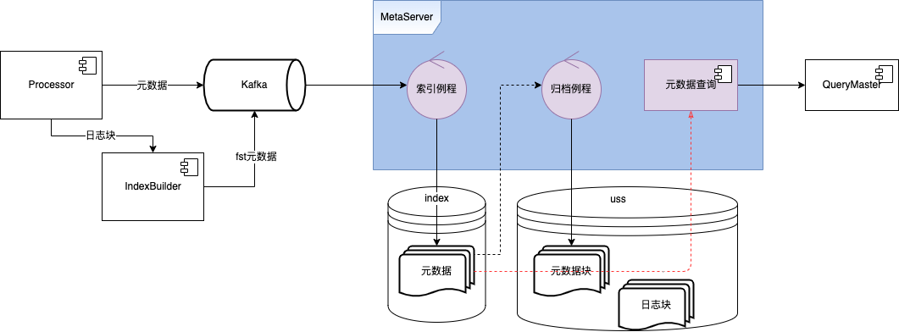
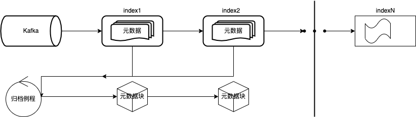

[WIP]日志块存储元数据服务设计

2022-3-22 

	

	Create the initial version
1. 背景

日志块存储实现把一批日志（10M规模）按列编码压缩一次写入一个二进制块中。写入之后，我们需要记录块地址等元信息，查询时根据元信息获取块日志内容。为此，我们需要设计一个元数据服务，管理块的元信息。

2. 设计目标

根据3、12.12 Campaign Report的数据，2021双12大促日志采集峰值带宽达到了78.9GB/s。按这个数据来推算，意味着每秒要写入8079个块。一个块一条元数据，一天要写入接近7亿条元数据。按每条元数据1KB大小来算，一天要写入665GB元数据。对于查询而言，用户想要的是一段时间内满足搜索条件的日志，整体性能要求能够快速扫描1TB以上原始日志数据。按每个块存储10MB日志来推算，1TB日志有104858条原数据，这就意味着元数据服务要满足在极短时间内进行范围查询。

综上所述，元数据服务应当满足以下3个主要设计目标：

满足峰值近w级别的写入qps；
支持大数据量规模存储；
支持10W+结果快速范围查询；
3. 架构设计

元数据服务分为索引、查询和可选的归档模块。根据数据流动方向，整体架构如下图：

Processor进程消费业务产生的日志，构造日志块，写入uss，将元数据写入Kafka；
Processor进程日志块传递给IndexBuilder，构造fst；
MetaServer消费Kafka元数据，写入index；
归档例程批量将元数据归档，写入uss。
4. 数据模型设计

元数据服务对外提供接口：

type MetaService interface {
 	ListChunkMeta(start_ms, end_ms timestamp, filters Filter) return stream ChunkMeta
}

供查询时使用。

日志块元数据ChunkMeta由

chunk_id	string	日志块fid
chunk_size	int32	日志块大小（byte）
fst_id	string	日志块fst fid
tenant_id	int64	日志所属tenant
log_db	int64	日志所属逻辑db
log_index	int64	日志所属逻辑index
start_epoch_in_ms	int64	块内最小日志时间
end_epoch_in_ms	int64	块内最大日志时间
service	string	产生日志的服务
env	string	服务所在环境（test、uat、live)
cid	string	服务所在地区
host	string	产生日志的host
source	string	产生日志的source
category	string	日志所属类别
severity	map<string, int>	日志等级日志数量{"debug":10,"info":20}
tags	map<string, string>	其他tag

构成，在Processor写入日志块后创建，写入Kafka中。其中Kafka Topic按tenant维度创建。

索引例程消费chunk元数据后，写入索引中。索引按数据量创建，当达到一定大小时，创建新索引。

fst元数据创建后写入chunk元数据同一个topic中，这样可以保证消费fst元数据时chunk元数据已经插入到索引中。fst元数据消费后更新到chunk元数据记录中，更新策略是：先找最新的索引更新，如果未命中记录，找上一个索引去更新。

索引信息保存在数据库log_chunk_meta_index_list_tab中：

id	int64	自增id
tenant_id	int64	日志所属tenant
index_name	string	索引名字
start_epoch_in_ms	int64	索引中元数据记录的最小日志时间
end_epoch_in_ms	int64	索引中元数据记录的最大日志时间
state	int8	(Active，ReadOnly，Archived，ToRecycle)

索引在创建时处于Active状态，可以写入或更新。当索引不再更新时，状态变为ReadOnly。这时归档例程可以开始对元数据进行归档。归档完成后，索引状态更新为Archived。在索引回收时，索引状态更新为ToRecyle，此时索引对查询不再可见。

@startuml

left to right direction

[*] --> Active
Active --> ReadOnly
ReadOnly --> Archived
ReadOnly --> ToRecycle
Archived --> ToRecycle
ToRecycle --> [*]

Active : 索引创建
ReadOnly : 索引不再更新
Archived : 索引归档完成
ToRecycle : 索引准备回收

@enduml

后台归档例程（可选）不停将索引中元数据归档，以log_index维度构造元数据块写入uss中，使用system.meta作为固定的bucket。

归档元数据ArchiveChunkMeta由

chunk_id	string	元数据块id
log_db	int64	日志所属逻辑db
log_index	int64	日志所属逻辑索引
start_epoch_in_ms	int64	块内最小日志时间
end_epoch_in_ms	int64	块内最大日志时间
state	int8	归档记录状态（Active，ToRecycle）

构成，保存在数据库log_chunk_meta_archive_tab中：

归档数据记录刚创建时处于Active状态，可供查询。当块内所有日志到期时，归档记录状态变更为ToRecycle状态，对查询不再可见。

@startuml

left to right direction

[*] --> Active
Active --> ToRecycle
ToRecycle --> [*]

Active : 归档记录创建
ToRecycle : 块存储资源将回收

@enduml

归档的元数据块按列进行存储：

chunk_id	chunk_id	chunk_id	chunk_id
start_epoch_in_ms	start_epoch_in_ms	start_epoch_in_ms	start_epoch_in_ms
end_epoch_in_ms	end_epoch_in_ms	end_epoch_in_ms	end_epoch_in_ms
service	service	service	service
host	host	host	host
source	source	source	source
tag1	tag1	tag1	tag1
...	...	...	...
tagn	tagn	tagn	tagn

归档进度保存在数据库log_chunk_meta_archive_progress_tab中：

id	int64	自增id
last_archive_index	string	归档的索引名
last_archive_log_db	int64	归档的logdb
last_archive_log_index	int64	归档的logindex
last_archive_doc_id	string	上次归档最后一个文档id

归档数据可以作为索引崩溃后恢复的数据来源，增加系统的容错性。同时归档数据也可以用于元数据查询。假设一条元数据占用1KB存储空间，1MB大小的归档数据块包含1024条元数据。在归档过程中，我们可以把元数据块同时缓存到MetaServer的本地SSD磁盘中。查询时假设读取1MB元数据块平均耗时9ms，然后在内存中过滤块内符合条件的元数据耗时1ms，相当于每条元数据平均处理时间约为10us。

5. 核心流程描述
5.1 写入

元数据写入之前需要先创建索引，首次创建发生在业务接入日志平台时。在创建完logdb之后，我们在uss中创建bucket（bucket以logdb维度创建）。在es中创建索引，将索引记录插入db中。

@startuml

autonumber

actor "业务" as User
participant "接入服务" as MgmtSvr
participant MetaServer
participant ES
participant DB
participant USS

activate User

User -> MgmtSvr: 接入日志
activate MgmtSvr

MgmtSvr -> MgmtSvr: 前置处理

MgmtSvr -> MetaServer: 创建资源
activate MetaServer

MetaServer -> USS: 创建bucket
activate USS
deactivate USS

MetaServer -> ES: 创建元数据索引
activate ES
deactivate ES

MetaServer -> DB: 创建索引列表记录
activate DB
deactivate DB

MetaServer --> MgmtSvr
deactivate MetaServer

MgmtSvr --> User
deactivate MgmtSvr

@enduml

processor进程从kafka中消费日志后，构造日志块，获取bucket，写入uss。随后创建元数据记录，发送kafka。之后将日志块数据传递给IndexBuilder模块，IndexBuilder汇聚一批日志块创建fst，写入uss，然后将fst元数据发往kafka。

@startuml

autonumber

participant Processor
participant IndexBuilder
participant USS
participant Kafka

activate Processor

Processor -> Processor: 消费日志数据, 构造LogChunk

Processor -> Processor: 获取logdb当前写入bucket

Processor -> USS: 写入LogChunk到bucket
activate USS

USS --> Processor: 返回chunk_id
deactivate USS

Processor -> Kafka: 写入元数据
activate Kafka
deactivate Kafka

Processor -> IndexBuilder: LogChunk
activate IndexBuilder

IndexBuilder -> IndexBuilder: 批量对LogChunk构建fst

IndexBuilder -> USS: 写入fst到bucket
activate USS

USS -> IndexBuilder: 返回fst_id
deactivate USS

IndexBuilder -> Kafka: 写入fst元数据
activate Kafka
deactivate Kafka

@enduml

Processor保证不会把跨天的日志写入一个日志块中，同样的，IndexBuilder保证不会把跨天的日志块构建一个fst。

索引例程消费完一批数据后，检查写入数据量，达到限制规模后，创建新索引。

@startuml

control "索引例程" as indexer
participant DB
participant ES

autonumber

activate indexer

loop 消费Kafka chunk元数据

indexer -> DB : 获取正在写入的索引
activate DB
deactivate DB

indexer -> ES: 批量写入元数据
activate ES
deactivate ES

indexer -> DB : 更新写入记录数量
activate DB
deactivate DB

alt 索引记录数量 > 1kw

indexer -> ES : 创建新索引
activate ES
deactivate ES

indexer -> DB : 创建新索引记录
activate DB

end

end

loop 消费Kafka fst元数据

indexer -> DB : 获取tenant索引列表
activate DB
deactivate DB

loop 从新到旧遍历索引列表
indexer -> ES: 尝试更新fst_id到对应对应索引
activate ES
deactivate ES

alt 更新成功
break
end

end

end

end

deactivate indexer

@enduml
5.2 归档（可选）

当索引不再更新后，状态变为ReadOnly，可以对元数据进行归档。

归档例程按logdb维度，一次将1024条元数据构造一个元数据块，写入uss。同时在归档进度表中记录进度信息。

@startuml

autonumber

control "归档例程" as archiver
participant DB
participant ES
participant USS

activate archiver

loop

archiver -> DB: 遍历ReadOnly状态索引
activate DB
deactivate DB

archiver -> ES: 获取所有logdb
activate ES
deactivate ES

loop 遍历lodb列表

loop 

archiver -> ES: 获取上次归档点之后的最多1024条元数据
activate ES
deactivate ES

archiver -> archiver: 构造元数据块

archiver -> USS: 写入<chunkID, MetaChunk>
activate USS
deactivate USS

archiver -> DB: 记录归档进度信息
activate DB
deactivate DB

archiver -> archiver: 缓存元数据块

end

end

archiver -> DB: 更新索引状态=Archived
activate DB
deactivate DB

end

@enduml
5.3 查询

查询时首先对用户输入的查询语句进行分解，提取出元数据过滤信息和关键字查询。

@startuml

usecase "@severity = ERROR and panic" as query
usecase "@severity = ERROR" as meta_filter
usecase "panic" as keyword_search

query -- meta_filter : filter
query -- keyword_search : keyword

@enduml

然后通过过滤信息和时间范围查询索引获取元数据，流式迭代结果，在迭代过程中，通过查询fst过滤不含关键字的数据，最后符合条件的chunk_id发给query-worker进一步搜索。

5.4 资源回收

日志存储时间超过保留天数后，可以对存储资源进行回收。我们通过遍历索引元数据回收uss资源，在查询时根据日志保留时间调整查询时间范围，保证不会查询超过保留时间（1h）之外的日志。

@startuml

autonumber

control "回收例程" as recycle
participant DB
participant ES
participant USS

activate recycle

loop 遍历log_db_tab

recycle -> DB: 获取含待回收日志索引列表
activate DB
deactivate DB

loop 遍历索引列表

recycle -> ES: 获取 > 保留时间+1h的元数据
activate ES
deactivate ES

loop 遍历待删除元数据

recycle -> USS: 删除日志块
activate USS
deactivate USS

recycle -> ES: 删除元数据记录
activate ES
deactivate ES

end

end

end

@enduml
6. 监控和告警（必填）
7. 上线计划 （必填）
8. 其他说明事项
9. sign off :SRE/PM/DEV/QA/SEC （必填）

