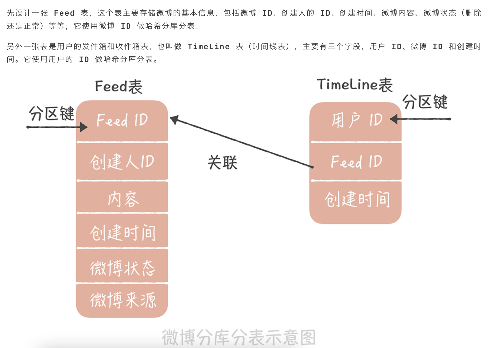

# 面试要点
* 自信, 这题做不出来只是这题可能理解或者一些其他方面的原因, 没有人能搞定所有题目, 但是自信是一定要随时保持的, 没答好的问题就不要想了. 
* 如何让别人感觉你是个牛逼, 经验丰富的人
* 交流, 主旨是让面试官舒服, 让他引领, 但是要把他当做跟你同级的人, 所以碰到代码题和一些他那边出的题目, 有想法了就先问他, 先沟通, 这个顺序或者想法对吗, 再深入
* 说自己这边项目或者答案的时候, 他不问细节就不要说, 真的说主动说太多细节就是给自己挖矿, 就算代码是自己写的也别说, 可能面试官有不同看法.
* 问问题, 可以问面试官所在的组是干什么的, 有几个人, 平时code review吗, 怎么cr, 会和别人讨论代码的实现吗, 精确到函数级别. 或者是汇报层级, 平时工作的一天是怎么样的. 觉得公司什么制度或者文化比较好. 然后说说自己的看法, 没想法就重复下别人的话.
* 代码题的沟通过程
## 架构图

查询：


写入：


## metasvr
metasvr: 
 meta-kafka --> metasvr es: 消费元数据kafka, chunk 和 index 的一些元信息写入es
 query-worker --> metasvr: 接受查询, 转换为查询es 
 metasvr --> es: 找出符合查询条件 chunkId , 通过时间等字段过滤
 metasvr --> indexsearch: 通过 chunkId 找到匹配的 indexId, 通过indexId 拉取 oss 数据, 目前使用bloom 过滤器, 将查询语句分词后查询是否命中bloom, 若命中返回chunkId
 metasvr --> queryworker: 返回命中的chunkId
## indexsearch
indexsearch:
meta-kafka -> indexsearch: 因为日志搜索时间越近的搜索概率越大, 所以消费元数据的kafka 写入磁盘缓存, 保持缓存最新, 提高缓存命中率. 

client(queryworker) --> client-server: 发起请求, indexId 作为key, 使用一致性hash, 保证每次都命中同一台机器, 一致性hash 返回worker server ip and port

worker client --> worker server: 通过ip:port, grpc 查询, 先查询缓存若不命中, 则查询oss, 每个 indexId 单独给一个search thread 执行. 因为每个indexId 的chunkid 列表不可能重复. 每个chunkid 由一个download thread 进行下载, 多个chunkid 并行, 最后返回每个词对应的 chunkid list.

一致性hash 有心跳检测 rpc, 返回失败, 则过滤掉失败的节点

## querymaster
pipeline search, 管道查询类似linux 的管道, 流式返回, 传统基于ELK的查询是查询完所有日志后才返回, 浪费资源而且很慢, 用户的搜索大多是探索式的, 逐步修改查询条件, 需要快速返回; 也有部分是统计性质的, 需要聚合, 解析等功能. 每天生成4PB的数据

querymaster:

browser -> querymaster: open query. 
querymaster -> browser: return queryid.
browser -> querymaster: 周期性查询query status, 如果没有异常, 就fetch 数据, 类似分页. 交互方式是流式返回的, 如果是聚合类的查询, 查询结果会一直更新, 只返回最多 200MB 的数据, 查询出来的数据会缓存在内存中, 如果内存撑不住会输出到外部存储. 

* 如何把逻辑计划转换为物理执行计划
例如starttime 和 endtime, 是如何转为es 的range 查询的, 等于说根据key 拿到逻辑执行计划的开始时间和结束时间, 然后再构造es 查询函数 range, 最后转成json 查询es.
而逻辑执行计划说白了就是把各种算子, 排序,解析等序列化传输到物理执行引擎, 常见的就是json, 然后物理执行引擎, 再构造具体的查询代码. 

* 如何流式返回


* antlr
语法和文法. 语法指的是go 等编程语言的语法, 而文法指的是能精确描述语法的语言, 能判断此段语法是否有错. 

* 向量化计算, 单指令多数据流（Single Instruction Multiple Data），简称SIMD。
目前应该是没有实现的查询这边, 向量化计算实际上是需要语言的api 有支持, 原理实际上是将多个可并行化的指令批量执行, 例如for 循环累加之前步长是1, 向量化后就是一个指令做多个累加, 但是需要考虑向量化前后结果的一致. 
* logreduce
目前就是每条日志按空格等分割成token, 然后数字变成 *** , 形成一个template, 然后再根据template, 提炼出一个字典树, 每个token 为一个node, children 为下一个token 组成的tokenlist. 

## indexer

indexer:
log agent --> kafka: 从业务机器本机采集日志
kafka --> indexer(processor): 消费日志写chunk 和index , chunk 使用流式编码压缩写入, 不存原文省内存, chunk 格式为列式; index 目前使用bloom 算法, 支持无锁并发流式写入, 分词后过滤, 经过改良, 比google 官方的bloom 反序列化时间少百分之二十, 
indexer --> meta-kafka: chunk 和 index 的一些元信息写入元数据的kafka, 可以理解为一级索引, 不用查询原始数据就只用时间戳等一些字段信息就过滤chunk
indexer --> oss: chunk 和 chunk的索引信息(以下称为index) 存入对象存储

### 优化点
1. chunkwriter 使用对象锁, 可以改成每个列一个锁. 充分并发
2. chunkwriter 里面各种编码对象可以采用reset, 而不是new 一个, 减少gc
3. 把kafka 去掉, 与indexer 结合到一起, 数据缓存到本地磁盘, 并支持查询, 固定实例消费. 

### 亮点
1. bloom 改良
  a. 内部采用字节存储优化了序列化和反序列化性能, 比google 官方的bloom 反序列化时间少百分之三十, 就是因为google 内部使用的是long 数组需要把8个字节的依次还原long, 但是我们是字节数组, 读整块大的字节数组就会快, 但是中间涉及到复杂的位操作, 需要先算bitIndex, 再算byteIndex, offsetInByte, 再转成 哪一个int, 以及int 里面哪一个byte, byte 里面哪一个bit, 存到 AtomicIntegerArray 里面, 最后反序列化的时候直接反序列化成一个byte 数组, 不需要按照依次 8 字节的转成 long 数组, 反序列化就快, 读取就快. 

  b. bloom 采用流式写入, 预先按照key 多少分配内存, 内部统计不同的key 的个数接近了预先key 个数才刷新, 提高bloom 存储率, 实际就是某一bit 位之前是0, 置1 的话就是一个新的key. 
  c. bloom 大小是原文日志的百分之0.1

2. 写入的时候是尽量减少内存数组的resize 和拷贝, 只拷贝了两次, 写入从kafka msg 拷贝到内存中, flush 到uss 的读取的时候拷贝了一次. 使用的是list bytebuffer

3. fst 构建chunkid 到分词的倒排索引, 根据分词找chunkid ,实际相当于bloom, key, val 的但是存储大小是bloom(fpp=1%) 的五倍, 是原文日志的百分之0.5 . 

分为前缀和不用前缀两种方式: 
前缀: 
例如 32个词使用一个前缀, term index 树形结构最后得到的是前缀, val 是词典块的地址, 然后找到词典块, 再二分查找得到具体词的postings 就是chunkid 列表

不用前缀: term index 树形结构最后得到的是整个完整的词, val 是词的posting 对应的文件偏移, 就没有词典里面二分查找的过程了. 但是term index 大小会比用前缀大很多. 

term index 在内存中可以理解为 term -> dictionary address 的sortedmap, 但是由于是树形结构 key 的前缀是共用的, 所以内存要少得多. 但是查找的时候效率就不是 O(1) 了, 是 O(term 的长度). 
term dictionary 在内存中理解为 term -> chunkid, 在磁盘中term 会前缀压缩. 

下图中就是前缀的表示, 图出自: https://zhuanlan.zhihu.com/p/33671444


4. 为什么按照chunkmeta 为key 来写入

就是为了在es 中能进行快速过滤, 虽然合并了host, source 等字段, 但是依然可以通过es 全文搜索搜索到, 只是效率稍微低了点, 例如搜host1, 因为chunk 里面还含有其他host 的信息, 但是在多个chunk 并发搜索的情况下, 只返回前多少条, 影响很小, 只要把chunkmeta 的个数降低到合理能接受的范围内, 就够了. 

5. 如何避免小chunk 问题, chunk 个数过多的问题. 
再一个chunk 中, 合并host, source(文件路径), 等重复度高的字段, 

6. 为什么需要滑动窗口满了, 就强制刷新

因为滑动窗口实际是一个数组, 按bufferId 作为下标直接插入, 不限制大小数组会无限大, 爆内存.

7. chunk 格式的优劣和对比
主要参考的apache arrow, 一些编码方式也是从里面的代码单独扣出来的. 

8. 自定义索引列. 
需求背景: 用户搜索请求耗时大于 x 的日志, 因为99% 的日志都有这个关键字, 需要扫描chunk , 一行行的过滤, 扫描的数据量太大. 查询超时, 如果能在chunk 级别, 数值类型的加个最大最小的索引, 能不用解析chunk, 只需要扫描es , 过滤效果就很好. 
所以数值类型加了最大最小值的索引存在es, string 类型存hashset , 然后拼接存es, 使用全文扫描. 解决orderid 的一些场景. 

9. 实时查询. 
需求背景: 现在没有刷新到uss 的chunk 是搜不到的, 存在indexer 内存里面, 如果刷新频率过快, chunk 过多, 查询扫描效率也会下降. 所以需要可以搜索在内存中没有被刷新的数据. 从queryworker -> processorserver -> indexer, processorsvr 和
indexer 采用grpc 双向stream 连接, 因为processorsrv 是请求发起方, 但是没办法广播请求到所有的pod, k8s 没有原生支持, 需要记录ip port, 有变更要同步, 很麻烦, 所以采用indexer 连processorsvr, 然后processorsvr 发起请求, indexer 回包. 
中间克服了nginx 代理, 连接超时频繁断开, 数据包大小受nginx 限制的问题, 都通过测试和观察, nginx 加配置, 双向ping 解决了. 

10. objid 分布式唯一的uuid, 其实只是bucket里面唯一即可, bucket1 和bucket2 objid 有可能有重复, 实际上是bucket/objid 这个路径唯一即可, 一个实例在消费某个topic 的三个partition, 1,3,5, 那么 5 当做snowflake 算法的workerid , 因为由kafka 保证, 不会有一个parititon 同时被两个进程消费. 

## 之前架构的问题和优化点
### es
* es 写入时指定routing key, 随机生成的, 因为查询时用不到, 一批数据只写入一个节点, 避免一个慢节点拖慢所有写入, 请求直接写入数据节点, 省去写入客户端节点的不必要的转发
* shard 数过多, es 官方推荐的是单个节点, 1GB 20个shard, 如果五个节点, 每个节点32gb, 大概3000 个shard , 
* master 单线程处理task, 本质是因为es 的整个集群状态是一个数据结构体, 集群状态是你的群集中每个节点上的每个索引包含的每个分片的所有字段信息. 目前是单个master 单线程执行的, 例如 create index, update mapping, allocate(计算某个节点迁入迁出多少shard ) 等很多任务都是es master 单线程执行的, 复杂度是单个节点shard 数乘集群shard 数, 当集群shard 数达到大于5w 时, 就非常耗时, 拖慢了其他task. 解决方法是修改代码, 提前算出目前节点中的shard 数, 时间复杂度由O(m*n), 降低到O(m), m 为全平台的shard 数,大概十几万, n 为单个节点的shard 数, 将近一万. 
* 冷索引查询过慢, 冷索引指的是通过 freeze api 冻结的索引, 不占内存, 但是由于查询时需要首次加载就很慢, 新版本es 可以把fst 改为用文件系统缓存, 不冻结, 直接引入这部分代码解决了这个问题, fst 内存数据: 原始es 数据的比例 = 1.5:1000.
* 查询提前返回, 通常是按照时间戳倒序排序, 设置文档按照时间戳排序, 例如只需要一千条数据, 那么每个segment(lucene 索引) 只需要访问最大时间戳的一千条, 再归并排序即可; 并且设置 track_total_hits为false, size: 1000, terminate_after: 1000，提前返回. 
* 为什么不用日期当做rounting key, 从而查询的时候可以用来路由, 过滤掉部分shard, 因为最重要的是写入多, shard 数量主要根据写入能力来配置.如果根据日期来路由, 某个流量大的时候都会写入到某一个shard, 造成热点. 目前是一批数据用一个随机的id 当做rounting key. 
* es 重启很慢, 在hdd 磁盘上 iops 成为瓶颈, 因为每个shard 是lucene 的segment, 每个seg 有大概差不多十个文件元数据需要读取, shard 数量过多的时候就会很慢, 磁盘使用率已经满了, 但是只在hdd 机器上出现, 只是冷节点, 没有数据写入的, 理论上可以控制单台机器的节点重启并发度来解决, 面试的时候最好别提这点, 容易说不清. 

* es 降低时间复杂度的代码改动
集群状态是可以说包含了集群中所有的状态, 包括所有索引的每个字段信息. 但是集群状态的计算是master 单线程的, 为什么这么慢, 因为计算单线程, 结构体大, 而且需要广播到所有节点, 虽然已经是优化, 而且批量更新, 并且压缩后增量广播.
shard 多会增加集群状态的计算耗时, 单节点每gb 只能承担20 个shard,
### 机器成本省在哪了
1. 存储的数据少了, 之前架构存储数据和日志数据基本1:1, es 有各种索引都必要且占空间, 目前这个比例在1:5 到1:15 之间, 根据数据类型的不同而不同, 重复率高的数据, 就是差不多 15 . 为什么会有这个存储原文的差距呢，首先目前是列式存储chunk，每列相似数据一编码后就占得空间很少，例如字典和delta 编码，原文单独用zstd 压缩的比例都大概有1:6 了，提升压缩级别差别不大，压缩级别的提升只是重复压缩的次数增多。
原先logv3 是行式存储，一条日志作为一个es doc 存储，还有一些常用的日志级别，文件名，ip，时间，label，业务标识，采集源头，文件offset等一系列冗余的信息，这些新架构之后一批日志都一样的信息都被存在chunk 的footer 字段，不重复存。
老架构原始数据除了索引之外都存储在每个lucene segment 的fdt 文件里，fdt 存的按照chunk （16KB一个）来存，每个chunk 存doc，第一个docId，有多少个doc；每个doc 存field。如图，等于还是按照一个个doc 存，等于一条条日志来存，那肯定压缩率不如列式存储压缩率高。


2. 单核的写入性能也提升了, 之前的写入是分processor 和 es, 单核处理性能 2MB, 目前随着压缩比例不同, 性能从 5 到 20 MB/s 不等, 大概有五倍的提升. 而且写的索引也简单很多，


### es 集群采用节点组合算法负载均衡

* es 集群里面如何均衡shard

通过平衡每个节点的shard 数量。

* es 根据shard 数来平衡各个节点的压力有什么问题

一是shard 属于各个index，index 索引属于不同业务，那么虽然一个索引里面的shard 写入可以认为是均衡的，但是不同索引的shard 写入压力不一样。二是index 滚动之后，旧索引是不写入的，新索引的shard 才承担写入压力。

* 如何分配shard 到es 的某些节点上

通过更改index 的配置即可，滚动时候新配置就生效了

* 之前的办法，根据写入权重如何分配，又有什么问题。

一个es 节点的写入权重由这个节点的shard 的写入权重总和而成，某个shard 的权重由shard 的大小除以写入时间而得，比如 多少MB每秒， 是流量单位。 那么现在可得所有es 节点的写入权重了，按照升序排列，写入权重最小的节点就是第一个要选择的节点， 例如你要新增一个index， 此时没有监控数据，就只能默认给个shard 4，等到第一次滚动之后就有监控数据了，假设就是 n 个shard， 就遍历目前所有节点n 次， 每次取写入权重最小的节点，最后把这 n 个节点写入index 配置中。那么你如何感知集群的各个节点的写入权重变化呢，创建index 的时候会知道shard 到节点的分配关系，维护一个索引维度的cache，只要索引不新增，滚动可以认为节点的写入权重没变，如果有新增索引，就再查询shard 大小和所在节点，再全局算一遍。

但是这种办法难以应对，某个业务的流量突然增加，导致某个index 的shard 的写入量都增加，那么这些节点的cpu 就会飙升。就会需要集群增加节点，但是有些节点的cpu 还是低，就利用率低，成本增加。
就算可以监控shard 写入流量来做到自动扩容，processor 扩容之后还没用，就扩shard 但是写入不均衡只是减少了而已，没有根本解决问题

* 按照 4,8,16,以及小于4 的这group 分组之后的优点
如图：


减少不均衡程度，理论上完全均衡就是shard 数是节点数的整数倍，然后每个索引都分配同样数量的shard，但是会带来shard 数增加，master负担过重，
不规则group 用于小于4 shard 索引，可能就用几台机器写入量都比较小，这些机器均衡不均衡影响的机器数很少。
还有个问题是，目前假设节点数8 个，那么你四个节点的shard 数为4 的一个group 和另外四个节点的shard 数为4的group 承担的写入流量不一样，导致这四个节点比那四个节点负载高，但是因为除以了4 就大大减少了不均衡程度。

* 如何估算shard 数量，实时扩容呢
一开始接入没有历史数据的情况下先给个预估值，例如4，单个shard 写入能力主要看机器，磁盘和cpu，单个机器32 个shard可以达到150MB每秒，4个shard可以达到110MB每秒，所以实际生产上一个shard能有多少吞吐取决于当时能分到多少机器磁盘和cpu 的资源，如果不够，只能扩到够为止，还是不够证明要加机器，在没有bug 等异常情况下。所以给了预估值之后，如果有延迟 kafka lag，证明是消费不过来，先检查一下partition 数量，一般4个就足够百分之90的情况了，除非这个业务有大几百MB 的流量每秒，一般来说因为kafka 本身机器资源原因导致消费不过来很少，一般是下游处理慢，一个是消费的实例数量，在partition 数量合理，lag 连续几分钟递增，证明消费一直不足，然后扩消费实例 ，根据消费速率，生产速率，lag 增加的速率可以估算扩多少消费实例，如果扩完还是有lag，再扩shard，因为是2 的n次方 预设，所以直接翻倍。再不行就有异常，资源不够了等等，需要人工介入。

* 假设一个集群8台机器，一共32个节点，怎么分

先分8个四节点的，然后两两凑成16节点，再依次类推。剩下几台给小于4 shard 的索引。然后8个4节点的group怎么选呢，先按吞吐量排序，再按shard个数排序，选最低的。

* 如果加入几个节点，group 重算？

加入几个节点，会新增几个group 原有group 不变，新的group 在索引滚动时会计算group 写入压力，重新选择合适的group 来写入。

* 某个索引的shard 个数不能太少，否则单个shard 写入太占cpu也容易导致不均衡。举例单个shard 占10%cpu和20%cpu 对分配到某个节点来说压力肯定是不一样的。


* 如何判断es 集群需要扩容


* 如何判断es 集群负载不均衡


### Sinker
 1.  是一个接收 Kafka 写入 Hdfs 的 exactly once 组件，解决了 Flume 在处理大数据量的时候经常会有百分之十的数据丢失和文件 EOF 等长达半年没解决的问题，能容忍 hdfs 和 kafka 集群异常，大促期间每天数据 100TB，上线的一年时间里没有出现过数据量过多或过少的问题
 2. 没法解释的一个问题是， flume 采用流式上传然后最后rename，我用的是整个文件先保留再本地然后整个文件上传，照理说也是流式上传也有可能部分损坏，虽然最后可以对比文件md5 或者文件长度，但其实流式上传也可以对比一块块的md5，再接受前和写入前做对比md5 一样能保证接受和写入的md5 是一样的，所以没法解释hdfs 流式上传为什么不行

# 系统设计
## feed 流系统
1. 推模式
表设计如图, 适合用户的粉丝数不多的情况, 例如微信朋友圈, 朋友数一般就是几千个最多了, 发一条微博时, 插入一条微博id, 用户id 的数据进入数据库, 相当于是往用户的收件箱发一条信息, 
并且用户查询自己的feed 流式, 获取到微博id, 仍然需要校验这条微博是否删除, 是否还在关注列表等;
实现简单.但是发微博时由于写入量很大, 可能发的慢. 不适用粉丝数较多的场景. 
2. 拉模式


## 推特系统
```
// 用链表连接每个用户发的推特, 获取关注列表的所有推特, 就可以用优先级队列合并多个有序列表
public List<Integer> getNewsFeed(int userId) {
    List<Integer> res = new ArrayList<>();
    if (!userMap.containsKey(userId)) return res;
    // 关注列表的用户 Id
    Set<Integer> users = userMap.get(userId).followed;
    // 自动通过 time 属性从大到小排序，容量为 users 的大小
    PriorityQueue<Tweet> pq = 
        new PriorityQueue<>(users.size(), (a, b)->(b.time - a.time));

    // 先将所有链表头节点插入优先级队列
    for (int id : users) {
        Tweet twt = userMap.get(id).head;
        if (twt == null) continue;
        pq.add(twt);
    }

    while (!pq.isEmpty()) {
        // 最多返回 10 条就够了
        if (res.size() == 10) break;
        // 弹出 time 值最大的（最近发表的）
        Tweet twt = pq.poll();
        res.add(twt.id);
        // 将下一篇 Tweet 插入进行排序
        if (twt.next != null) 
            pq.add(twt.next);
    }
    return res;
}

class Tweet {
    private int id;
    private int time;
    private Tweet next;

    // 需要传入推文内容（id）和发文时间
    public Tweet(int id, int time) {
        this.id = id;
        this.time = time;
        this.next = null;
    }
}


class User {
    private int id;
    public Set<Integer> followed;
    // 用户发表的推文链表头结点
    public Tweet head;

    public User(int userId) {
        followed = new HashSet<>();
        this.id = userId;
        this.head = null;
        // 关注一下自己
        follow(id);
    }

    public void follow(int userId) {
        followed.add(userId);
    }

    public void unfollow(int userId) {
        // 不可以取关自己
        if (userId != this.id)
            followed.remove(userId);
    }

    public void post(int tweetId) {
        Tweet twt = new Tweet(tweetId, timestamp);
        timestamp++;
        // 将新建的推文插入链表头
        // 越靠前的推文 time 值越大
        twt.next = head;
        head = twt;
    }
}

```

## LRUCache
```
class LRUCache {
    int cap;
    LinkedHashMap<Integer, Integer> cache = new LinkedHashMap<>();
    public LRUCache(int capacity) { 
        this.cap = capacity;
    }
    
    public int get(int key) {
        if (!cache.containsKey(key)) {
            return -1;
        }
        // 将 key 变为最近使用
        makeRecently(key);
        return cache.get(key);
    }
    
    public void put(int key, int val) {
        if (cache.containsKey(key)) {
            // 修改 key 的值
            cache.put(key, val);
            // 将 key 变为最近使用
            makeRecently(key);
            return;
        }
        
        if (cache.size() >= this.cap) {
            // 链表头部就是最久未使用的 key
            int oldestKey = cache.keySet().iterator().next();
            cache.remove(oldestKey);
        }
        // 将新的 key 添加链表尾部
        cache.put(key, val);
    }
    
    private void makeRecently(int key) {
        int val = cache.get(key);
        // 删除 key，重新插入到队尾
        cache.remove(key);
        cache.put(key, val);
    }
}
```
## 全文搜索
全文搜索可以理解为布尔代数，查询语句最后也都是布尔代数，布尔代数可以理解为与或非的运算，集合论可以描述逻辑推理过程，布尔代数可以判断某个命题是否符合这一过程。
布尔代数可以用来描述电路，人类的推理和判断就可以用电路实现了。

## kafka 
* kafka 的缺点一存算不分离

partition 和broker 绑定,要是新加一台broker,如果不新增对应的partition, 并把新增的空的partition 手动设置到新的broker 上来, 就涉及到数据的搬迁, 有可能新增的broker 不能很好的负担负载, 之前负载高的机器还是高. 但是手动的话在集群复杂的情况下就会很麻烦, 容易出错. 其实就是因为存储和计算没有分离, broker 负责了数据的存储, 也负责了数据的读写.
分离了之后存储存在专门的存储集群, 由存储集群把控机器的容量和读写流量, partiiton 和broker 只是对应关系的改变, 不涉及数据移动.

*  缺点二以partiton 为最小维度做主存复制, 扩容和容灾代价很大, 需要搬迁数据

而plusar 不需要, 是以消息为维度做数据的冗余的, 记录着哪条消息写到哪个bookie , 只记录消息的开始和结束序号, 新增bookie 只是记录关系变化, 数据不用动. 如果少了一个bookie, 由于它应该是对等随机写入, 那么可以由多个
来提供恢复.


* 缺点三读写都用操作系统page cache, 互相影响

plusar 每个bookie 节点有两个磁盘, 一个读一个写, 写会写磁盘和memtable, 然后memtable 会定时flush 到读磁盘, 读取的时候会从先读memtable, 读不到再找读磁盘


## LSM vs B+ tree

B+ tree 可以认为是对磁盘文件的索引, 如何CRUD 处于多个文件的磁盘上的某个key. 

存储结构可以粗略分为两类：数据可变的和数据不可变的。所谓可变，就是说已经插入的数据还可以原地进行修改，不可变就是说已经插入的数据就不能再修改了。

B 树是数据可变的代表结构（B+ 树等衍生结构都归为 B 树一族）。你就想想 BST 吧，数据存在节点上，我们可以随意插入、删除、修改 BST 中的节点。

B 树的理论增删查改性能和 BST 一样都是 logN，但 B 树的实际写入效率并不是特别高：

一方面是因为 B 树需要分裂合并等操作保证整棵树的平衡性，这里面涉及很多磁盘随机读写的操作，性能会比较差；另一方面考虑到并发场景，修改 B 树结构时需要比较复杂的锁机制保证并发安全，也会一定程度影响效率。

综上，B 树的难点在于平衡性维护和并发控制，一般用在读多写少的场景。

LSM 树是数据不可变的代表结构。你只能在尾部追加新数据，不能修改之前已经插入的数据。

如果不能修改以前的数据，是不是就不能提供删、查、改的操作 API 呢？其实是可以的。

我们只需要提供 set(key, val) 和 get(key) 两个 API 即可。查询操作靠 get(key)，增删改操作都可以由 set(key, val) 实现：

如果 set 的 key 不存在就是新增键值对，如果已经存在，就是更新键值对；如果把 val 设置为一个特殊值（比如 null）就可以代表 key 被删掉了（墓碑机制）。

那么我对某个键 key 做了一系列操作后，我只要找到最近一次的操作，就能知道这个键当前的值是多少了。

从磁盘的角度来说，在尾部追加的写入效率非常高，因为不需要像 B 树那样维护复杂的树形结构嘛。但代价就是，查找效率肯定比较低，因为只能通过线性遍历去查找操作记录。

后面我会讲讲真正的 LSM 树如何针对读场景进行优化，但再怎么优化，肯定也达不到 B 树的读取效率。

同时，LSM 树还有一个明显弊端就是存在空间放大。在 B 树中一个键值对就占用一个节点，我更新这个键 100 次，它还是只占用一个节点。但在 LSM 树中，如果我更新一个键 100 次，就相当于写入了 100 条数据，会消耗更多空间。

后面会讲到，这个问题的解决方案是压实（compact），把操作序列中失效的历史操作消除掉，只保留最近的操作记录。

综上，LSM 树的难点在于 compact 操作和读取数据时的效率优化，一般用在写多读少的场景。

# 如何学习新技术或者开源系统
1. 先对新技术有个大概的了解, 架构, 解决什么问题, 各个组件的作用, 各个名词的概念, 大概了解, 不用深究
2. 然后了解官网的资料, 有哪些方面, 方便有问题时寻找资料.
3. 如果只看某部分的代码, 例如kafka 的复制或者容灾, 看能不能在github 上面找到设计文档, 一般都有的. 
3. 最后就是带着问题去寻找答案, 直接搜不到答案就只能看代码了, 如何找到相关代码呢, 一是从文档, 二是打开debug 日志, 找到代码之后就去看测试用例, 然后先对代码框架有个大概了解, 只看输入和输出
4. 用idea 的git blame 看代码提交的comment
5. 关键代码可以远程debug, 可以打日志看, 初看代码是靠经验和猜去过滤, 有些常见的逻辑是很容易通过查找字符串常量去找到的. 
# TODO
* 不管什么压缩都是一块块压的？那么影响压缩率的关键是什么，为什么 lucene fdt 文件要16KB 为一个chunk，这么小
* es 改源码复习
* lucene segment 新增策略
* es 新版本优化点，解决了按照shard 数量分配了吗
* java 新版本特性
* 查询性能的提升，首屏时间比之前es 的快了吗，因为整个过程查询都是流式的。
* 编码格式
* 成本到底省在哪了
* queryworker 如何在内存中做全文搜索的
* es 的缺点, 相比于其他软件
* B+ 树具体如何实现的, 起码能大概说说
* innodb double write to prevent ending up with partially updated page by powering failure
* LSM detail
* 老的TODO

 es 新增节点写倾斜问题：新增节点如果不 rebalance， 那么滚动后写入的 shard 就会大量新建到这个新节点上， 导致这个新增节点负载很高。

 每个节点的写入权重是这个节点里面所有 shard 写入权重的总和，某个 shard的写入权重是所有索引总大小除以 shard 数量再除以写入时间。

 要分配一个新建的 es 索引，只能先预分配并日后调整，如果已经有历史过去几天的shard 写入数据了，单个 shard 的写入吞吐量已经知道了，假设要分配的 shard 数是 n，目前集群节点中选择最小的 n 个写入量的节点，然后给 es 均分；

 假设 processor 一次处理一百条日志消息，分成 4 批，一批 25 条写入 es，每批随机生成一个路由 key，保证这批数据都分到一个 es shard；写 es 过程是先随机选取一个 client node，然后 client node 把数据转发到 shard node，等 shard node 都返回成功之后，再把最后结果返回给用户；如果一批数据分到多个 shard node，就要等待最慢的 shard node 写完，cpu 利用率就低了。


 之前是按照写入权重分配的，如果某个业务的写入量暴涨还是会导致节点 cpu 过高，之前是没做实时扩 shard 数，实时迁移的，实时迁移可能新节点的 cpu 也会暴涨，因为大概也就是只能迁移20% 30% cpu 的流量过去，48core 的百分之二十就是 10core 对应的流量 10*2.3 = 23 MB每秒，所以迁移解决不了多少问题，需要扩 shard 数量，

 但是 shard 数量太多会导致 master 压力过高，cpu 受不了，整个集群都很慢，因为 es 的整个集群状态是一个结构体，master 单线程计算的，master 很容易成为 shard 过高时的瓶颈，因为发现 master 经常打日志 took xx s to compute cluster state，用 es hot threads api 发现百分之 90 以上的 cpu 能耗在 shard 分配的 decider 上面，有很多的 decider 构成一个 decider list，主要分为三种，1. 新创建的 shard 能否分配到这个节点  2. 已经创建的是否需要迁出  3. 是否需要整个集群 rebalance shard ，后面仔细看 es 的 decider 的代码发现计算复杂度是 m*n，m 是整个集群的 shard 数量，n 是单个节点的 shard 数量，目前集群总 shard 数量大概是 8w 左右，20 个节点，es 官方推荐shard 数量最优是 20 个 shard 每 gb，那么一个 节点 30GB 内存，对应 600 shard，我们使用情况是单节点 4000 个 shard 远超，所以 master 很慢。因为是实时计算 m*n， 8w*4k 可以优化成4k 是事先计算好的，统计在一个 list 里面，等于说统计每个 node 的初始化中，收集好的shard 只用统计一次， 而不是每次循环都是 m*n，统计好之后每次循环每个 decider就是 m 而已，

 但是我们没有这样改代码去发布所有 es 节点，因为 es 节点重启很慢，每个 shard 都是lucene 的一个索引，重启 es 节点，每个 shard 都要读一些信息到内存里？ 读什么信息？ 导致重启是磁盘瓶颈，所以我们做的是把这些 decider 关掉，关掉之后，在 6w 的 shard，10 个节点的规模下，reroute 的耗时从 15s 下降到 250ms.

 1. raft 用在什么地方
 多台机器需要达成一致和共识的地方, 向一个集群写入数据, 一个 leader, 多个 follower, 如何保证数据在业务看来是一致的, 写入成功的数据后续肯定能读到, 哪怕 leader 发生了切换.
 常见的分布式故障如何解决, 
 1. 写入返回客户端成功之后, leader 挂掉:  因为是大多数节点返回成功才最终返回 client 成功, 而且选择新 leader 选择的是有最多数据的节点, 所以依然能保证一致性.
 2. 怎么选择最新, 最多数据的候选者作为新的 leader 呢: 与旧 leader 心跳失败的 follower 都会变为 candidate, 然后发送 requestVote rpc 到其他 follower, 获得大多数票的 cadidate 变为新的 leader , 请求中带上candidate 的 term, 最新的日志的 term 和 index , 其他接收请求的 follower 如果自己的日志比 candidate 的新, 或者 term 更大, 则不投票, 否则投票; 得到大多数投票的 follower 或者接收到新的 leader 的 append 请求(只要新的 leader 的 term id 大于自己的)就自动变为 follower.

 2. 每个 shard 都是lucene 的一个索引，重启 es 节点，每个 shard 都要读一些信息到内存里？ 读什么信息？
 3. 分布式事务

4.
 1.the second phase is remote archiving. The data builder moduleasynchronously converts the row-store into the column-orientedLogBlocks and then uploads them to OSS. Moreover, each work hasa multi-layer cache to avoid frequent remote reads from OSS. 从行存转成列存，行存利于写入，append，列存好压缩，好读取，好分列来查。

In the row-store, all log data is stored in a single huge table,and organized only by the timestamp, rather than separated bytenants, to improve space efficiency and reduce random I/O ac-cesses, as shown in Figure 3. The data builder then converts datain row-store into manyLogBlocks in the remote archiving stage.During this period, the row-store table will be divided into sepa-rated columnar tables according to tenants（在数据流转层，面向行，不分 tenant，直接 append，对写友好，避免了随机 IO，后续写 oss 转成列存）

We create indexes forall columns, which is different from other columnar storages. This is to reduce the scan operation, which is relatively expensive onOSS. The extra space cost of the index is acceptable after usingOSS. We support two types of indexes: the inverted index and BKDtree index[47], corresponding to string type and numerical typerespectively. We also generate a Small Materialized Aggregates(SMA) [44] for each column, including maximum and minimumvalues for skipping data blocks
全列都建索引，减少 scan 的消耗，BKD 索引，每列都有 SMA 索引， skip table。 每列的索引怎么建呢，然后找到对应到原文里面是哪一行


# 流程图

* 查询

@startuml
browser -> queryMaster: 发起查询,并轮训是否有新数据产生
queryMaster -> queryWorker: 发送查询计划
queryWorker -> metaSvr: 通过元数据过滤部分chunk
metaSvr -> indexSearch: 根据元数据中的索引 id 流式查询返回关键字所在的chunkId 列表
metaSvr -> queryWorker: 返回关键字所在的chunkId 列表
queryWorker -> queryMaster: 通过chunkId 查询对象存储获取匹配的日志原文流式返回给queryMaster
@enduml


* 写入

@startuml
agent -> kafka: 采集用户的日志数据发送到kafka
kafka -> indexer: 消费kafka 数据并流式写入缓存在内存中
indexer -> oss: 累积成chunk 之后发送的对象存储
indexer -> metaKafka: 发送chunk 的一些信息到元数据kafka
metaKafka -> indexSearch: 消费chunk 元信息并更新缓存
metaKafka -> metaSvr: 消费chunk 元信息写入es 做查询过滤
@enduml